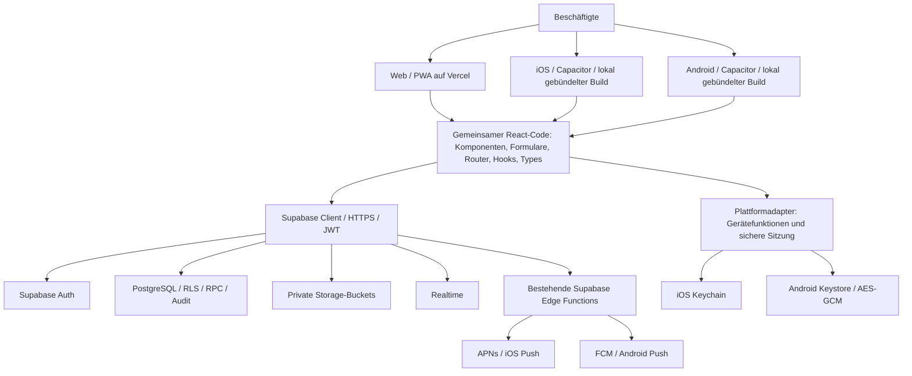

# 06 · Architektur der gemeinsamen Web-, iOS- und Android-App

Stand: 17.09.2026. Implementierte Architektur; externe Store-/Push-Zugänge und tatsächliche Geräteabnahme sind davon getrennte Freigabeschritte.

## Gesamtarchitektur

Ein Frontend, eine Geschäftslogik und dieselben Benutzerkonten. Das Diagramm beschreibt logische Abhängigkeiten, keine zusätzliche Laufzeit zwischen React und Supabase. Reproduzierbare Diagrammquelle: `docs/diagrams/gesamtarchitektur.mmd`.

## Vorher und nachher

| Bereich         | Vorher                                    | Nachher                                                                                |
| --------------- | ----------------------------------------- | -------------------------------------------------------------------------------------- |
| Auslieferung    | React-SPA und PWA auf Vercel              | Web unverändert plus separate Pakete desselben React-Builds in Capacitor               |
| Geräteplattform | Unbenutzte Interfaces                     | Ausführbare, getestete Adapter und native Projekte                                     |
| Sitzung         | Browser-LocalStorage                      | Web-Storage im Browser, native Keychain/Keystore über eigene schmale Bridge            |
| Standort        | Nicht implementiert                       | Einmalige Vordergrundabfrage; Entwurf vor ausdrücklichem Teilen im Chat                |
| Fotos           | HTML-Dateieingaben                        | Native Kamera/Systempicker, JPEG-Normalisierung und Entfernung eingebetteter Metadaten |
| Mikrofon        | Nicht implementiert                       | Explizite Aufnahme, Stop/Verwerfen/Vorschau, Audioanhang im bestehenden Chat           |
| Push            | Präferenzen/Gerätetabelle, kein Transport | Registrierung, Sitzungsbindung, Rotation/Logout sowie APNs-/FCM-Transport vorbereitet  |
| Qualität        | Web-/Datenbank-CI                         | Zusätzlich native Builds/Sync, Geräte- und Sicherheitsprüfungen, Release-Artefakte     |

## Frontend und Web-App

React 19, TypeScript strict und Vite bleiben erhalten. `src/features` bleibt die fachliche Struktur. React Router verwendet weiterhin dieselben URLs; neue native Links führen ausschließlich auf erlaubte interne Routen. TanStack Query übernimmt serverseitigen Zustand. Fachliche Mutationen werden nicht automatisch wiederholt; unklare Übertragungsergebnisse müssen fachlich geprüft werden. Es gibt keine automatische Offline-Schreibqueue.

`npm run build` erzeugt `dist` mit PWA-Manifest, Workbox-App-Shell und Updatehinweis. Vercel-Rewrite und Security-Header gelten weiter. Standort und Mikrofon sind im Permissions-Policy-Header nun ausschließlich für die eigene Origin freigegeben. Audio darf aus eigener Origin, Blob-URLs und den vorhandenen Supabase-Storage-Hosts abgespielt werden.

## iOS und Android

`npm run build:native` erzeugt `dist-native` aus demselben Einstiegspunkt. Native Pakete enthalten HTML, CSS, JavaScript und Assets. Kein `server.url`, kein Remote-JavaScript-Updatekanal und keine zweite Oberfläche. Der native Build enthält eine eigene Meta-CSP, weil Vercel-Header bei lokalem Laden nicht greifen. Der Buildtest verweigert versehentlich mitgelieferte Service Worker.

Capacitor 8.5.2 stellt die Bridge und Plattformprojekte. Swift/Java enthalten nur die notwendigen Geräte-/Sicherheitsfunktionen. iOS verwendet Swift Package Manager; Android verwendet die erzeugte Gradle-Struktur. Bundle-/Package-Kennung: `de.alberring.connect`; Debug-Variante `.dev`. Die Kennung muss vor der ersten Store-Registrierung mit dem Betreiber verbindlich bestätigt werden.

Native App-Shell: Safe Areas, Systemleisten im hellen Stil, lokale Splash-/Icon-Assets, Keyboard Resize, ausgeblendete Bottom-Navigation bei geöffneter Tastatur, Android Zurücknavigation/Minimieren und Lifecycle-Listener. Die vorhandene helle Gestaltung wird konsistent beibehalten, auch bei dunklem Systemmodus. Eine eigene dunkle Farbpalette für alle Fachscreens ist nicht implementiert.

## Capacitor und Plattformgrenzen

Offizielle Plugins: App, Network, Camera, Geolocation, Push Notifications, Keyboard, Splash Screen und Filesystem. Das Mikrofon verwendet `@capgo/capacitor-audio-recorder` 8.2.9. Filesystem dient der Bereinigung nativer temporärer Audioaufnahmen, nicht der Ablage von Auth-Tokens oder Dokument-Caches. Native Settings-/Secure-Storage-Bridges sind projektintern; dafür entstehen keine weiteren Drittanbieter-Abhängigkeiten.

`Capacitor.isNativePlatform()` entscheidet an den Geräte-/Storage-Grenzen. Web verwendet Geolocation, MediaRecorder, Dateipicker und LocalStorage. Komponenten und fachliche Verarbeitung bleiben gemeinsam. Fehler nativer Secure-Storage-Aufrufe führen nicht zu einem unsicheren Web-Storage-Fallback.

## Backend, Supabase und Datenbank

Das vorhandene Supabase-Projekt bleibt Backend für alle Plattformen. Auth, PostgREST/RPC, Realtime, Storage und Deno Edge Functions laufen in der bisherigen Infrastruktur. Native Apps kommunizieren per HTTPS/WSS mit öffentlichen Client-Keys und Benutzer-JWTs. Öffentliche Client-Keys ersetzen keine Autorisierung.

Fachdaten bleiben organisationsbezogen. RLS und RPCs prüfen Benutzer, aktive Profile, Organisationsgrenzen, Rollen und fachliche Zustände. Die neue Migration erweitert die bestehende `user_devices`-Struktur und erlaubt begrenzte Audioformate im bestehenden Chat-Bucket/Anhangsmodell. Keine parallele Benutzerdatenbank, kein neues Hosting und keine Datenmigration zwischen separaten Apps.

## Storage und Uploads

Dokumente, Atteste, Fahrzeugdateien, Chat-Anhänge und Gruppenbilder bleiben privat. Signed Downloads werden über die vorhandenen autorisierten Pfade erzeugt. Chat/Fuhrpark-Uploads erhalten echten Bytefortschritt über XHR und kurzlebige signierte Upload-URLs. Der Adapter prüft Origin und exakten Zielpfad gegen das konfigurierte Backend. Tokenwerte werden weder protokolliert noch dauerhaft gespeichert. HTTP-Erfolg beendet den Transfer; fachliche Verknüpfung und vorhandene Kompensation folgen weiterhin im jeweiligen Modul.

Fotoaufnahmen/-auswahl werden vor Upload begrenzt, dekodiert und als JPEG neu encodiert. Canvas-Neukodierung übernimmt keine EXIF-/GPS-Metadaten. Originaldateien werden nicht in das native Paket aufgenommen. Private Dateien werden nicht durch Workbox gecacht. Größen-/MIME-Grenzen gelten zusätzlich serverseitig; visuelle Dateien bleiben untrusted Content.

## Authentifizierung und sichere Persistenz

Web und Apps verwenden dieselben Supabase-Konten. Web-Persistenz bleibt kompatibel. Native Sessions und der PKCE-Verifier werden über `authStorage` ausschließlich in Keychain bzw. verschlüsseltem Keystore-Storage gespeichert. iOS-Zugänglichkeit ist gerätegebunden und an den entsperrten Zustand gekoppelt; Android-Schlüssel verlassen den Keystore nicht. Backup-Regeln schließen Sitzungsdaten aus.

Native Auth-Callbacks verwenden das registrierte App-Scheme und einen einmaligen PKCE-Code. Beliebige URL-Schemes, fremde Hosts, Bearer-Token-Fragmente und freie Weiterleitungsziele werden abgelehnt. Native Passwort-Reset-Links werden in derselben App angefordert und eingelöst. Bereits bestehende Einladungs-/Verifikations-E-Mails öffnen weiterhin den bewährten Webablauf; danach kann das Konto in jeder Plattform verwendet werden. OAuth/Magic-Link-Login ist keine bestehende Produktfunktion und wurde nicht zusätzlich eingeführt.

Sitzungswiederherstellung zeigt bei Verbindungs-/Storage-Fehlern einen verständlichen Zustand. Im Hintergrund wird nativer Auth-Refresh angehalten; im Vordergrund werden Sitzung/Fachdaten aktualisiert. Logout hebt zunächst die Gerätebindung auf und meldet dann die lokale Sitzung ab. Falls der Server nicht erreichbar ist, wird kein vollständiger Logout vorgetäuscht; die App meldet den Fehler und ermöglicht einen erneuten Versuch.

## API-Kommunikation und Fehlerbehandlung

Zentrale Backend-Fetch-Grenze: 25 Sekunden, größere Upload-Fetches bis 120 Sekunden. XHR-Uploads besitzen ebenfalls ein Timeout und expliziten Abbruch. Aufrufer-Abbruchsignale werden weitergereicht. Leseabfragen dürfen einmal wiederholt werden; mutierende Fachoperationen nicht. Globale Netzwerk-Anzeige erkennt fehlende Verbindung und bietet erneutes Prüfen. Error Boundary und Router-Fehleransicht verhindern leere Bildschirme bei Render-/Chunk-Fehlern.

Ein Online-Signal beweist keine Erreichbarkeit von Supabase. Deshalb bleiben konkrete API-Fehler und Timeouts erforderlich. Eine vorhandene Sitzung bedeutet offline keine gültige Berechtigung für einen späteren Serverzugriff; der Server prüft jeden Vorgang erneut.

## Permissions und Standort

Die gemeinsame Statusdefinition lautet `notDetermined`, `granted`, `denied`, `restricted`, `permanentlyDenied`. Native Abfragen verwenden die Betriebssystemzustände und unterscheiden bei Android bereits angefragte, dauerhaft verweigerte Rechte. Webbrowser stellen nicht jeden Zustand bereit; die UI kennzeichnet eine nicht verfügbare Statusabfrage statt ihn zu erfinden.

Standort wird ausschließlich nach „Standort zum Entwurf hinzufügen“ einmalig abgefragt. Präzision wird angefordert, ungefähre Freigaben bleiben nutzbar und gekennzeichnet. Ergebnis enthält Koordinaten, Genauigkeit und Zeitpunkt; der Benutzer prüft den Entwurf und sendet ihn bewusst. Keine Watcher, keine Bewegungsdatenbank, keine Ortung im Hintergrund. Deaktivierte Ortungsdienste, Verweigerung, Restriktion, Timeout und nicht verfügbare Position werden behandelt. GPS kann offline funktionieren; die Nachricht benötigt eine Verbindung.

Hintergrundortung hätte hier keinen belegten fachlichen Nutzen. Sie würde zusätzliche Plattformrechte, Energieverbrauch, Datenschutzabwägung und Store-Prüfung erfordern. Sie ist ausdrücklich nicht eingerichtet.

## Kamera, Fotos und Mikrofon

Kamera wird erst bei „Foto aufnehmen“ angefragt. Bestehende Fotos stammen aus dem Systempicker einzelner Bilder; kein pauschaler vollständiger Bibliothekszugriff. Nutzer können Auswahl/Aufnahme abbrechen. Größen-/Formatprobleme erscheinen im Formular. Eingebettete Metadaten werden bei der gemeinsamen Bildvorbereitung entfernt.

Mikrofonaufnahme startet nur auf ausdrückliche Aktion. Es gibt Stop, Verwerfen, Zeitlimit von 120 Sekunden und eine lokale Vorschau. Erst das normale Senden erstellt den Audioanhang. App-Wechsel, Unterbrechung und Unmount beenden/verwerfen die aktive Aufnahme. Native temporäre Dateien und Browser-Media-Tracks/Blob-URLs werden bereinigt. Aufnahme bei geschlossenem Bildschirm oder im Hintergrund ist keine Funktion dieser App.

## Push Notifications

Die technische Kette lautet: kontextuelle Freigabe in Einstellungen → OS-Token → benutzer-/sitzungsgebundene Registrierung → bestehende kategorienbezogene Präferenzen → vorhandene Notification-Queue → Edge Function → APNs/FCM → generischer Hinweis → erlaubte interne Route.

Mehrere Geräte, Tokenrotation, konkurrierende Registrierung/Logout, ungültige Tokens und serverseitiger Opt-out werden berücksichtigt. Tokens sind nicht über die Client-Lese-API sichtbar. Registrierung/Abmeldung laufen in einer geordneten Warteschlange; veraltete Antworten können keine neue Sitzung überschreiben. Push enthält keine Nachrichteninhalte, Gesundheitsdaten, Koordinaten oder signierten Download-URLs. Der aktuelle Benutzer muss beim Öffnen weiterhin die Fachberechtigungen besitzen.

`VITE_PUSH_ENABLED` bleibt standardmäßig aus. APNs-/Firebase-/Signing-Daten sind nicht erfunden oder eingebettet. Fehlende Providerkonfiguration wird als nicht verfügbar behandelt. Echte Zustellung in Vordergrund, Hintergrund und nach Beenden der App muss nach der Account-Einrichtung auf Geräten abgenommen werden.

## Remote Config und gemeinsame Update-Strategie

Bestehende Organisationseinstellungen, Kategorien, Notification-Präferenzen und Feature-Flags sind geeignete serverseitige Konfiguration. Kategorien/Regeln können gemeinsame fachliche Änderungen tragen; harte Sicherheitsgrenzen verbleiben im Backend. Ausführbare entfernte Skripte werden nicht nachgeladen.

| Typ                 | Beispiel                                                              | Wirkung/Verteilung                                                                                             |
| ------------------- | --------------------------------------------------------------------- | -------------------------------------------------------------------------------------------------------------- |
| A: Serveränderung   | Daten, Kategorien, Freigaberegeln, Präferenzen, sichere Konfiguration | Gemeinsam über Supabase, ohne neuen Frontend-Build; API-Kompatibilität mit bereits installierten Apps erhalten |
| B: Frontendänderung | React-Komponente, Validierung, Darstellung                            | Einmal implementieren; Web per Vercel, derselbe Code im nächsten nativen Store-Build                           |
| C: native Änderung  | Permission, SDK, Plugin, Swift/Java, Signing                          | Neue iOS-/Android-Binaries und regulärer Store-Prozess                                                         |

Keine Aktualisierung darf eine Store-Prüfung umgehen. Bei Typ A sollten neue Datenfelder additiv eingeführt und ältere Clientversionen unterstützt werden. Entfallende Felder/RPCs erst nach geregeltem Mindestversions-/Migrationskonzept entfernen. Sicherheitskritische Prüfungen dürfen nie ausschließlich von einer schaltbaren Clientfunktion abhängen.

## CI/CD, Deployment und Betrieb

Web-/Datenbankprüfungen bleiben erhalten. Native Kompatibilitätsjobs bauen aus demselben Commit. Version und Buildnummer werden zentral geführt und in Plattformdateien übertragen. Geschützte Release-Environments stellen später Signing-Daten bereit. Ohne Accounts können Sync, Quellprüfungen und unsignierte/native Kompatibilitätsbuilds geprüft werden; ein Store-Upload ist kein Bestandteil einer lokalen erfolgreichen Typprüfung.

Vercel bleibt Webhosting, Supabase bleibt Backend. Zusätzliche Umgebungswerte sind ausschließlich öffentliche Schalter oder serverseitige/CI-Geheimnisse an der dafür vorgesehenen Stelle. `ALLOWED_ORIGINS` muss native Origins gezielt enthalten; keine pauschale CORS-Freigabe. Ausführliche Schritte in `03_RELEASE_PROZESS.md` und `08_STORE_SETUP_CHECKLISTE.md`.

## Sicherheit, Datenschutz und Store-Freigabe

Das native Paket ist vollständig analysierbar. Deshalb werden nur ausdrücklich öffentliche Werte eingebettet. Buildvalidator und Client-/Bundle-Scan ergänzen RLS, Serverautorisierung, TLS, CSP und sichere Sessionpersistenz. Kein Zertifikat, privater Signierschlüssel oder Service-Role-Key gehört in `VITE_*` oder das Paket.

Technische Datenschutzgrundlage: `07_DATENSCHUTZ_STORE.md`. Ausstehende Betreiberentscheidungen: Aufbewahrung/Löschung, externe Dienstleister, Datenschutztexte, Store-Identität, Reviewer-Zugang und reale Geräteabnahme. Die Dokumentation unterscheidet überprüften Code, lokale Tests und noch nicht durchführbare Store-/Hardwareprüfungen.
