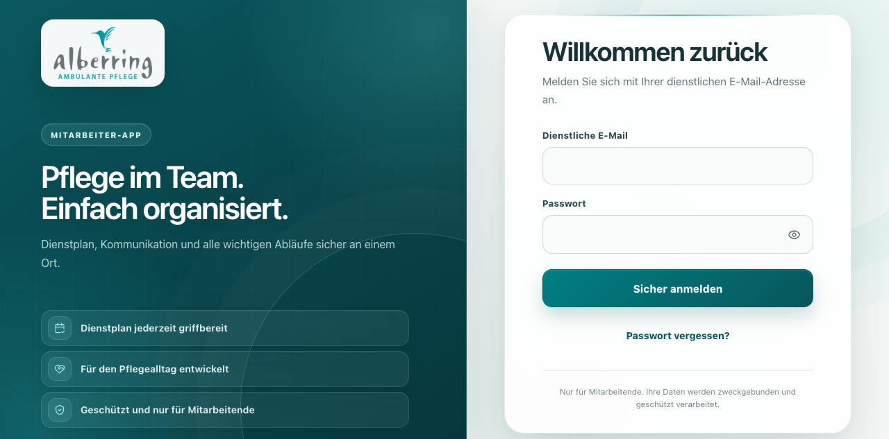
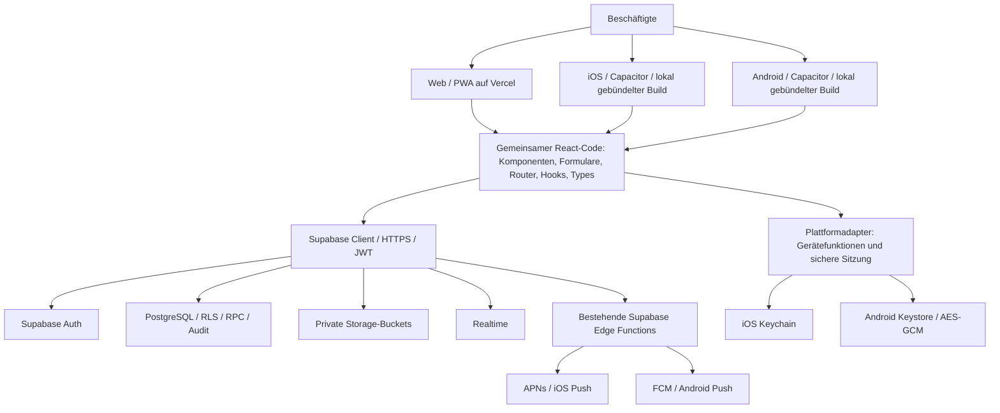
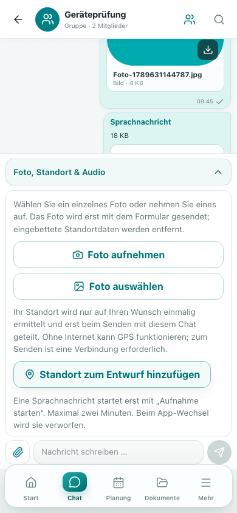
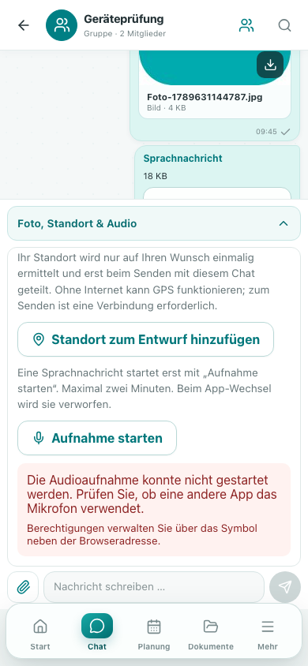
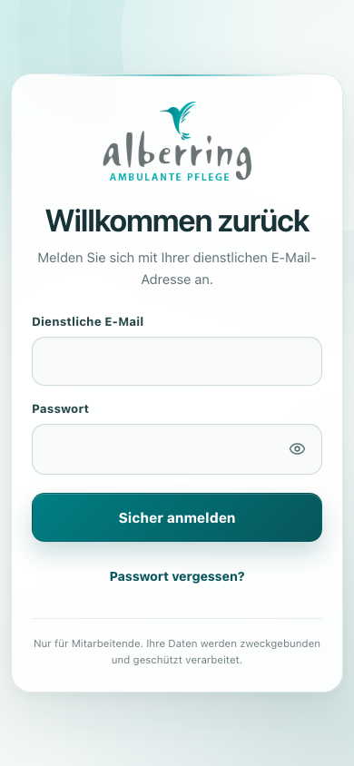
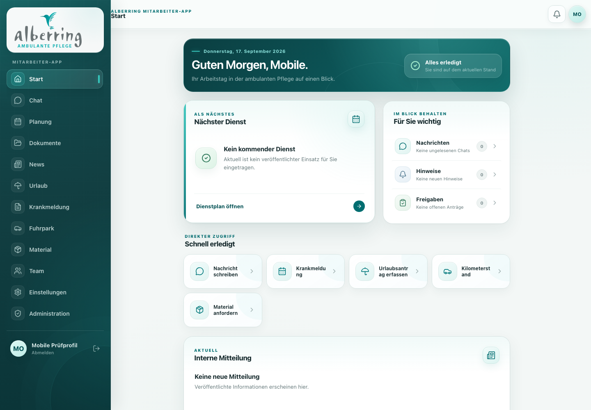
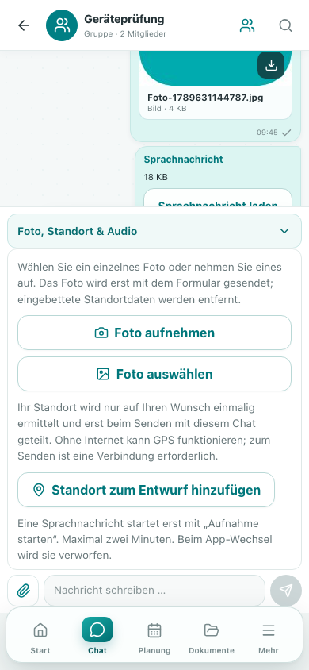
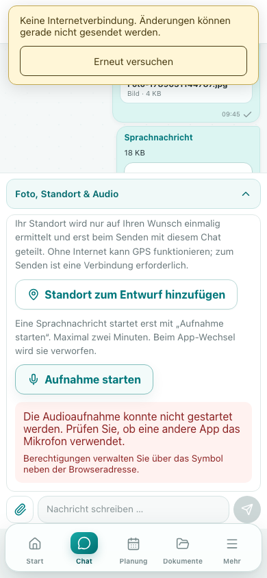
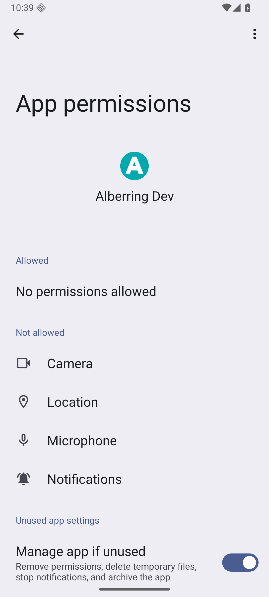

# Alberring Connect

# Technische Förderungsdokumentation

Gemeinsame Web-, iOS- und Android-Anwendung

Version 1.0 · Dokumentationsstand 17.09.2026

# 1. Projektübersicht

Alberring Connect ist eine interne Mitarbeiterplattform. Gegenstand dieser Entwicklung ist die Erweiterung der bestehenden Web-App um gemeinsam gepflegte iOS- und Android-Pakete. Fachmodule, Benutzerkonten und Supabase-Backend bleiben gemeinsam. Patientendokumentation gehört nicht zum vorgesehenen Zweck.

Dokumentationsstand: 17.09.2026. Die folgenden Aussagen unterscheiden ausgeführten Code, tatsächlich durchgeführte Tests und noch offene Betreiber-/Storefreigaben. Es wurde weder eine App in einem Store veröffentlicht noch die bestehende produktive Web-App ersetzt.

# 2. Ausgangssituation

Die übernommene React-/Vite-PWA enthielt produktive Fachbereiche, Supabase-Sicherheitsregeln und Webtests. Native Projekte, sichere mobile Sessionpersistenz und ausführbare Standort-/Mikrofon-/Pushadapter fehlten. Umfangreiche bereits vorhandene uncommittete Änderungen wurden als Ausgangsstand erfasst und beibehalten.



# 3. Projektziel

Eine gemeinsame Codebasis für Web, iOS und Android, unveränderte Hosting-Infrastruktur, nutzerinitiierte Gerätefunktionen, sichere Sessions und vorbereitete Builds/Releases. Die zusätzliche Entwicklungsleistung soll durch Quelländerungen, reproduzierbare Tests, echte Screenshots und eine editierbare technische Dokumentation nachvollziehbar sein.

# 4. Technische Problemstellung

Ein nativer Container benötigt andere Sessionpersistenz, Berechtigungszustände, Lifecycle- und Navigationsbehandlung als ein Browser. Vercel-Header gelten nicht im lokal gebündelten WebView. Standort und Audio erfordern explizite Einwilligung in der Bedienung; Uploads und Push dürfen keine Mandanten- oder Sitzungsgrenzen umgehen. Fehlende Developerkonten dürfen nicht durch erfundene Keys oder vorgetäuschte Zustellerfolge ersetzt werden.

# 5. IST-Analyse

Analysezeitpunkt: 17.09.2026, vor Beginn der Implementierung der mobilen Erweiterung. Projekt: Alberring Connect. Ausgangs-Commit: `8a75225` (Fix repeated product tour audit tracking). Diese Beschreibung dokumentiert den übernommenen Arbeitsstand, einschließlich bereits vorhandener uncommitteter Änderungen.

### Vorgehen und Abgrenzung

Untersucht wurden Projekt-/Buildkonfiguration, alle Fachbereiche unter `src/features`, gemeinsame Komponenten/Styles/Services, Authentifizierung, sämtliche Migrations- und Function-Bereiche, vorhandene Tests, CI und Betriebsdokumentation. Drei parallele Prüfbereiche: Frontend/Gerätefunktionen, Backend/Sicherheit und native Toolchains. Bestehende Änderungen werden nicht zurückgesetzt. Ein SHA-256-Ausgangsmanifest der 196 versionierten bzw. nicht ignorierten Dateien und `git status` wurde vor Codeänderungen lokal erfasst. Die endgültige Dateiliste unterscheidet den übernommenen Stand vom mobilen Erweiterungsumfang.

Es wurden keine Produktionsdaten verändert, keine Nachrichten versandt und keine Developer-/Signing-Zugangsdaten angelegt. Bestehende historische Dokumentationen berichten frühere Produktionsprüfungen; diese werden nicht als neue Tests ausgegeben.

### Technologie und Struktur

| Bereich         | Übernommener Stand                                                                        |
| --------------- | ----------------------------------------------------------------------------------------- |
| Framework       | React 19.2.7, React DOM 19.2.7, reine SPA; kein Next.js/SSR                               |
| Sprache         | TypeScript 5.9.3, strict, ES2022, Bundler-Auflösung                                       |
| Build           | Vite 8.1.4, React-Plugin 6.0.3; Ausgabe `dist`; npm 11.12.1, Node >=24                    |
| Routing         | React Router 8.3.0, BrowserRouter, Lazy Imports/Suspense; Vercel SPA-Rewrite              |
| Datenzugriff    | Supabase JS 2.110.2, TanStack Query 5.101.2                                               |
| Formulare       | React Hook Form 7.81.0, Zod 4.4.3 sowie modulbezogene React-Formulare                     |
| UI              | CSS, Lucide React, date-fns; keine native UI-Codebasis                                    |
| PWA             | vite-plugin-pwa 1.3.0, Workbox App-Shell-Precache, Updatehinweis                          |
| Backend         | Supabase Auth/PostgreSQL/RLS/Storage/Realtime/Edge Functions                              |
| Hosting         | Bestehendes Vercel-Projekt, statischer Build; keine Vercel Server Functions im Repository |
| Native Projekte | Keine `ios`-/`android`-Verzeichnisse, keine Capacitor-Abhängigkeiten                      |

`src/app`: Shell, Routing, Zugangs-/Rechteprüfungen. `src/features`: Auth, Onboarding, Dashboard, Messaging, News, Dienstplan, Urlaub, Krankheit, Dokumente, Fuhrpark, Material, Verzeichnis, Benachrichtigungen, Einstellungen und Administration. `src/lib`: Client, Typen, Validierungen, Fach-/Fehlerfunktionen. `src/components`: gemeinsame Form-/PWA-Komponenten. `src/services/platform`: bislang nur Interfaces und ein einfacher Web-Dateipicker. `src/services/integrations`: manueller Provider und ausdrücklich nicht konfigurierter Careville-Adapter. `supabase`: Migrationen, SQL-Setup-Bundles, Seed, pgTAP, Deno Functions. `.github/workflows`: Web-/Datenbank-CI.

### Routing und relevante Screens

Öffentlich: Login, Passwort vergessen/zurücksetzen, Einladung annehmen. Keine öffentliche Registrierung. Geschützt: Dashboard, Chats und Chatdetail, News/Detail, Dienstplan, Urlaub, Krankmeldungen, Dokumente/Detail, Fuhrpark, Material, Mitarbeiterverzeichnis, Benachrichtigungen, Profil, Einstellungen und Mehr. Administration enthält Benutzer/Details, Rollen, Teams, News, Dokumente, Planung, Abwesenheiten, Fuhrpark, Material, Audit, Integrationen und Systemeinstellungen. Das besondere Erst-Onboarding und die Produkttour werden serverseitig freigeschaltet.

`ProtectedRoute` prüft Sitzung, aktives Fachprofil und Onboarding. Permission-Gates begrenzen die Darstellung, ersetzen aber keine Backend-Autorisierung. Native Cold Starts, Android Back und Auth-Deep-Links werden noch nicht behandelt.

### Authentifizierung, Benutzer und Sessions

Supabase E-Mail-/Passwort-Login, Einladungsannahme, neutraler Reset und `PASSWORD_RECOVERY`-Status sind implementiert. OAuth und Magic-Link-Login werden nicht als Produktfunktion angeboten. Benutzeranlage/-änderung/-löschung erfolgen über privilegierte Edge Functions mit Fachberechtigungen. Drei aktive Rollen: Super Admin, Mitarbeiter, Teamleitung; historische Rollen bleiben erhalten. Organisations- und zeitgebundene Rollenzuordnung, effektive Berechtigungen über RPCs.

Supabase speichert Sessions standardmäßig im Browser-LocalStorage (`persistSession`, automatischer Token-Refresh, URL-Erkennung). Keine eigene native Keychain-/Keystore-Anbindung. `AuthProvider` lädt Profil/Rechte/Onboarding, leert Query-Cache beim Identitäts-/Rechtewechsel und aktualisiert Rechte bei Fokus/Sichtbarkeit sowie periodisch. Initiale Ladefehler werden bisher mit einem fehlenden Fachprofil gleichgesetzt. Logout ignoriert das zurückgegebene Fehlerobjekt. Passwort-Reset verwendet `location.origin`, was im nativen Container kein geeigneter externer Rücksprung ist. Keine eigene SessionStorage-/Cookie-Persistenz im Quellcode; Browser-SDK übernimmt seine Sessionpersistenz.

### Backend, Datenmodell und APIs

Supabase PostgREST/RPCs, Auth, Realtime und Edge-Function-Aufrufe bilden die gemeinsame API. Tabellen umfassen Organisationen/Settings/Profile/Teams/Rollen, Kommunikation, News, Benachrichtigungen, Planung, Abwesenheiten, Dokumente, Fahrzeuge und Material. Fachdatensätze tragen Organisationsbezüge. Mutierende Fachabläufe verwenden überwiegend transaktionale SQL-RPCs; Audit-Logs halten relevante Änderungen fest.

Edge Functions: administrative Benutzeroperationen, sichere Downloads, Careville-Verbindungstest sowie Geburtstags-, Kilometer-, News- und Benachrichtigungsjobs. Service Role und externe Serverkonfiguration bleiben serverseitig. E-Mail-/Push-Zustellung ist fachlich vorbereitet, bisher aber nicht als externer Transport aktiv. `user_devices`, `notification_preferences`, `notification_deliveries` und `feature_flags` existieren bereits. Geräteeinträge besitzen bisher keine belastbare native Registrierungs-/Abmeldelogik.

Careville ist ohne offizielle Zugangsdaten korrekt nicht konfiguriert. MediFox ist nicht implementiert. Es existieren keine OpenAI-/Stripe-Clientintegrationen und kein Bedarf für weitere Hosting-Infrastruktur.

### Storage, Uploads und Gerätefunktionen

Private Supabase-Buckets und autorisierte, kurzlebige Download-URLs. Chat akzeptiert JPEG/PNG/PDF bis 10 MB, Gruppenbilder bis 5 MB; Dokumente bis 20 MB; Atteste und Kilometerfotos bis 10 MB. Größen-/MIME-Prüfungen sowie Upload-Fehler-/Ladezustände bestehen. Dateiauswahl über HTML-Input; teilweise direkte neue Fenster für Downloads. Kein nativer Photo Picker, keine zentrale Bildkomprimierung/EXIF-Entfernung und kein echter Byte-Fortschritt. Der generische Web-Picker löst Abbruch nicht zuverlässig auf.

Keine Geolocation-/GPS-Funktion im übernommenen Code. Die Datenbanktabelle `locations` bezeichnet organisatorische Standorte, keine Bewegungsprofile. Deshalb besteht kein belegter Bedarf für Hintergrundortung. Kein Mikrofon, keine MediaRecorder-/Audioaufnahme. Keine native Permission-UX. Keine APNs-/FCM-Registrierung, Tokenrotation oder Notification-Tap-Behandlung.

### Webplattform, Offline und mobile Darstellung

PWA-Manifest mit Icons/Standalone, Service Worker für App-Shell, keine Runtime-Caches sensibler API-Antworten. PWA-Registrierung erfolgt bisher uneingeschränkt beim Start. TanStack Query wiederholt Leseabfragen einmal; einzelne Module zeigen Netzwerk-/Fehlerzustände. Kein globaler Offlinehinweis, keine zentrale Fetch-Zeitgrenze und keine vollständige Error Boundary. Keine Offline-Schreibqueue.

Responsive Sidebar/Bottom-Navigation, Safe-Area-CSS, 44px-Touchziele, 16px-Formularfelder, horizontale Tabellencontainer, Reduced Motion und erhöhte Kontraste sind vorhanden. Farbschema bewusst hell. Native Tastatur-/Statusleisten-/Lifecycle-Abstimmung fehlt. Browser-APIs: Clipboard, Dateieingaben, confirm/prompt, window.open/location, DOM-Fokus, Sichtbarkeit/Fokus und navigator.onLine.

### Environment und Sicherheit

Öffentliche Variablen: `VITE_SUPABASE_URL`, `VITE_SUPABASE_ANON_KEY`; lokal zusätzlich `VITE_APP_URL`. Ein lokal vorhandenes Vercel-Authentifizierungs-Environment wird nicht in Dokumente übernommen. `.env*`, `.vercel` und Supabase-Temporärdaten sind ignoriert. Keine Secretwerte in dieser Analyse.

Vercel setzt CSP, no-referrer, nosniff, Frame-Verbot, COOP und Permissions-Policy. Letztere erlaubt Kamera, sperrt jedoch Mikrofon und Standort. CSP enthält bislang keine ausdrückliche Medienquelle für Blob-Audio. Der öffentliche Buildvalidator prüft notwendige Variablen/URL, blockiert aber noch keine versehentlich als VITE-Variable gesetzten privaten Schlüssel. Eine native CSP muss gesondert im eingebetteten HTML gelten, weil Vercel-Header dort nicht greifen.

RLS, private Buckets, explizite API-Grants, serverseitige Rechteprüfungen, gehärtete Search Paths und geringe Signed-URL-Laufzeiten bestehen. Lokale Quellprüfung fand keine privaten Schlüssel im Client. Verbleibende Detailbefunde/Behebungen folgen in `02_SECURITY_AUDIT.md`; diese Aussage ersetzt keinen Penetrationstest.

### Bestehende Qualitätssicherung und gemessener Ausgangszustand

Am 17.09.2026 vor Codeänderungen tatsächlich ausgeführt:

- `npm ci`: erfolgreich, 554 Pakete installiert.
- TypeScript und ESLint: erfolgreich.
- Vitest: 12 Testdateien, 93 erfolgreiche Tests.
- Produktions-Webbuild einschließlich PWA: erfolgreich.
- Browser: tatsächlicher lokaler Login lädt ohne gemeldeten JavaScript-Fehler; Vorher-Screenshot `screenshots/01-vorher-web-login.png`.
- npm Audit: 7 gemeldete Probleme (4 high, 3 moderate), in Vitest/Mocker und transitiven Buildwerkzeugen. Gezielte kompatible Updates erforderlich; keine pauschale Major-Aktualisierung.

Vorhandene Playwright-Suite: 6 öffentliche Szenarien jeweils Desktop/Pixel 7, inklusive axe-Loginprüfung. Vitest testet Fach-/Auth-/UI-Logik mit isolierten Mocks. Deno-Tests und pgTAP prüfen Serverlogik/Rechte. CI: Installation, Audit, TypeScript, Lint, Formatierung, Vitest, Deno, Browser sowie lokale Supabase-Tests. Native CI/Signing-/Store-Artefakte fehlen.

### Lokale Werkzeuggrenzen

Node 24.15.0/npm 11.12.1 vorhanden. Xcode und iOS-Simulator fehlen, nur Command Line Tools sind installiert. Android Studio, SDK/Emulator und Java fehlen im Ausgangszustand. Docker ist installiert, der Daemon war bei der Erstprüfung nicht erreichbar. Native Projekterzeugung/Sync sind davon getrennt prüfbar. Nicht ausführbare native Tests werden später ausdrücklich als offen ausgewiesen.

### Architekturentscheidung und Umsetzungsplan

1. Vorliegende React-SPA beibehalten; separater nativer Vite-Build in `dist-native`, ohne PWA-Service-Worker. Capacitor 8.5.2 als aktuell stabile, mit Node24 kompatible Version. Keine produktive Remote-WebView-URL.
2. Native Projekte für iOS/Android ergänzen, gemeinsame Typen/Komponenten/APIs weiterverwenden. Bundle-/Package-Struktur `de.alberring.connect` als technische Kennung; finale Kontoinhaberschaft vor Store-Registrierung bestätigen.
3. Kleine Plattformadapter für Secure Storage, Lifecycle/Links, Netzwerk, Kamera/Picker, Standort, Mikrofon und Push. Berechtigungen erst nach bewusster Aktion. Hintergrundortung bleibt aus.
4. Konkrete Integration in bestehende Chat-/Fuhrpark-/Einstellungsabläufe, keine isolierte zweite Anwendung. Keine kontinuierliche Mitarbeiterortung.
5. Bestehende Gerätetabelle und Benachrichtigungsarchitektur härten/erweitern; neue SQL-Migration statt Umbau vorhandener Fachmodelle. Credentials strikt extern.
6. Security- und Fehlerbehandlung, automatisierte Prüfungen, native Sync-/Build-Pipelines, Versionierung und Store-Checklisten ergänzen.
7. Tatsächliche Browser-Screenshots, überprüfbare Testnachweise, Vorher/Nachher-Dokumentation und daraus reproduzierbares A4-PDF erstellen.

Offizielle Quellen geprüft am 17.09.2026: [Capacitor-Dokumentation](https://capacitorjs.com/docs), [Capacitor 8.5 Migration](https://capacitorjs.com/docs/updating/8-5), [Supabase native Deep Links](https://supabase.com/docs/guides/auth/native-mobile-deep-linking), [Supabase Changelog](https://supabase.com/changelog), [Apple SDK-Anforderungen](https://developer.apple.com/news/upcoming-requirements/), [Google Play Target API](https://support.google.com/googleplay/android-developer/answer/11926878). Paketversionen zusätzlich aus npm-Metadaten ermittelt.

# 6. Technische Anforderungen

Der Frontend-Build muss im nativen Paket liegen. Alle Fachkomponenten, Datenmodelle, Formulare und API-Clients bleiben gemeinsam. Native Kommunikation verwendet HTTPS; privilegierte Schlüssel verbleiben serverseitig. Berechtigungen werden im Nutzungskontext angefragt. Keine Hintergrundortung und keine heimliche Audioaufnahme. Fehlende Netzwerk-/Providerverfügbarkeit ist sichtbar zu behandeln.

Für die Storevorbereitung sind Xcode-/SDK-Versionen, Android-Target, versionierte Artefakte, Signing-Konfiguration, Datenverarbeitung und reale Geräteszenarien getrennt zu prüfen. Einzelheiten folgen in den Plattform- und Releasekapiteln.

# 7. Architektur vor der Erweiterung

Browser/PWA auf Vercel → gemeinsamer Supabase-JS-Client → Auth, PostgreSQL/RLS, private Storage-Buckets, Realtime und Edge Functions. Die Frontend-App war bereits für kleine Bildschirme gestaltet. Plattforminterfaces existierten, aber keine nativen Implementierungen oder Store-Artefakte.

# 8. Zielarchitektur



Ein Frontend, eine Geschäftslogik und dieselben Benutzerkonten. Das Diagramm beschreibt logische Abhängigkeiten, keine zusätzliche Laufzeit zwischen React und Supabase. Reproduzierbare Diagrammquelle: `docs/diagrams/gesamtarchitektur.mmd`.

| Bereich         | Vorher                                    | Nachher                                                                                |
| --------------- | ----------------------------------------- | -------------------------------------------------------------------------------------- |
| Auslieferung    | React-SPA und PWA auf Vercel              | Web unverändert plus separate Pakete desselben React-Builds in Capacitor               |
| Geräteplattform | Unbenutzte Interfaces                     | Ausführbare, getestete Adapter und native Projekte                                     |
| Sitzung         | Browser-LocalStorage                      | Web-Storage im Browser, native Keychain/Keystore über eigene schmale Bridge            |
| Standort        | Nicht implementiert                       | Einmalige Vordergrundabfrage; Entwurf vor ausdrücklichem Teilen im Chat                |
| Fotos           | HTML-Dateieingaben                        | Native Kamera/Systempicker, JPEG-Normalisierung und Entfernung eingebetteter Metadaten |
| Mikrofon        | Nicht implementiert                       | Explizite Aufnahme, Stop/Verwerfen/Vorschau, Audioanhang im bestehenden Chat           |
| Push            | Präferenzen/Gerätetabelle, kein Transport | Registrierung, Sitzungsbindung, Rotation/Logout sowie APNs-/FCM-Transport vorbereitet  |
| Qualität        | Web-/Datenbank-CI                         | Zusätzlich native Builds/Sync, Geräte- und Sicherheitsprüfungen, Release-Artefakte     |

# 9. Umgesetzte Maßnahmen

Bezugsstand: Arbeitskopie vom 17.09.2026 vor mobiler Erweiterung, nicht allein der letzte Git-Commit. Bereits vorhandene Änderungen bleiben im Ausgangsmanifest als übernommen gekennzeichnet. Die folgende Dokumentation beschreibt ausschließlich die neue Entwicklungsleistung. Verbindliche Testzahlen und Aussagegrenzen stehen in `09_ENTWICKLUNGSNACHWEIS.md`.

### 1. Gemeinsame native Auslieferung

**Änderung:** Capacitor und vollständige Plattformprojekte ergänzt.

**Ausgangszustand:** React-SPA/PWA; Dokument `CAPACITOR_MIGRATION.md` beschrieb lediglich spätere Möglichkeiten.

**Ziel:** Ein React-Quellstand für Web, iOS und Android mit lokalem Frontend im App-Paket.

**Umsetzung:** Stabile Capacitor-Version 8.5.2, `capacitor.config.ts`, separates Vite-Native-Buildziel, eigene CSP, Ausschluss des PWA-Service-Workers, Swift-Package-/Gradle-Projekte. Konfiguration verbietet produktive Remote-URL und unsicheren Mixed Content. Native Ressourcen stammen aus vorhandenen Markenassets.

**Betroffene Dateien:** `package.json`, `package-lock.json`, `vite.config.ts`, `capacitor.config.ts`, `src/main.tsx`, `scripts/verify-native-bundle.mjs`, `ios/`, `android/`, `scripts/generate-mobile-assets.mjs`.

**Technologien:** Capacitor, Vite, TypeScript, Swift, Java, Swift Package Manager, Gradle.

**Ergebnis:** Webbuild bleibt eigenständig; native Plattformen verpacken denselben Frontend-Code. Kein Framework-Wechsel.

**Test:** Web-/Native-Build, Bundleprüfung, Capacitor Sync und tatsächlicher Android-Build. iOS-Kompilierung benötigt weiterhin Xcode.

**Screenshot:** Native Android-Nachweis soweit im Screenshot-Verzeichnis vorhanden; fehlende Simulatorbelege werden im Screenshotregister begründet.

### 2. Sichere native Sitzung und Auth-Rücksprünge

**Änderung:** Plattformabhängige Auth-Persistenz, PKCE-Callback, Lifecycle und bessere Fehlerzustände.

**Ausgangszustand:** SDK-LocalStorage auf allen Plattformen, Web-URL beim Reset, uneinheitliche Fehler-/Logoutbehandlung.

**Ziel:** Gemeinsame Konten ohne unnötige Klartextpersistenz im nativen Container.

**Umsetzung:** `AlberringSecureStorage` nutzt gerätegebundene Keychain bzw. AES-GCM mit Android-Keystore-Schlüssel. Kein nativer Fallback auf LocalStorage. Auth-Callback akzeptiert nur registrierte Schemes, erlaubte Routen und einmaligen PKCE-Code. Session Restore/Refresh und Fachprofilfehler sind getrennt sichtbar. Logout widerruft Gerätebindung vor lokaler Abmeldung und meldet Verbindungsfehler offen.

**Betroffene Dateien:** `src/services/platform/storage.ts`, `links.ts`, `push.ts`, `src/lib/supabase.ts`, `src/features/auth/AuthProvider.tsx`, `AuthScreens.tsx`, `src/app/ProtectedRoute.tsx`, native Bridge-Dateien.

**Technologien:** Supabase Auth, PKCE, Keychain, Android Keystore, Capacitor App.

**Ergebnis:** Bestehende Benutzerkonten funktionieren gemeinsam; mobile Auth-Tokens werden verschlüsselt bzw. im Keychain gespeichert. Web-Einladungsabläufe bleiben erhalten.

**Test:** Storage-Fail-Closed-Tests, URL-/Redirect-Tests, Auth-Regressionen und echte lokale Browseranmeldung mit Neuladen/Logout. Keychain-Verhalten auf iOS-Hardware bleibt Geräteabnahme.

**Screenshot:** `02-nachher-web-login.png`, `03-nachher-mobile-login.png`.

### 3. Standort und kontextuelle Berechtigungen

**Änderung:** Vordergrundortung und eine gemeinsame Berechtigungsanzeige ergänzt.

**Ausgangszustand:** Keine Standortfunktion; organisatorische Standorttabelle ohne GPS-Bezug.

**Ziel:** Explizites Teilen einer aktuellen Position ohne Mitarbeiter-Tracking.

**Umsetzung:** Capacitor Geolocation bzw. Browser-Geolocation; präzise Abfrage, ungefähre Freigabe als Alternative, Genauigkeit/Zeitpunkt, Timeout-/Disabled-/Denied-/Restricted-Fehler. Ergebnis wird zunächst Chatentwurf. Native Settings-Bridge ermittelt Berechtigungszustände und öffnet Systemeinstellungen. Keine Startabfrage aller Permissions.

**Betroffene Dateien:** `src/services/platform/location.ts`, `permissions.ts`, `src/components/common/DeviceActions.tsx`, `DevicePermissions.tsx`, `src/features/messaging/Messaging.tsx`, native Manifest-/Info.plist-/Settings-Dateien.

**Technologien:** Capacitor Geolocation, Core Location, Android Location/Permissions, Web Permissions API.

**Ergebnis:** Nutzer entscheiden über Ermittlung und Versand separat. Keine Hintergrundortung, kein Verlauf außerhalb bewusst versendeter Nachrichten.

**Test:** Adapter-/Fehlerklassentests, UI-Test ohne Anfrage beim Mount, Browser-Denial und positive Browserprüfung mit explizit synthetischen GPS-Testkoordinaten.

**Screenshot:** `10-standort-abgelehnt.png`; positive Geräteprüfung wird im Screenshotregister gekennzeichnet.

### 4. Kamera, Fotos und Uploadfortschritt

**Änderung:** Native Kamera/Systempicker und gemeinsame Bildvorbereitung in Chat/Fuhrpark.

**Ausgangszustand:** HTML-Dateieingaben ohne zentrale Komprimierung/Metadatenentfernung; nur Upload-Ladezustand.

**Ziel:** Mobile Aufnahme/Auswahl, begrenzte Dateien, datensparsame Bilder und nachvollziehbarer Transfer.

**Umsetzung:** Capacitor Camera 8 verwendet Aufnahme und einzelne Systemauswahl. Web behält Dateiauswahl/Capture. Bilder werden größen-/pixelbegrenzt und als JPEG neu encodiert; EXIF wird nicht übernommen. Abbruch löst den Picker zuverlässig auf. XHR über geprüfte signierte URLs zeigt echten Bytefortschritt, erlaubt Abbruch und behandelt Timeout/HTTP-Fehler. Bestehende fachliche Upload-/Kompensationslogik bleibt bestehen.

**Betroffene Dateien:** `src/services/platform/media.ts`, `uploads.ts`, `src/components/common/DeviceActions.tsx`, `UploadProgress.tsx`, `src/features/messaging/Messaging.tsx`, `src/features/fleet/FleetPage.tsx`.

**Technologien:** Capacitor Camera, nativer Photo Picker, Canvas, Supabase Storage, XMLHttpRequest.

**Ergebnis:** Foto erst als Vorschau/Dateientwurf, Speicherung erst bei fachlichem Senden. Kein pauschaler Zugriff auf die gesamte Fotobibliothek.

**Test:** Bild-/MIME-/Größenprüfungen, Abbruch-/Uploadtests, bestehende Chat-/Fuhrpark-Regressionen und tatsächliche lokale Storage-Übertragung.

**Screenshot:** `09-chat-geraetefunktionen.png` und Foto-Upload-Nachweis aus der lokalen Geräteprüfung.

### 5. Sprachnachrichten

**Änderung:** Explizite Audioaufnahme, Vorschau und Audioanhang im vorhandenen Chat.

**Ausgangszustand:** Kein Mikrofon; Chat erlaubte ausschließlich Bild/PDF.

**Ziel:** Aufnahme im Vordergrund mit widerrufbarer Nutzerentscheidung.

**Umsetzung:** Nativer Capacitor-Audiorecorder und Web-MediaRecorder; maximal 120 Sekunden, Start/Stop/Verwerfen, Preview, Cleanup, Abbruch bei Hintergrund/Unmount/Unterbrechung. Bestehende Attachment-Tabelle und privater Bucket akzeptieren die begrenzten Audio-MIMEs. Dateien bleiben bis zur Sendeaktion lokal; native Temporärdateien werden bereinigt.

**Betroffene Dateien:** `src/services/platform/audio.ts`, `DeviceActions.tsx`, `Messaging.tsx`, neue SQL-Migration, native Mikrofon-Permissions.

**Technologien:** Capgo Audio Recorder, MediaRecorder, Filesystem, Supabase Storage.

**Ergebnis:** Sprachnachrichten verwenden dasselbe Mitglieder-/RLS-Modell wie bestehende Chat-Anhänge.

**Test:** Codec-/Größen-/Lifecycle-/Abbruchtests, Browserfehler ohne Mikrofon und Audio-Transportprüfung mit synthetischem Browser-Mikrofon. Reale Hardwarequalität bleibt gesonderter Test.

**Screenshot:** `11-mikrofon-fehlerzustand.png`; Aufnahme-/Vorschaunachweis laut Screenshotregister.

### 6. Push und Backend-Härtung

**Änderung:** Gerätetokenregistrierung, Sitzungsschutz und APNs-/FCM-Transport vorbereitet.

**Ausgangszustand:** Gerätetabelle und Präferenzen vorhanden, kein aktiver nativer Registrierungs-/Transportpfad.

**Ziel:** Mehrere Geräte und zuverlässige Lebenszyklen ohne Tokens im öffentlichen Client-Lesezugriff.

**Umsetzung:** Bestehende Gerätetabelle erhält Installation/Sitzungsbindung und sichere RPCs; Clientrechte werden auf erforderliche Metadaten beschränkt. Rotation, Logout und verspätete Callbacks werden serialisiert. Dispatcher verarbeitet aktuelle Präferenzen, generische Payloads, Providerfehler, ungültige Tokens, Wiederholungen und bereits erfolgreiche Einzelzustellungen. Provider-Secrets bleiben in Supabase Functions.

**Betroffene Dateien:** `src/services/platform/push.ts`, `PushSettings.tsx`, neue Migration und pgTAP-Datei, `supabase/functions/_shared/push.ts`, `send-notification-batch/index.ts` sowie zugehörige Tests.

**Technologien:** Capacitor Push, APNs, FCM HTTP v1, JWT/OAuth, PostgreSQL, Deno.

**Ergebnis:** Technische Ende-zu-Ende-Struktur vorhanden; tatsächlicher Versand bleibt ohne Accountkonfiguration deaktiviert. Keine fingierten Zustellerfolge.

**Test:** SQL-Isolation/Sitzungsschutz, kryptographische Signaturtests, Providervertrag und Race-/Logouttests. Keine reale APNs-/FCM-Zustellung behauptet.

**Screenshot:** `07-einstellungen-permissions.png` zeigt den tatsächlichen nicht konfigurierten Pushzustand.

### 7. Netzwerk, Sicherheit und mobile Shell

**Änderung:** Globale Fehler-/Offlineansichten, Zeitgrenzen, native Navigation und Buildhärtung.

**Ausgangszustand:** Modulfehler vorhanden, aber kein globaler Offlinehinweis/Error Boundary; Mikrofon/Standort in Web-Headern gesperrt.

**Ziel:** Verständliche Fehler statt leerer Bildschirme oder unklarer, endloser Ladezustände.

**Umsetzung:** Network-Plugin, Error Boundary/Router-Fallback, begrenzter Fetch, expliziter Retry, native Back-/Keyboard-/Lifecycle-Listener, Kamera-Restore-Hinweis. Public-Env-Allowlist blockiert Service-Role-/Privatschlüssel; Client-/Bundle-Scan ergänzt die Prüfung. Dependencies gezielt aktualisiert; kompatibles UUID-Override für Capacitor-Xcode-Werkzeug geprüft.

**Betroffene Dateien:** `src/components/common/NetworkStatus.tsx`, `AppErrorBoundary.tsx`, `PlatformRuntime.tsx`, `src/services/platform/network.ts`, `src/styles/platform.css`, `vercel.json`, `scripts/public-env.mjs`, `check-client-security.mjs`, Lockfile.

**Ergebnis:** Bestehende mobile Darstellung bleibt erhalten, neue Gerätefunktionen passen in die gemeinsame Shell. Keine automatische Wiederholung fachlicher Schreibvorgänge.

**Test:** Timeout-/Abbruchtests, Secret-Negativtests, Web-/Native-Build, 25 lokale mobile Routen ohne Horizontalüberlauf/Renderfehler, echte Offline-Umschaltung.

**Screenshot:** `04-mobile-dashboard.png`, `06-mobile-navigation.png`, `08-permission-status.png`, `12-offline-zustand.png`.

### 8. Versionierung, CI/CD und prüfbare Dokumentation

**Änderung:** Version 1.0.0/Build 1, native Kompatibilitäts-/Release-Pipelines, vorbereiteter verifizierter Vercel-Deploy und vollständige Nachweisdokumente.

**Ausgangszustand:** Web-/Datenbank-CI, keine nativen Artefakte oder Storeprozesse.

**Ziel:** Wiederholbare Prüfung/Release aus derselben Codebasis und sachlicher Förderungsnachweis.

**Umsetzung:** Zentrale Versionierung, überprüfte Buildnummern, geschützte Secrets/Environments, Artefaktausgabe, dokumentierte spätere Store-Einrichtung. Vorher-Manifest, echte Browserbelege, Architekturdiagramm, Dateien-/Dependencylisten, Markdown und reproduzierbarer A4-PDF-Generator.

**Betroffene Dateien:** `.github/workflows/`, `mobile-version.json`, Version-/Release-/Asset-/Dokumentationsskripte, `.gitignore`, `.prettierignore`, `docs/01` bis `09`, Förderdokumentation und Screenshots.

**Technologien:** GitHub Actions, Vercel CLI, Gradle, Xcode-Konfiguration, Playwright, ReportLab, SHA-256.

**Ergebnis:** Nachvollziehbare Vorbereitung ohne erfundene Credentials, Testresultate oder Storefreigabe.

**Test:** Lokale Befehle/Artefakte dokumentiert, PDF visuell und strukturell geprüft. Cloud-CI und signierte Storeuploads benötigen spätere Kontoeinrichtung.

# 10. iOS-Integration

`npm run build:native` erzeugt `dist-native` aus demselben Einstiegspunkt. Native Pakete enthalten HTML, CSS, JavaScript und Assets. Kein `server.url`, kein Remote-JavaScript-Updatekanal und keine zweite Oberfläche. Der native Build enthält eine eigene Meta-CSP, weil Vercel-Header bei lokalem Laden nicht greifen. Der Buildtest verweigert versehentlich mitgelieferte Service Worker.

Capacitor 8.5.2 stellt die Bridge und Plattformprojekte. Swift/Java enthalten nur die notwendigen Geräte-/Sicherheitsfunktionen. iOS verwendet Swift Package Manager; Android verwendet die erzeugte Gradle-Struktur. Bundle-/Package-Kennung: `de.alberring.connect`; Debug-Variante `.dev`. Die Kennung muss vor der ersten Store-Registrierung mit dem Betreiber verbindlich bestätigt werden.

Native App-Shell: Safe Areas, Systemleisten im hellen Stil, lokale Splash-/Icon-Assets, Keyboard Resize, ausgeblendete Bottom-Navigation bei geöffneter Tastatur, Android Zurücknavigation/Minimieren und Lifecycle-Listener. Die vorhandene helle Gestaltung wird konsistent beibehalten, auch bei dunklem Systemmodus. Eine eigene dunkle Farbpalette für alle Fachscreens ist nicht implementiert.

Offizielle Plugins: App, Network, Camera, Geolocation, Push Notifications, Keyboard, Splash Screen und Filesystem. Das Mikrofon verwendet `@capgo/capacitor-audio-recorder` 8.2.9. Filesystem dient der Bereinigung nativer temporärer Audioaufnahmen, nicht der Ablage von Auth-Tokens oder Dokument-Caches. Native Settings-/Secure-Storage-Bridges sind projektintern; dafür entstehen keine weiteren Drittanbieter-Abhängigkeiten.

`Capacitor.isNativePlatform()` entscheidet an den Geräte-/Storage-Grenzen. Web verwendet Geolocation, MediaRecorder, Dateipicker und LocalStorage. Komponenten und fachliche Verarbeitung bleiben gemeinsam. Fehler nativer Secure-Storage-Aufrufe führen nicht zu einem unsicheren Web-Storage-Fallback.

iOS-Projekt, Info.plist, Swift-Bridges, SPM und Sync sind vorhanden. Ohne Xcode wurde keine erfolgreiche iOS-Kompilierung oder Simulator-/Hardwareabnahme behauptet.

# 11. Android-Integration

Android-Projekt mit API 36, AGP 8.13.0 und Gradle 8.14.3; Permissions, sichere Netzwerk-/Backupregeln, adaptive Icons, Splash, Deep Links und Keystore-Bridge. Die lokale Java-/SDK-Toolchain wurde geprüft eingerichtet. Tatsächliche Debug-APK, unsigniertes Release-AAB und Android-Lint wurden erfolgreich erstellt. Zusätzliche KeyStore-Instrumentation wurde auf dem Android-36-Emulator ausgeführt. Die Ergebnisse im Entwicklungsnachweis sind maßgeblich; eine erfolgreiche Kompilierung ist keine Play-Store-Freigabe.

# 12. Berechtigungskonzept

Die gemeinsame Statusdefinition lautet `notDetermined`, `granted`, `denied`, `restricted`, `permanentlyDenied`. Native Abfragen verwenden die Betriebssystemzustände und unterscheiden bei Android bereits angefragte, dauerhaft verweigerte Rechte. Webbrowser stellen nicht jeden Zustand bereit; die UI kennzeichnet eine nicht verfügbare Statusabfrage statt ihn zu erfinden.

Standort wird ausschließlich nach „Standort zum Entwurf hinzufügen“ einmalig abgefragt. Präzision wird angefordert, ungefähre Freigaben bleiben nutzbar und gekennzeichnet. Ergebnis enthält Koordinaten, Genauigkeit und Zeitpunkt; der Benutzer prüft den Entwurf und sendet ihn bewusst. Keine Watcher, keine Bewegungsdatenbank, keine Ortung im Hintergrund. Deaktivierte Ortungsdienste, Verweigerung, Restriktion, Timeout und nicht verfügbare Position werden behandelt. GPS kann offline funktionieren; die Nachricht benötigt eine Verbindung.

Hintergrundortung hätte hier keinen belegten fachlichen Nutzen. Sie würde zusätzliche Plattformrechte, Energieverbrauch, Datenschutzabwägung und Store-Prüfung erfordern. Sie ist ausdrücklich nicht eingerichtet.


# 13. Standort

Vorher gab es keine GPS-Funktion. Nachher verwendet Web die Browser-Geolocation und Native die Capacitor-Standort-API. Koordinaten, Genauigkeit und Zeit erscheinen zuerst als Chatentwurf. Es erfolgt keine automatische Übertragung und kein Bewegungsprofil. Die positive Browserprüfung verwendete ausdrücklich synthetische Testkoordinaten; reale GPS-Qualität und alle OS-Dialoge bleiben Geräteabnahme.




# 14. Kamera und Fotos

Dokumente, Atteste, Fahrzeugdateien, Chat-Anhänge und Gruppenbilder bleiben privat. Signed Downloads werden über die vorhandenen autorisierten Pfade erzeugt. Chat/Fuhrpark-Uploads erhalten echten Bytefortschritt über XHR und kurzlebige signierte Upload-URLs. Der Adapter prüft Origin und exakten Zielpfad gegen das konfigurierte Backend. Tokenwerte werden weder protokolliert noch dauerhaft gespeichert. HTTP-Erfolg beendet den Transfer; fachliche Verknüpfung und vorhandene Kompensation folgen weiterhin im jeweiligen Modul.

Fotoaufnahmen/-auswahl werden vor Upload begrenzt, dekodiert und als JPEG neu encodiert. Canvas-Neukodierung übernimmt keine EXIF-/GPS-Metadaten. Originaldateien werden nicht in das native Paket aufgenommen. Private Dateien werden nicht durch Workbox gecacht. Größen-/MIME-Grenzen gelten zusätzlich serverseitig; visuelle Dateien bleiben untrusted Content.


# 15. Mikrofon

Kamera wird erst bei „Foto aufnehmen“ angefragt. Bestehende Fotos stammen aus dem Systempicker einzelner Bilder; kein pauschaler vollständiger Bibliothekszugriff. Nutzer können Auswahl/Aufnahme abbrechen. Größen-/Formatprobleme erscheinen im Formular. Eingebettete Metadaten werden bei der gemeinsamen Bildvorbereitung entfernt.

Mikrofonaufnahme startet nur auf ausdrückliche Aktion. Es gibt Stop, Verwerfen, Zeitlimit von 120 Sekunden und eine lokale Vorschau. Erst das normale Senden erstellt den Audioanhang. App-Wechsel, Unterbrechung und Unmount beenden/verwerfen die aktive Aufnahme. Native temporäre Dateien und Browser-Media-Tracks/Blob-URLs werden bereinigt. Aufnahme bei geschlossenem Bildschirm oder im Hintergrund ist keine Funktion dieser App.




# 16. Push Notifications

Die technische Kette lautet: kontextuelle Freigabe in Einstellungen → OS-Token → benutzer-/sitzungsgebundene Registrierung → bestehende kategorienbezogene Präferenzen → vorhandene Notification-Queue → Edge Function → APNs/FCM → generischer Hinweis → erlaubte interne Route.

Mehrere Geräte, Tokenrotation, konkurrierende Registrierung/Logout, ungültige Tokens und serverseitiger Opt-out werden berücksichtigt. Tokens sind nicht über die Client-Lese-API sichtbar. Registrierung/Abmeldung laufen in einer geordneten Warteschlange; veraltete Antworten können keine neue Sitzung überschreiben. Push enthält keine Nachrichteninhalte, Gesundheitsdaten, Koordinaten oder signierten Download-URLs. Der aktuelle Benutzer muss beim Öffnen weiterhin die Fachberechtigungen besitzen.

`VITE_PUSH_ENABLED` bleibt standardmäßig aus. APNs-/Firebase-/Signing-Daten sind nicht erfunden oder eingebettet. Fehlende Providerkonfiguration wird als nicht verfügbar behandelt. Echte Zustellung in Vordergrund, Hintergrund und nach Beenden der App muss nach der Account-Einrichtung auf Geräten abgenommen werden.

# 17. Authentifizierung und Secure Storage

Web und Apps verwenden dieselben Supabase-Konten. Web-Persistenz bleibt kompatibel. Native Sessions und der PKCE-Verifier werden über `authStorage` ausschließlich in Keychain bzw. verschlüsseltem Keystore-Storage gespeichert. iOS-Zugänglichkeit ist gerätegebunden und an den entsperrten Zustand gekoppelt; Android-Schlüssel verlassen den Keystore nicht. Backup-Regeln schließen Sitzungsdaten aus.

Native Auth-Callbacks verwenden das registrierte App-Scheme und einen einmaligen PKCE-Code. Beliebige URL-Schemes, fremde Hosts, Bearer-Token-Fragmente und freie Weiterleitungsziele werden abgelehnt. Native Passwort-Reset-Links werden in derselben App angefordert und eingelöst. Bereits bestehende Einladungs-/Verifikations-E-Mails öffnen weiterhin den bewährten Webablauf; danach kann das Konto in jeder Plattform verwendet werden. OAuth/Magic-Link-Login ist keine bestehende Produktfunktion und wurde nicht zusätzlich eingeführt.

Sitzungswiederherstellung zeigt bei Verbindungs-/Storage-Fehlern einen verständlichen Zustand. Im Hintergrund wird nativer Auth-Refresh angehalten; im Vordergrund werden Sitzung/Fachdaten aktualisiert. Logout hebt zunächst die Gerätebindung auf und meldet dann die lokale Sitzung ab. Falls der Server nicht erreichbar ist, wird kein vollständiger Logout vorgetäuscht; die App meldet den Fehler und ermöglicht einen erneuten Versuch.

# 18. Security Audit

Stand: 17.09.2026. Gegenstand: vorhandene Web-Anwendung, gemeinsame Client-Erweiterungen, native Projektkonfiguration, Supabase-Migrationen, Edge Functions und lokale Prüfung. Diese technische Prüfung ist kein unabhängiges Penetrationstest-Zertifikat. Einstellungen eines gehosteten Supabase-Projekts oder Store-Kontos lassen sich durch Repository-Dateien allein nicht bestätigen. Die Umsetzung hat keine Produktionsdatenbank verändert.

### Prüfmodell und Bestandsschutz

APK, IPA und JavaScript-Bundles gelten als vollständig einsehbar. Zugriffsschutz darf deshalb nicht auf versteckten Client-Schlüsseln, ausgeblendeten Schaltflächen oder App-Paketintegrität beruhen. Maßgeblich sind Supabase Auth, aktuelle Datenbankberechtigungen, Row Level Security und geprüfte Serverfunktionen.

Der Arbeitsbaum enthielt bereits umfangreiche Änderungen an Benutzerverwaltung, Rollen, Workflows, Tests und SQL-Dateien. Diese wurden erhalten. Die IST-Analyse entstand vor der Implementierung. Bei der SQL-Bewertung wurde die gesamte Migrationsreihenfolge berücksichtigt: frühere Policies sind teilweise durch spätere Härtungen ersetzt. Historische Risiken wurden deshalb nicht fälschlich als aktuelle, unbehobene Lücken bewertet.

### Ergebnisse und Maßnahmen

| Bereich                     | Vorher / Risiko                                                                               | Umsetzung und Ergebnis                                                                                                                                                                                                                                                                            |
| --------------------------- | --------------------------------------------------------------------------------------------- | ------------------------------------------------------------------------------------------------------------------------------------------------------------------------------------------------------------------------------------------------------------------------------------------------- |
| Native Auth-Daten           | SDK verwendete browsertypischen Storage                                                       | Plattformabstraktion verwendet unter iOS den eigenen Keychain-Adapter und unter Android Keystore-gestützte Verschlüsselung. Native Storage-Fehler führen zu einer Fehlermeldung; kein stiller Rückfall auf Klartext-localStorage. Web-Verhalten bleibt erhalten.                                  |
| Öffentliche Build-Variablen | Vorhandensein und URL wurden geprüft, private Schlüsseltypen nicht zuverlässig ausgeschlossen | Explizite VITE-Variablenliste, HTTPS-Regel für native Builds, Prüfung auf private Schlüsselpräfixe und auf service_role-JWT statt anon-JWT. Zusätzlicher Musterscan für Clientquellen und erzeugte Bundles.                                                                                       |
| Client-Secretprüfung        | Bundles können ausgelesen werden                                                              | Im untersuchten Client wurden keine privaten Supabase-, Stripe-, OpenAI-, Resend-, Datenbank- oder Signing-Zugangsdaten festgestellt. Service-Role-Zugriff bleibt auf Edge Functions/Administration begrenzt. Ein Musterscan ersetzt keine Inventur aller externen Secrets.                       |
| Native Weiterleitungen      | Passwort-Reset nutzte ausschließlich location.origin                                          | Native Auth-Weiterleitung und Deep-Link-Parser akzeptieren bekannte Schemes/Ziele und PKCE-Code; fremde URLs und ungeprüfte Weiterleitungsziele werden abgewiesen. Produktive Redirect-Allowlist muss im Betreiberprojekt gesetzt werden.                                                         |
| Gerätezuordnung             | user_devices enthielt bereits Tokenfelder, jedoch keine native Lebenszyklusbindung            | Vorhandene Tabelle erweitert: Installations-ID, Auth-Session-ID, Push-Umgebung und App-Version. Registrierung und Widerruf über begrenzte RPCs. Profil und Organisation werden serverseitig bestimmt.                                                                                             |
| Tokenzugriff                | Eigene Geräte konnten direkt geändert und Tokenfelder gelesen werden                          | Direkte Client-Writes entzogen. Raw Token und Hash nicht client-lesbar. Eine aktive Tokenbindung pro Plattform/Umgebung, atomare Rotation und Neuverknüpfung. Höchstens zehn aktive native Geräte pro Profil.                                                                                     |
| Logout / Parallelität       | Logout ignorierte SDK-Fehler; keine Push-Abmeldung                                            | Gerätewiderruf vor lokalem Supabase-Sign-out; Fehler werden angezeigt. Registrierung und Widerruf sind clientseitig serialisiert. Generation-Prüfungen unterbinden verspätete Registrierung und veraltete Rückmeldungen. Bei fehlender Verbindung wird keine erfolgreiche Abmeldung vorgetäuscht. |
| Push-Inhalt                 | Kein APNs-/FCM-Versand                                                                        | APNs-/FCM-Sender vorbereitet. Auf dem Sperrbildschirm nur allgemeiner Hinweis, keine Nachrichten-, Krankheits-, Standort- oder Personaldetails. Navigation ist auf interne App-Pfade beschränkt.                                                                                                  |
| Push-Wiederholung           | Andere Kanäle wurden ohne Anbieter übersprungen                                               | Atomare Batch-Lease und gerätebezogene Versandbelege, begrenzte Wiederholung, erneute Prüfung von Opt-out/Ruhezeit, Behandlung ungültiger Tokens. Fehlende Credentials verschieben den Versuch ohne vorgetäuschten Versand.                                                                       |
| Browserberechtigungen       | HTTP-Header blockierten Mikrofon und Standort                                                 | Gezielt auf eigene Herkunft begrenzte Freigabe für nutzerinitiierte Funktionen; kein allgemeines Öffnen für Fremdframes. Native Transport-/WebView-Konfiguration wird getrennt geführt.                                                                                                           |
| Medien                      | Browserdateien; Chat nur PDF/JPEG/PNG                                                         | Aufnahme/Fotoauswahl mit Fehlerzuständen. Neue Fotoaufbereitung dekodiert und kodiert Pixel neu, begrenzt Dimensionen/Größe und entfernt EXIF. Chat-Audio bleibt im vorhandenen privaten Bucket mit 10-MiB-Limit und bestehender Mitgliedschaftsprüfung.                                          |

### Supabase-Zugriffsschutz

Die bestehende Mandanten- und Benutzerisolation bleibt maßgeblich. `private.current_profile_id()` und `private.current_organization_id()` bestimmen aus `auth.uid()` das aktive Profil in einer aktiven Organisation. Rechte stammen aus Datenbankrollen und zeitlich gültigen Zuweisungen. Benutzereditierbares `user_metadata` wird nicht für Rollenfreigaben verwendet; die frühere Einladungsauswertung wurde bereits im Bestand auf `app_metadata` gehärtet.

Im Bestand sind öffentliche Tabellen mit RLS versehen. Anonyme Tabellenzugriffe und gefährliche Privilegien wie TRUNCATE wurden entzogen. Kritische Änderungen erfolgen über geprüfte RPCs; vertrauliche HR-Spalten besitzen eingeschränkte Leserechte. Admin-Edge-Funktionen prüfen den Benutzer über Supabase Auth, aktiven Kontostatus und aktuelle Berechtigungen. CORS ist eine ausdrückliche Herkunftsliste und ersetzt keine Autorisierung.

Private Storage-Buckets verwenden Mandanten-, Eigentümer- und Konversationsregeln. `create-secure-download` autorisiert den Dateipfad vor dem Erzeugen eines zeitlich begrenzten Links; TTL beträgt konfigurierbar 30 bis 120 Sekunden. Ein signierter Link ist innerhalb seiner Laufzeit ein Zugriffsnachweis und darf nicht öffentlich weitergegeben werden. Uploadbereinigung bleibt auf zulässige, nicht mehr referenzierte Objekte begrenzt.

Die neue Migration `20260917073037_native_push_devices_and_audio.sql` ergänzt ausschließlich den erforderlichen Geräte-/Versandzustand sowie Audio-MIME-Typen. `push_delivery_receipts` besitzt RLS und ausschließlich Service-Role-Grants. Die öffentlichen Registrierungs-Wrapper laufen als SECURITY INVOKER; die benötigte privilegierte Implementierung befindet sich im nicht per PostgREST exponierten Schema `private`, mit ausdrücklichen Execute-Grants und interner Auth-Prüfung. Service-only-RPCs für aktiven Geräteabruf und Batch-Claim sind für anon/authenticated gesperrt. Keine Policy wurde zum Beheben eines Clientfehlers pauschal geöffnet.

Supabase unterscheidet Tabellen-Grants und Zeilen-Policies; beides muss korrekt gesetzt sein. Neue Objekte erhalten hier ausdrückliche Minimalberechtigungen. Siehe [Supabase RLS](https://supabase.com/docs/guides/database/postgres/row-level-security) und [Data-API-Härtung](https://supabase.com/docs/guides/api/securing-your-api).

### Push-Sicherheitsarchitektur

`register_push_device` übernimmt keine vom Client behauptete Benutzer-/Mandanten-ID. Eine gültige Auth-Session muss zum angemeldeten Benutzer gehören; abgelaufene oder fehlende Sessions werden abgewiesen. Tokenformat/Länge/Plattform/Umgebung werden geprüft. Der SHA-256-Hash entsteht serverseitig. Tokenwechsel oder Kontowechsel widerrufen die bisherige aktive Bindung und löschen den alten Rohwert. Nach Logout/Providerwiderruf bleibt nur der minimale Registerdatensatz bestehen.

Der Sender berücksichtigt nur aktive Profile/Organisationen mit bestehender, nicht abgelaufener Session und einer innerhalb von 60 Tagen aktualisierten Gerätebindung. Diese Frist ist ein Versandfilter, kein automatischer Löschlauf. APNs verwendet signierte ES256-Provider-Tokens, FCM signierte Service-Account-Assertions und kurzlebige OAuth2-Zugriffstokens. Credentials werden ausschließlich serverseitig gelesen. Token- und Credential-Inhalte werden in diesem Versandpfad nicht geloggt.

Parallelität und Netzabbrüche können nach Annahme durch einen externen Anbieter eine Wiederholung verursachen, falls der anschließende Datenbankbeleg ausfällt. Das System arbeitet daher mit mindestens einmaliger Zustellung, nicht mit behaupteter Exactly-once-Garantie; gerätebezogene Belege und Anbieter-Collapse/Tags reduzieren Duplikate. Bereits an das Betriebssystem zugestellte Meldungen können bei einer späteren serverseitigen Abmeldung nicht garantiert zurückgeholt werden. Der Client entfernt lokale zugestellte Meldungen soweit die Plattform dies unterstützt.

### Konfiguration ohne Secretwerte

| Ziel                       | Später zu setzen / zu prüfen                                                                                                                                       |
| -------------------------- | ------------------------------------------------------------------------------------------------------------------------------------------------------------------ |
| Edge-CORS                  | Bestehende Web-Herkünfte plus `capacitor://localhost` (iOS) und `https://localhost` (Android), exakt in `ALLOWED_ORIGINS`                                          |
| Supabase Auth              | Produktive Web-URL und native Callback-Schemes in der Redirect-Allowlist; SMTP/Verifikation/Passwortrichtlinie prüfen                                              |
| APNs                       | `APNS_PRIVATE_KEY`, `APNS_KEY_ID`, `APNS_TEAM_ID`, `APNS_BUNDLE_ID`, für separate Dev-App `APNS_DEVELOPMENT_BUNDLE_ID`; korrekte Entwicklungs-/Produktionsumgebung |
| FCM                        | `FCM_SERVICE_ACCOUNT_JSON` ausschließlich als Edge-Secret; Android-Clientkonfiguration separat im nativen Build                                                    |
| Öffentliche Storage-Origin | Optional `APP_SUPABASE_PUBLIC_URL` im Edge-Server, z. B. für lokale Docker-/Reverse-Proxy-Umgebungen; produktiv ohne Wert unverändert                              |
| Automatisierung            | Bestehendes `AUTOMATION_SECRET`, Scheduler-Konfiguration und Anbieterzustand prüfen                                                                                |
| Client                     | Nur zulässige öffentliche VITE-Werte; `VITE_PUSH_ENABLED` erst nach Betreiberkonfiguration aktivieren                                                              |

### Nachgewiesene Prüfungen

- Alle 14 lokalen SQL-Testdateien: **539 pgTAP-Prüfungen erfolgreich**, davon 33 neue Geräte-/Session-/Privilege-/Audio-Prüfungen.
- Alle 13 Edge-Entrypoints: Deno-Typprüfung erfolgreich; **29 Deno-Tests erfolgreich**, einschließlich APNs-JWT-Signaturtest mit flüchtigem Testschlüssel, FCM-Request-Vertrag, ungültiger Tokens, Vertraulichkeit und Ruhezeiten.
- Client-Push: **7 gezielte Vitest-Prüfungen erfolgreich**, einschließlich konkurrierender Registrierung/Abmeldung, verweigerter Permission und abgewiesenem Fremdlink.
- `supabase db advisors --local --type security --level warn --fail-on error`: **keine Befunde**.
- `supabase db lint --local --level warning --fail-on error --schema public,private`: kein Fehler; bestehende Warnung zum ungenutzten Parameter `p_name` in `public.create_role`.
- Schema-Abgleich über lokale Shadow-Datenbank: **No schema changes found**. Die CLI liefert für diesen In-sync-Zustand einen Fehler-Exitcode; es bestand kein Schema-Diff. Migrationsdatei und lokales Schema wurden abgeglichen, die beiden vorhandenen Setup-Bundles neu erzeugt.
- Für Browserprüfungen wurde eine separate lokale Organisation mit ausdrücklich bezeichneten Prüfprofilen und einer realen Testkonversation angelegt. Sie ist nicht Bestandteil produktiver App-Daten oder hardcodierter Clientlogik. Kein E-Mail-Versand.

### Im lokalen Integrationstest behobener Downloadfehler

Die lokale Edge-Laufzeit verwendet intern `http://kong:8000`. Der dort erzeugte signierte Storage-Link war für den Browser nicht auflösbar. Der neue Serverhelfer `publicDownloadUrl` ersetzt ausschließlich die Herkunft eines signierten Storage-Pfads durch die validierte optionale Betreiberkonfiguration `APP_SUPABASE_PUBLIC_URL`. Signierter Pfad und Query bleiben unverändert. Er erlaubt HTTPS sowie HTTP auf Loopback, verbietet eingebettete Credentials/fremde Pfadpräfixe und übernimmt keine Client-Herkunft als Ziel. Ohne Konfiguration bleibt das produktive Verhalten unverändert. Der anschließende reale Abruf über die autorisierte Edge-Funktion lieferte lokal HTTP 200 und JPEG-Inhalt. Zwei zusätzliche Deno-Tests prüfen URL-Erhalt und die Ablehnung unzulässiger Ziele.

### Verbleibende Prüf- und Betriebsaufgaben

1. Migration und Edge Functions kontrolliert in Staging, anschließend im Betreiberprojekt anwenden. Deployter Stand, Redirects, CORS und Storage-Einstellungen müssen gegen das Repository geprüft werden.
2. APNs/FCM-Zustellung auf echten Geräten mit tatsächlichen Betreiber-Credentials prüfen: Vordergrund, Hintergrund, beendet, Rotation, Logout, erneute Installation, Tipp auf Benachrichtigung. Die derzeitigen Tests belegen Protokollverhalten; sie belegen keine Live-Zustellung.
3. Keychain-/Keystore-Wiederherstellung, Gerätesperre, Backup/Restore und Fehlerfälle auf signierten Gerätebuilds prüfen. Ein erfolgreicher Webtest belegt diese Betriebssystemfunktionen nicht.
4. Fachliche Lösch- und Aufbewahrungsfristen für HR-/Krankheitsdaten, Chat, Dateien, Audit und Gerätebelege festlegen. Die vorhandenen Retention-Einstellungen sind noch kein universeller automatischer Löschlauf.
5. Bestehende und neue Dependencies einschließlich ihrer Datenschutzmanifeste bei jedem Release prüfen. Zertifikate, private Keys und Service-Accounts ausschließlich in CI-/Server-Secretverwaltung speichern.

Referenzen: [Supabase Sign-out und Token-Lebensdauer](https://supabase.com/docs/guides/auth/signout), [APNs Provider-Authentifizierung](https://developer.apple.com/documentation/usernotifications/establishing-a-token-based-connection-to-apns), [FCM HTTP v1](https://firebase.google.com/docs/cloud-messaging/send/v1-api), [FCM Fehlercodes](https://firebase.google.com/docs/cloud-messaging/error-codes). Abruf: 17.09.2026.

# 19. Backend und Datenhaltung

Das vorhandene Supabase-Projekt bleibt Backend für alle Plattformen. Auth, PostgREST/RPC, Realtime, Storage und Deno Edge Functions laufen in der bisherigen Infrastruktur. Native Apps kommunizieren per HTTPS/WSS mit öffentlichen Client-Keys und Benutzer-JWTs. Öffentliche Client-Keys ersetzen keine Autorisierung.

Fachdaten bleiben organisationsbezogen. RLS und RPCs prüfen Benutzer, aktive Profile, Organisationsgrenzen, Rollen und fachliche Zustände. Die neue Migration erweitert die bestehende `user_devices`-Struktur und erlaubt begrenzte Audioformate im bestehenden Chat-Bucket/Anhangsmodell. Keine parallele Benutzerdatenbank, kein neues Hosting und keine Datenmigration zwischen separaten Apps.

Zentrale Backend-Fetch-Grenze: 25 Sekunden, größere Upload-Fetches bis 120 Sekunden. XHR-Uploads besitzen ebenfalls ein Timeout und expliziten Abbruch. Aufrufer-Abbruchsignale werden weitergereicht. Leseabfragen dürfen einmal wiederholt werden; mutierende Fachoperationen nicht. Globale Netzwerk-Anzeige erkennt fehlende Verbindung und bietet erneutes Prüfen. Error Boundary und Router-Fehleransicht verhindern leere Bildschirme bei Render-/Chunk-Fehlern.

Ein Online-Signal beweist keine Erreichbarkeit von Supabase. Deshalb bleiben konkrete API-Fehler und Timeouts erforderlich. Eine vorhandene Sitzung bedeutet offline keine gültige Berechtigung für einen späteren Serverzugriff; der Server prüft jeden Vorgang erneut.

# 20. Update- und Release-Architektur

Stand: 17. September 2026. Diese Anleitung beschreibt die im Repository angelegte technische Vorbereitung. Ein Store-Upload oder eine Freigabe durch Apple/Google wurde nicht durchgeführt. Die Veröffentlichung vorhandener Web-Funktionen bleibt im bestehenden Vercel-Projekt.

### Identität und unterstützte Plattformen

| Eigenschaft                       | Konfiguration                                          |
| --------------------------------- | ------------------------------------------------------ |
| Produktname                       | Alberring                                              |
| Produktions-Bundle-ID / Package   | `de.alberring.connect`                                 |
| Entwicklungs-Bundle-ID / Package  | `de.alberring.connect.dev`                             |
| Version und laufende Build-Nummer | `mobile-version.json`: `1.0.0`, Build `1`              |
| Gemeinsamer Frontend-Build        | `dist-native`, erstellt aus demselben React-/Vite-Code |
| Capacitor                         | `8.5.2`, zum Umsetzungszeitpunkt stabile npm-Version   |
| Mindestversion iOS                | iOS 15.0                                               |
| Apple Build-Anforderung           | Xcode 26 oder neuer, iOS-26-SDK oder neuer             |
| Android                           | minSdk 24, compileSdk 36, targetSdk 36                 |
| Android Build                     | Java 21, AGP 8.13.0, Gradle 8.14.3                     |

Die vorgeschlagene Produktions-ID muss vor der ersten Store-Registrierung der Organisation zugeordnet und bestätigt werden. Nach Veröffentlichung kann ein Android-Package nicht für ein Update ausgetauscht werden; auch die Apple-Identität ist an die angelegte App gebunden. Änderungen der ID erfordern außerdem die Anpassung von nativen Projektdateien, Auth-Redirects, Firebase und Signing-Profilen. `CAPACITOR_ENV=development` ändert die synchronisierte Capacitor-Identität; Xcode Debug und Android Debug verwenden unabhängig davon den Suffix `.dev`.

Die App enthält ihre Frontend-Dateien im Paket. `capacitor.config.ts` enthält keine `server.url`, erlaubt keine beliebige Navigation und verwendet keine Remote-JavaScript-Updatepakete. Entwicklungsbuilds werden ebenfalls lokal paketiert. Der normale Vite-Entwicklungsserver bleibt für die Web-Entwicklung verfügbar.

Die bisherige helle Web-Gestaltung bleibt erhalten. iOS und Android sind ausdrücklich auf eine helle App-Oberfläche eingestellt, auch wenn das Betriebssystem den Dunkelmodus verwendet. Ein vollständiges zweites dunkles App-Theme wird nicht als umgesetzt behauptet.

### Verifizierte offizielle Anforderungen

- [Capacitor – Entwicklungsumgebung](https://capacitorjs.com/docs/getting-started/environment-setup): Node ab 22; Xcode ab 26; Android Studio ab 2025.2.1, alternativ SDK-Werkzeuge für CLI-Builds.
- [Capacitor – Version 8](https://capacitorjs.com/docs/updating/8-0): iOS 15, Android API 36, AGP 8.13.0 und Gradle 8.14.3. Die erzeugten Projektdateien wurden damit abgeglichen.
- [Capacitor – Version 8.5](https://capacitorjs.com/docs/updating/8-5): UIScene-Lifecycle. Das erzeugte iOS-Projekt enthält `SceneDelegate.swift`; die eigene Bridge wird dort eingebunden.
- [Apple – aktuelle Anforderungen](https://developer.apple.com/news/upcoming-requirements/): Seit 28. April 2026 müssen neue Uploads mit Xcode 26 und dem iOS-26-SDK oder neuer gebaut werden.
- [Google Play – Target-API-Anforderungen](https://support.google.com/googleplay/android-developer/answer/11926878): Seit 31. August 2026 benötigen neue Smartphone-Apps und Updates mindestens Target API 36.

Diese veränderlichen Anforderungen sind vor jedem tatsächlichen Store-Release erneut zu prüfen.

### Drei Update-Arten

**A – Server:** Änderungen an bestehenden Supabase-Daten, sicheren Edge Functions, Kategorien, serverseitig ausgewerteter Konfiguration und fachlichen Statuswerten gelten für alle Clients. Abwärtskompatibilität zu bereits installierten nativen Versionen muss erhalten bleiben. Eine neue API darf keine sofortige Installation eines Store-Updates voraussetzen.

**B – Frontend:** Komponenten, Validierungen, Routen und Business-Logik werden einmal im gemeinsamen `src/` geändert. Der Web-Build wird im bestehenden Vercel-Prozess bereitgestellt. Der gleiche geänderte Quellcode gelangt erst mit einem neuen nativen Paket auf iOS/Android. Ein Server-Deployment aktualisiert kein bereits installiertes JavaScript-App-Paket.

**C – Native:** Neue Berechtigungen, native Swift-/Java-Änderungen, SDKs oder Capacitor-Plugins benötigen einen neuen Store-Build. Es gibt keine Funktion zum Umgehen der Store-Prüfung durch nachgeladenen ausführbaren Anwendungscode.

### Lokaler Ablauf

```sh
npm ci
npm run typecheck
npm run lint
npm run test
npm run build
npm run mobile:sync
npx cap open ios
npx cap open android
```

`mobile:sync` baut den separaten nativen Frontend-Output, überträgt die Version nach Xcode und synchronisiert beide Plattformen. Android liest dieselbe `mobile-version.json` direkt. Temporäre CI-Overrides `APP_VERSION` und `BUILD_NUMBER` werden von beiden Plattformen berücksichtigt. Ein Release-Tag muss exakt `v` plus der Version in `mobile-version.json` entsprechen. Build-Nummern müssen global je Store-App monoton steigen; der CI-Laufzähler ist nur dann geeignet, wenn niemals höhere Nummern außerhalb dieser Pipeline vergeben wurden. Bei manuellen Releases ist die nächste zulässige Nummer explizit anzugeben.

```sh
## Ohne Android-Studio-Oberfläche möglich; JAVA_HOME und ANDROID_HOME setzen.
./android/gradlew --project-dir android --no-daemon assembleDebug bundleRelease lintDebug

## Ohne Signing für den Simulator; vollständiges Xcode erforderlich.
xcodebuild -project ios/App/App.xcodeproj -scheme App -configuration Debug \
  -sdk iphonesimulator -destination 'generic/platform=iOS Simulator' \
  CODE_SIGNING_ALLOWED=NO build
```

Ein unsigniertes Release-AAB ist ein Build-Nachweis, kein hochladbares Store-Paket. Debug-APK und Simulator-App benötigen keine bezahlten Store-Konten. Für physische iOS-Testgeräte gelten Apples Signing-Voraussetzungen.

### CI/CD im Repository

- `.github/workflows/ci.yml` erhält die bestehende Web-/Datenbankprüfung einschließlich Lint, Typen, Tests und Browser-Tests.
- `.github/workflows/native.yml` ergänzt einen Android-Debug-/AAB-/Lint-Build sowie einen unsignierten iOS-Simulator-Build. Öffentliche synthetische CI-Konfiguration dient ausschließlich der Kompilierungsprüfung; diese Artefakte sind ausdrücklich `compatibility-only`.
- `.github/workflows/mobile-release.yml` reagiert auf Release-Tags oder manuellen Start. Die Jobs bleiben deaktiviert, bis `MOBILE_RELEASE_ENABLED=true` gesetzt ist. Ein geschütztes GitHub Environment `store-release` schützt echte Konfiguration und Signing-Material. Ein vorgeschalteter Quality-Job prüft npm-Audit, TypeScript, ESLint, Tests, Web-/Native-Build und Client-Secret-Muster. Die Pipeline validiert reale HTTPS-Backend-Konfiguration, stellt Signing-Dateien kurzzeitig her und erzeugt signierte `.aab`-/`.ipa`-Artefakte. Fehlende Credentials führen zu einem Fehler und werden nicht ersetzt.
- Store-Übermittlung und Store-Review sind separat durchzuführen. Automatisches Veröffentlichen im produktiven Store ist nicht aktiviert. Die signierten Artefakte können später in einen geschützten Upload-Schritt übernommen werden.

Die CI-Dateien wurden erstellt; ein tatsächlicher GitHub-Actions-Lauf erfordert Push/Repository-Einrichtung und wurde in dieser lokalen Arbeit nicht ausgelöst.

### Exakt benötigte spätere CI-Werte

Repository-Variable: `MOBILE_RELEASE_ENABLED=true` erst nach vollständiger Konto-/Signing-Einrichtung.

Im geschützten Environment `store-release`:

| Name                          | Art                      | Verwendung                                                        |
| ----------------------------- | ------------------------ | ----------------------------------------------------------------- |
| `VITE_SUPABASE_URL`           | öffentliche Variable     | Tatsächliche HTTPS-Backend-URL                                    |
| `VITE_SUPABASE_ANON_KEY`      | öffentlicher Client-Key  | Für Client-Zugriff vorgesehener Schlüssel; kein Service-Role-Key  |
| `VITE_PUSH_ENABLED`           | Variable                 | Nur `true`, wenn APNs/FCM und Token-Backend einsatzbereit sind    |
| `ANDROID_KEYSTORE_BASE64`     | Secret                   | Base64 der Upload-Keystore-Datei                                  |
| `ANDROID_KEYSTORE_PASSWORD`   | Secret                   | Keystore-Passwort                                                 |
| `ANDROID_KEY_ALIAS`           | Secret                   | Upload-Key-Alias                                                  |
| `ANDROID_KEY_PASSWORD`        | Secret                   | Passwort des Upload-Keys                                          |
| `GOOGLE_SERVICES_JSON_BASE64` | geschützte Konfiguration | Firebase-Datei für das Produktions-Package, bei Push erforderlich |
| `APPLE_TEAM_ID`               | Variable                 | Tatsächliche Organisation/Apple-Team-ID                           |
| `IOS_PROFILE_NAME`            | Variable                 | Tatsächlicher App-Store-Profilname                                |
| `IOS_CERTIFICATE_BASE64`      | Secret                   | Distribution-Zertifikat mit privatem Schlüssel als `.p12`         |
| `IOS_CERTIFICATE_PASSWORD`    | Secret                   | Passwort der `.p12`-Datei                                         |
| `IOS_PROFILE_BASE64`          | Secret                   | Passendes App-Store-Provisioning-Profil mit Push-Capability       |
| `IOS_KEYCHAIN_PASSWORD`       | Secret                   | Zufälliges Passwort für den temporären CI-Keychain                |

`ANDROID_KEYSTORE_PATH` wird zur Laufzeit durch `prepare-release-secrets.py` gesetzt; es gehört nicht als absoluter Entwicklerpfad ins Repository. Der Helfer prüft bei iOS Team, Profilname und App-Identität, gibt keine Secret-Werte aus und erstellt die ExportOptions-Datei aus den realen Werten. Nach dem Build werden temporäre Schlüsseldateien und der CI-Keychain entfernt. Ein Firebase-Server-Key oder APNs-Privatschlüssel gehört ausschließlich in den späteren Push-Sendedienst, niemals in `VITE_*`.

### Deep Links und Auth-Freigaben

Registriert sind `de.alberring.connect://auth/callback` beziehungsweise die `.dev`-Variante. Native Redirects verwenden PKCE und dieselben Supabase-Benutzer. Die exakten Redirect-URLs müssen später in Supabase zugelassen werden, einschließlich der benötigten Recovery-Weiterleitung. Custom Schemes können durch andere Apps beansprucht werden; PKCE bindet den Austausch an den ursprünglichen Client. Es werden keine beliebigen Bearer-Token-URLs als neue Session übernommen.

Universal Links/App Links sind bewusst nicht mit erfundenen Apple-Team-IDs oder Android-Zertifikat-Fingerprints aktiviert. Nach Einrichtung werden `apple-app-site-association` und `assetlinks.json` im vorhandenen Web-Hosting bereitgestellt; danach werden Associated Domains beziehungsweise verifizierte Android-Link-Filter ergänzt und auf Geräten getestet. Dafür ist keine neue Hosting-Plattform erforderlich.

### Release-Abnahme

Vor TestFlight/Internal Testing: reale Geräte für Kamera/System-Photo-Picker, Standortpräzision, verweigerte und permanente Permissions, Audio-Abbruch, Android Zurück, Tastatur/Safe Areas, Neustart/Session-Restore, Logout, Offline und Notification-Taps prüfen. Push muss für Vordergrund, Hintergrund und beendete App mit realen APNs-/FCM-Credentials geprüft werden. Anschließend Privacy-Angaben, technische Datengrundlage, Mitarbeiterzugang, Review-Zugang ohne personenbezogene Echtdaten und Store-Screenshots abnehmen. Reale Produktionsdaten gehören nicht in Build-Artefakte oder Screenshots.

### Geprüfter Web-Deployment-Workflow

`.github/workflows/web-release.yml` bereitet den Ablauf CI-Erfolg auf `main` → Build im bestehenden Vercel-Projekt → überprüftes `--prebuilt`-Deployment vor. Er ist durch `VERCEL_DEPLOY_ENABLED=true` ausdrücklich zu aktivieren und verwendet das geschützte GitHub-Environment `production`. `VERCEL_TOKEN` liegt als Secret, `VERCEL_ORG_ID` und `VERCEL_PROJECT_ID` als Environment-Variablen vor. Der Workflow checkt exakt den erfolgreich geprüften Commit aus und akzeptiert keine Pull-Request-/Fremdrepository-Trigger. Vercel CLI ist auf 59.20.0 festgelegt.

Vor Aktivierung die bisherige Vercel-Git-Integration so abstimmen, dass sie nicht parallel ungeprüfte Produktionsdeployments erstellt. Repo-Branchschutz, erforderliche CI-Checks und Environment-Regeln im Hosting-/GitHub-Konto ergänzen. Kein neues Vercel-Projekt anlegen. Die Pipeline-Datei allein richtet diese Kontoeinstellungen nicht ein. Während dieser Arbeit wurde sie nicht aktiviert und kein Produktionsdeployment ausgeführt.

Quelle: [Vercel GitHub Actions](https://vercel.com/kb/guide/how-can-i-use-github-actions-with-vercel), [Vercel prebuilt Deployment](https://vercel.com/docs/cli/deploy), geprüft am 17.09.2026.

### Tatsächliche lokale native Prüfung

Ein JDK 21.0.12.1 und die offiziellen Android-CLI-Werkzeuge wurden unter einem temporären lokalen Toolchain-Pfad heruntergeladen; die Archive wurden anhand ihrer veröffentlichten SHA-256-Werte geprüft. SDK 36, Build Tools 36.0.0 und ein Android-36-ARM-Emulator wurden eingerichtet. Android Studio war dafür nicht erforderlich. `assembleDebug`, das unsignierte `bundleRelease`, Android Lint und das Instrumentation-Testpaket wurden erfolgreich kompiliert.

Zwei Instrumentation-Tests liefen erfolgreich gegen den echten AndroidKeyStore des Emulators. Sie prüfen verschlüsseltes Speichern/Lesen, keine Klartextablage, unterschiedliche GCM-Nonces bei wiederholten Schreibvorgängen, Löschen, ungültige Schlüssel und Fehler bei manipulierten Ciphertext-Daten. Die Tests verwenden einen eigenen temporären Testschlüssel und berühren keine Supabase-Benutzersession.

Im gestarteten Emulator wurden die echte Login-Oberfläche, das Verhalten mit Bildschirmtastatur sowie die Offline-Meldung nach Deaktivierung von WLAN/Mobilfunk betrachtet. Betriebssystem-Back schloss die Tastatur. Die Netzwerkeinstellungen wurden anschließend wiederhergestellt. Native Screenshots liegen unter `docs/screenshots/12-android-login.png` bis `15-android-permissions.png`. Die System-Permissions waren zu diesem Zeitpunkt noch nicht angefragt; dieses Bild ist kein Nachweis einer Kameranutzung.

Die Swift-Dateien wurden mit dem vorhandenen Swift-Parser syntaktisch geprüft, die Xcode-Projekt-/Plist-Dateien erfolgreich geparst. Das ersetzt keinen iOS-SDK-Build. Vollständiges Xcode und damit iOS-Simulator/App-Store-Build fehlen lokal weiterhin. Reale Anmeldung, APNs/FCM-Zustellung und Kamera-/Mikrofon-/Standort-Hardwareabnahme sind zusätzlich zu den aufgezeichneten Tests erforderlich. Ein kompakter Build-Nachweis befindet sich unter `docs/evidence/android-build.txt`.

# 21. CI/CD und Deployment

Web-/Datenbankprüfungen bleiben erhalten. Native Kompatibilitätsjobs bauen aus demselben Commit. Version und Buildnummer werden zentral geführt und in Plattformdateien übertragen. Geschützte Release-Environments stellen später Signing-Daten bereit. Ohne Accounts können Sync, Quellprüfungen und unsignierte/native Kompatibilitätsbuilds geprüft werden; ein Store-Upload ist kein Bestandteil einer lokalen erfolgreichen Typprüfung.

Vercel bleibt Webhosting, Supabase bleibt Backend. Zusätzliche Umgebungswerte sind ausschließlich öffentliche Schalter oder serverseitige/CI-Geheimnisse an der dafür vorgesehenen Stelle. `ALLOWED_ORIGINS` muss native Origins gezielt enthalten; keine pauschale CORS-Freigabe. Ausführliche Schritte in `03_RELEASE_PROZESS.md` und `08_STORE_SETUP_CHECKLISTE.md`.

Der vorbereitete Webworkflow reagiert nur auf erfolgreiche CI-Läufe desselben Repositorys auf main und checkt den zugehörigen Commit aus. Ein späterer main-Stand verhindert die Veröffentlichung eines veralteten Builds. Native signierte Artefakte benötigen ein freigeschaltetes geschütztes Release-Environment. Die bestehenden produktiven Cloud-Einstellungen wurden nicht automatisch umgestellt.

# 22. Tests und Qualitätssicherung

Stand: 17.09.2026. Dieser Nachweis enthält beobachtbare technische Entscheidungen, Änderungen und Testergebnisse. Er enthält weder interne Denkprozesse noch private Zugangsdaten. Externe Account-/Storefreigaben werden nicht mit lokalen Tests gleichgesetzt.

### Ausgangssicherung und Analyse vor der Umsetzung

1. Eingefügte Aufgabenbeschreibung vollständig gelesen; Projektstruktur, Konfiguration, Fachmodule, Backend, Migrationen, Tests und vorhandene Betriebsdokumentation untersucht.
2. `git status`, letzten Commit und Dateiinventar erfasst. 196 vorhandene nicht ignorierte Dateien per SHA-256 dokumentiert. Bereits vorhandene Änderungen an Fachmodulen und SQL wurden beibehalten; keine Rücksetzung fremder Arbeit.
3. React 19/Vite 8/TypeScript/Supabase-Architektur bestätigt. Fehlende native Projekte und Geräteadapter, standardmäßiger LocalStorage und gesperrte Webrechte für Mikrofon/Standort identifiziert.
4. Offizielle Capacitor-/Store-/Supabase-Anforderungen und npm-Versionen geprüft. Capacitor 8.5.2 als aktuelle stabile Version gewählt; Node24-kompatibel. Quellen stehen in Analyse, Architektur und Releaseprozess.
5. Vor Codeänderungen `01_IST_ANALYSE.md` geschrieben und tatsächlichen Vorher-Screenshot aufgenommen. Baseline: Installation, TypeScript, ESLint, 93 Tests und Webbuild erfolgreich; npm meldete sieben Abhängigkeitsrisiken.

### Technische Entscheidungen und ausgeführte Entwicklung

- Gemeinsame React-SPA beibehalten, keinen Frameworkwechsel durchgeführt. Zusätzlicher Build nach `dist-native` statt separater Fachanwendungen. Kein produktiver Remote-WebView-Server und kein ausführbarer Remote-Updatekanal.
- Native iOS-/Android-Projekte aus stabiler Capacitor-Vorlage erzeugt und Plugins mit Swift Package Manager/Gradle integriert. Icons/Splash aus dem vorhandenen Markenasset reproduzierbar erzeugt.
- Keychain-/Keystore-Bridges mit kleiner API implementiert. Native Fehler bleiben sichtbar und führen nicht zu unsicherem Fallback. PKCE-/Deep-Link-Pfad, Lifecycle, Back/Keyboard und Netzwerkzustände ergänzt.
- Vordergrundstandort bewusst als Chatentwurf integriert; kein Nachweis für Hintergrundortung, daher keine solche Berechtigung/Funktion aktiviert.
- Native Kamera/Systempicker, JPEG-Normalisierung, EXIF-Entfernung für die neuen Fotoaktionen, Sprachnachrichten und echte Uploadfortschritte in vorhandene Fachabläufe integriert.
- Vorhandene `user_devices`-Tabelle statt neuer paralleler Geräteverwaltung erweitert. Tokenzugriff minimiert, Auth-Session gebunden, Rotation/Widerruf serialisiert. APNs-/FCM-Provider und Fehler-/Wiederholungsverhalten vorbereitet; ohne Credentials deaktiviert.
- SQL-Migration ausschließlich lokal angewendet und mit vollständigen RLS-/Fachtests geprüft. Setup-Bundles aus allen erhaltenen Migrationen neu erzeugt. Kein Produktionsschema oder produktiver Mitarbeiterdatensatz wurde verändert.
- Versionierung, native Kompatibilitätsbuilds, geschützte Signing-Artefakte und optionalen CI-geprüften Vercel-Release vorbereitet. Kontoeinstellungen und Signing-Secrets bleiben externe spätere Schritte.

### Gefundene Probleme und Behebung

| Beobachtung                                                   | Technische Behebung / Aussagegrenze                                                                                                                                                                                                                                                                   |
| ------------------------------------------------------------- | ----------------------------------------------------------------------------------------------------------------------------------------------------------------------------------------------------------------------------------------------------------------------------------------------------- |
| npm-Baseline meldet 7 Probleme                                | Vitest auf 4.1.11 sowie kompatible transitive Updates. Neues Capacitor-CLI-Xcode-Werkzeug brachte verwundbare UUID-Abhängigkeit; gezieltes `xcode → uuid 11.1.1`-Override. Tatsächliche Xcode-Projekt-UUID-Erzeugung, Sync und Android-Build geprüft; finale npm-Prüfung ohne Befund.                 |
| Verspäteter Push-Callback kann Logout überholen               | Gemeinsame Mutationswarteschlange sowie Benutzer-/Generationsprüfung vor und nach Serveraufruf. Adversarielle Tests zeigen Registrierung vor anschließendem Widerruf und keine veraltete Erfolgsmeldung.                                                                                              |
| Passwort-Reset ignorierte einen Fehler beim globalen Abmelden | Push-Widerruf vor globalem Sign-out ergänzt und SDK-Fehler ausgewertet. Nach erfolgreicher Passwortänderung wiederholt der eigene Abmelde-Retry nur das Aufräumen, nicht die Passwortänderung. Vier Regressionstests prüfen Reihenfolge und Fehlerfälle.                                              |
| Ein Auth-Fokustest fiel im vollständigen Paralleltestlauf aus | Fokuslistener war an den Ladezustand gebunden. Listener über die Provider-Lebensdauer stabil registriert; aktuelle Profil-/Benutzerrefs und Generation prüfen die Gültigkeit. Bestehender Test erhalten; gezielte und vollständige Wiederholung erfolgreich.                                          |
| Echter lokaler Fotoabruf scheitert nach erfolgreichem Upload  | Lokale Edge-Runtime erzeugte Docker-interne Signed-URL-Origin `kong:8000`. Optionaler serverseitiger, validierter `APP_SUPABASE_PUBLIC_URL` korrigiert nur die öffentliche Origin. Produktionsverhalten ohne Konfiguration unverändert; tatsächlicher Bildabruf danach HTTP 200.                      |
| Standortentwurf zeigte nur die erste Textzeile                | Bestehende Textarea reagierte nur auf DOM-Eingabe, nicht auf programmatische Standortergänzung. Höhenanpassung auch bei Änderung des Nachrichtenwerts ergänzt; Koordinaten/Genauigkeit/Zeitpunkt im Screenshot lesbar.                                                                                |
| Gradle-Inkrementalcache nach Ressourcenverschiebung           | Ein tatsächlicher Zwischenbuild meldete inkonsistente Ressourcen. App-Build bereinigt und neu gebaut; nachfolgende Builds erfolgreich. Keine Compilerfehler unterdrückt.                                                                                                                              |
| Android ADB-Verbindung auf macOS hängt                        | Native USB-Initialisierung diagnostiziert; separater ADB-Server mit libusb für die lokale Emulatorprüfung. Produktcode unverändert.                                                                                                                                                                   |
| Lint erfasst erzeugten Supabase-Tempcode                      | Ausschließlich generiertes `supabase/.temp` vom Frontend-Lint/Formatlauf ausgenommen; eigene Edge-Quellen werden weiterhin mit Deno geprüft. Browser-Testcallbacks verwenden explizite Browserglobals.                                                                                                |
| Ein Browserprüfstart fiel mit laufendem npm ci zusammen       | Abhängigkeiten wurden während des Starts ersetzt; danach enthielt der laufende Vite-Prozess veraltete voroptimierte Module. Entwicklungsserver mit frischer Optimierung gestartet und vollständigen Prüfablauf erfolgreich wiederholt. Fehlgeschlagene Zwischenläufe wurden nicht als Erfolg gezählt. |
| Kein Xcode installiert                                        | iOS-Syntax/Projekt-/Plistprüfung und Sync ausgeführt; tatsächliche Kompilierung offen. Es wird keine erfolgreiche iOS-Binärprüfung behauptet.                                                                                                                                                         |

### Abschließende automatisierte Prüfungen

Die folgenden Ergebnisse wurden tatsächlich lokal ausgeführt. Konkrete Belege liegen in `docs/evidence/`.

| Prüfung                                         | Ergebnis                                                    | Bedeutung und Grenze                                                                                       |
| ----------------------------------------------- | ----------------------------------------------------------- | ---------------------------------------------------------------------------------------------------------- |
| npm ci                                          | erfolgreich                                                 | Installation aus aktualisiertem Lockfile                                                                   |
| TypeScript                                      | erfolgreich                                                 | Frontend-/Buildkonfiguration ohne ignorierte TS-Fehler                                                     |
| ESLint                                          | erfolgreich, 0 Warnungen erlaubt                            | Eigener Frontend-/Scriptcode; generierte Native-/Tempdateien separat                                       |
| Prettier                                        | erfolgreich im Abschlusslauf                                | Keine fachlichen Änderungen durch Formatierung                                                             |
| Vitest                                          | 22 Dateien, 166 Tests erfolgreich                           | Bestehende Regressionen plus Geräte-/Storage-/Netzwerk-/Link-/Upload-/Pushfälle                            |
| Web-Produktionsbuild                            | erfolgreich                                                 | React-Build einschließlich PWA/App-Shell                                                                   |
| Nativer Frontendbuild                           | erfolgreich                                                 | Lokale Assets, eigene CSP, kein Service Worker                                                             |
| Capacitor Sync iOS/Android                      | erfolgreich, je 9 Plugins                                   | Projekte erhalten aktuellen gemeinsamen Build; kein Beweis iOS-Kompilierung                                |
| npm Audit                                       | 0 bekannte Schwachstellen                                   | Zeitgebundener Registry-/Advisory-Stand, keine allgemeine Sicherheitsgarantie                              |
| Client-/Bundle-Secretmusterprüfung              | ohne Befund                                                 | Keine gefundenen privaten Schlüsseltypen/Service-Role-JWTs; Musterprüfung allein ist kein Penetrationstest |
| Öffentliche Playwright-Suite                    | 12 von 12 erfolgreich                                       | Login, Reset, ungültige Einladung, Routing, responsive Breite und axe auf Desktop/Mobil                    |
| Lokale authentifizierte Browserprüfung          | 25 Routen, Login/Restore/Logout/Offline erfolgreich         | Tatsächliche lokale Supabase-Organisation, keine simulierten API-Antworten                                 |
| Lokale Geräte-/Uploadflüsse                     | 3 von 3 erfolgreich                                         | Foto, Audio und Standortentwurf; Browser-Sensorwerte ausdrücklich synthetisch                              |
| PostgreSQL/pgTAP                                | 14 Dateien, 539 Assertions erfolgreich                      | Fachabläufe, RLS, Mandantengrenzen und neue Geräte-/Audio-/Queuegrenzen                                    |
| Supabase Security Advisors                      | 0 Befunde                                                   | Lokale Datenbank; keine Aussage über abweichende Produktionseinstellungen                                  |
| Datenbank-Lint                                  | keine Fehler; vorhandener ungenutzter Parameter als Warnung | Kein sicherheitsrelevanter Fund aus dieser Warnung                                                         |
| Deno Typecheck                                  | alle 13 Edge-Einstiegspunkte erfolgreich                    | Serverquellen einschließlich Push und Download-Origin                                                      |
| Deno Tests                                      | 29 erfolgreich                                              | Bestehende Funktionen, kryptographische Signatur-/Provider-/URL-Verträge                                   |
| Android assembleDebug, bundleRelease, lintDebug | erfolgreich                                                 | Tatsächliche APK/unsigniertes AAB und Lint; kein Signing-/Storeupload                                      |
| Android Keystore-Instrumentation                | 2 Tests auf Android-36-ARM-Emulator erfolgreich             | Roundtrip, keine Klartextwerte, neue GCM-Nonce, Löschung, ungültige Schlüssel, manipulierte Ciphertexte    |
| iOS Quell-/Projektprüfung                       | Swift-Syntax, Projekt/Plist und Sync erfolgreich            | Kein SDK-Typecheck, kein Simulator und kein echtes iOS-Gerät verfügbar                                     |
| Git diff --check                                | erfolgreich im Abschlusslauf                                | Keine Konfliktmarker-/Whitespacefehler                                                                     |

### Echte Browser- und Gerätebelege

Die lokale Testorganisation enthält ausschließlich eigens angelegte Prüfprofile, einen Prüfchat und ein Prüffahrzeug. Vorhandene lokale Organisationen und Produktionsdaten wurden nicht ersetzt. Temporäre Zugänge lagen außerhalb des Repositorys in einer Datei mit Modus 0600. Keine E-Mails oder Pushnachrichten an reale Mitarbeiter wurden versandt.

Die Fotoprüfung wählte das bestehende Repository-Icon durch den tatsächlichen Browser-Dateidialog, kodierte es als 4.057-Byte-JPEG neu, lud es signiert in privaten Storage hoch und zeigte es nach Autorisierung wieder an. Die Audioprüfung nahm synthetischen Chromium-Mikrofoneingang mit dem tatsächlichen MediaRecorder auf, speicherte 17.627 Bytes `audio/mp4` und prüfte die Wiedergabe über eine echte signierte URL. Die Standortprüfung verwendete ausdrücklich vorgegebene Browser-Testkoordinaten mit 15 m Genauigkeit; die Datenbank-Nachrichtenanzahl blieb bis zum Senden unverändert.

Zusätzlich wurden die tatsächliche Android-App im API-36-Emulator, Offlinezustand, Tastatur und OS-Berechtigungseinstellungen aufgenommen. Der OS-Berechtigungsscreenshot zeigt, dass keine Rechte pauschal beim Start angefragt wurden. Browser-Screenshots oder synthetische Sensorwerte werden nicht als physische Kamera-/GPS-/Mikrofonabnahme ausgegeben.

### Erforderliche spätere Abnahme

- iOS mit Xcode 26/iOS-26-SDK kompilieren, Simulator und physisches iPhone prüfen; Keychain, Wiederinstallation, gesperrtes Gerät und Restore testen.
- Physische Android-/iOS-Geräte: genaue/ungefähre Position, GPS aus, eingeschränkte/dauerhaft verweigerte Rechte, Kameraabbruch/Prozessneustart, Photo Picker, Audio-Unterbrechung und Codec-Kompatibilität.
- APNs/FCM mit echten Accounts in Vordergrund, Hintergrund und beendetem Zustand prüfen; Tokenrotation, mehrere Geräte, Opt-out, ungültige Tokens und Notification-Tap abnehmen.
- Native Auth-Redirects/SMTP und Kontowiederherstellung mit realen freigegebenen Testkonten prüfen. Universal/App Links erst nach echten Domain-/Zertifikats-/Teamnachweisen aktivieren.
- Signing, Store-Identität, Datenschutzerklärung, Aufbewahrung/Löschung, Reviewerzugang und Storeangaben finalisieren. Last-, Restore-, unabhängige Penetrations- und manuelle Barrierefreiheitsprüfung bleiben Betriebsfreigaben.

### Dokumentationsnachweis

IST-Analyse, Security Audit, Releaseprozess, Änderungs- und Dateidokumentation, Architektur, technische Datenschutzgrundlage und Store-Checklisten liegen als editierbare Markdown-Dateien vor. Screenshots und Prüfbelege sind strukturiert abgelegt. `scripts/build-mobile-documentation.py` erzeugt die zusammengeführte Markdown-Quelle und ein A4-PDF mit Inhaltsverzeichnis, Seitenzahlen, echten Bildern und vektoriellem Architekturdiagramm. Die PDF-Prüfung umfasst A4-Seitenmaße, extrahierbaren Text, vollständige Kapitel/Lesezeichen, fortlaufende Abbildungsnummern, Textgrenzen und die visuelle Kontrolle aller gerenderten Seiten. Das konkrete Ergebnis liegt in `docs/evidence/pdf-quality.json`. Zum erneuten Erzeugen benötigt das Python-Skript `reportlab` und `pillow`; die zusätzliche Renderprüfung verwendet PyMuPDF.

# 23. Screenshots

Die folgenden Abbildungen stammen aus der tatsächlich ausgeführten App. Browserbilder verwenden ausschließlich eine isolierte lokale Supabase-Testorganisation. Es wurden keine API-Antworten zur Erzeugung der Oberflächen simuliert. Synthetische Sensorwerte sind gesondert gekennzeichnet.















Fehlende oder eingeschränkte Belege und ihre spätere Erstellung sind in `docs/screenshots/README.md` beschrieben. Es gibt keinen erfundenen iOS-Simulatorbeleg.

# 24. Architekturdiagramme

Das reproduzierbare Diagramm in Kapitel 8 stellt die implementierten Grenzen dar. Quelle: `docs/diagrams/gesamtarchitektur.mmd`; derselbe Aufbau wird im PDF vektoriell gerendert. Web, iOS und Android besitzen keine getrennten Fachanwendungen. Native Plattformadapter bilden nur die Geräte-/Storage-Grenze.

# 25. Code- und Dateiänderungen

Stand: 17.09.2026. Vergleich gegen den vor Beginn aufgenommenen SHA-256-Arbeitsstand; bereits vorhandene uncommittete Änderungen sind darin enthalten und werden nicht pauschal der mobilen Erweiterung zugeschrieben. Generierte/ignorierte Build-Artefakte sind gesondert genannt. Keine Quelldateien wurden absichtlich entfernt.

Ausgangs-Commit: `8a7522565b371db96e946ad252a79be662398dce`. Manifest: `docs/evidence/arbeitsstand-vorher.json`. Ermittlung: `node scripts/document-changes.mjs`.

### Neu angelegte Dateien

- `.github/workflows/mobile-release.yml`
- `.github/workflows/native.yml`
- `.github/workflows/web-release.yml`
- `.prettierignore`
- `android/.gitignore`
- `android/app/.gitignore`
- `android/app/build.gradle`
- `android/app/capacitor.build.gradle`
- `android/app/proguard-rules.pro`
- `android/app/src/androidTest/java/de/alberring/connect/SecureStorageInstrumentedTest.java`
- `android/app/src/main/AndroidManifest.xml`
- `android/app/src/main/java/de/alberring/connect/AlberringSecureStoragePlugin.java`
- `android/app/src/main/java/de/alberring/connect/AlberringSettingsPlugin.java`
- `android/app/src/main/java/de/alberring/connect/MainActivity.java`
- `android/app/src/main/res/drawable/alberring_logo.xml`
- `android/app/src/main/res/drawable/ic_launcher_foreground.xml`
- `android/app/src/main/res/drawable/splash.xml`
- `android/app/src/main/res/layout/activity_main.xml`
- `android/app/src/main/res/mipmap-anydpi-v26/ic_launcher.xml`
- `android/app/src/main/res/mipmap-anydpi-v26/ic_launcher_round.xml`
- `android/app/src/main/res/mipmap-hdpi/ic_launcher.png`
- `android/app/src/main/res/mipmap-hdpi/ic_launcher_round.png`
- `android/app/src/main/res/mipmap-mdpi/ic_launcher.png`
- `android/app/src/main/res/mipmap-mdpi/ic_launcher_round.png`
- `android/app/src/main/res/mipmap-xhdpi/ic_launcher.png`
- `android/app/src/main/res/mipmap-xhdpi/ic_launcher_round.png`
- `android/app/src/main/res/mipmap-xxhdpi/ic_launcher.png`
- `android/app/src/main/res/mipmap-xxhdpi/ic_launcher_round.png`
- `android/app/src/main/res/mipmap-xxxhdpi/ic_launcher.png`
- `android/app/src/main/res/mipmap-xxxhdpi/ic_launcher_round.png`
- `android/app/src/main/res/values/ic_launcher_background.xml`
- `android/app/src/main/res/values/strings.xml`
- `android/app/src/main/res/values/styles.xml`
- `android/app/src/main/res/xml/data_extraction_rules.xml`
- `android/app/src/main/res/xml/file_paths.xml`
- `android/app/src/main/res/xml/network_security_config.xml`
- `android/build.gradle`
- `android/capacitor.settings.gradle`
- `android/gradle.properties`
- `android/gradle/wrapper/gradle-wrapper.jar`
- `android/gradle/wrapper/gradle-wrapper.properties`
- `android/gradlew`
- `android/gradlew.bat`
- `android/settings.gradle`
- `android/variables.gradle`
- `capacitor.config.ts`
- `docs/01_IST_ANALYSE.md`
- `docs/02_SECURITY_AUDIT.md`
- `docs/03_RELEASE_PROZESS.md`
- `docs/04_AENDERUNGSDOKUMENTATION.md`
- `docs/05_DATEIAENDERUNGEN.md`
- `docs/06_ARCHITEKTUR.md`
- `docs/07_DATENSCHUTZ_STORE.md`
- `docs/08_STORE_SETUP_CHECKLISTE.md`
- `docs/09_ENTWICKLUNGSNACHWEIS.md`
- `docs/Foerderungsdokumentation_Mobile_App.md`
- `docs/Foerderungsdokumentation_Mobile_App.pdf`
- `docs/diagrams/gesamtarchitektur.mmd`
- `docs/evidence/ABSCHLUSSBERICHT.txt`
- `docs/evidence/NATIVE_NOTES.md`
- `docs/evidence/android-build.txt`
- `docs/evidence/arbeitsstand-vorher.json`
- `docs/evidence/backend-tests.txt`
- `docs/evidence/frontend-tests.md`
- `docs/evidence/mobile-device-flows.json`
- `docs/evidence/pdf-quality.json`
- `docs/screenshots/01-vorher-web-login.png`
- `docs/screenshots/02-nachher-web-login.png`
- `docs/screenshots/03-nachher-mobile-login.png`
- `docs/screenshots/04-mobile-dashboard.png`
- `docs/screenshots/05-web-dashboard.png`
- `docs/screenshots/06-mobile-navigation.png`
- `docs/screenshots/07-einstellungen-permissions.png`
- `docs/screenshots/08-permission-status.png`
- `docs/screenshots/09-chat-geraetefunktionen.png`
- `docs/screenshots/10-standort-abgelehnt.png`
- `docs/screenshots/11-mikrofon-fehlerzustand.png`
- `docs/screenshots/12-android-login.png`
- `docs/screenshots/12-offline-zustand.png`
- `docs/screenshots/13-android-offline.png`
- `docs/screenshots/13-photo-upload.png`
- `docs/screenshots/14-android-keyboard.png`
- `docs/screenshots/14-audio-recording.png`
- `docs/screenshots/15-android-permissions.png`
- `docs/screenshots/15-location-draft.png`
- `docs/screenshots/16-android-camera-settings.png`
- `docs/screenshots/NACHWEIS.json`
- `docs/screenshots/README.md`
- `ios/.gitignore`
- `ios/App/App.xcodeproj/project.pbxproj`
- `ios/App/App.xcodeproj/project.xcworkspace/xcshareddata/IDEWorkspaceChecks.plist`
- `ios/App/App/AlberringBridgeViewController.swift`
- `ios/App/App/AlberringSecureStoragePlugin.swift`
- `ios/App/App/AlberringSettingsPlugin.swift`
- `ios/App/App/App.entitlements`
- `ios/App/App/AppDelegate.swift`
- `ios/App/App/Assets.xcassets/AppIcon.appiconset/AppIcon-512@2x.png`
- `ios/App/App/Assets.xcassets/AppIcon.appiconset/Contents.json`
- `ios/App/App/Assets.xcassets/Contents.json`
- `ios/App/App/Assets.xcassets/Splash.imageset/Contents.json`
- `ios/App/App/Assets.xcassets/Splash.imageset/splash-2732x2732-1.png`
- `ios/App/App/Assets.xcassets/Splash.imageset/splash-2732x2732-2.png`
- `ios/App/App/Assets.xcassets/Splash.imageset/splash-2732x2732.png`
- `ios/App/App/Base.lproj/LaunchScreen.storyboard`
- `ios/App/App/Base.lproj/Main.storyboard`
- `ios/App/App/Info.plist`
- `ios/App/App/PrivacyInfo.xcprivacy`
- `ios/App/App/SceneDelegate.swift`
- `ios/App/CapApp-SPM/.gitignore`
- `ios/App/CapApp-SPM/Package.swift`
- `ios/App/CapApp-SPM/README.md`
- `ios/App/CapApp-SPM/Sources/CapApp-SPM/CapApp-SPM.swift`
- `ios/debug.xcconfig`
- `mobile-version.json`
- `scripts/build-mobile-documentation.py`
- `scripts/check-client-security.mjs`
- `scripts/document-changes.mjs`
- `scripts/generate-mobile-assets.mjs`
- `scripts/prepare-release-secrets.py`
- `scripts/public-env.mjs`
- `scripts/public-env.test.mjs`
- `scripts/sync-mobile-version.mjs`
- `scripts/validate-release.mjs`
- `scripts/verify-mobile-device-flows.mjs`
- `scripts/verify-mobile-local.mjs`
- `scripts/verify-native-bundle.mjs`
- `src/components/common/AppErrorBoundary.tsx`
- `src/components/common/DeviceActions.test.tsx`
- `src/components/common/DeviceActions.tsx`
- `src/components/common/DevicePermissions.test.tsx`
- `src/components/common/DevicePermissions.tsx`
- `src/components/common/NetworkStatus.tsx`
- `src/components/common/PlatformRuntime.tsx`
- `src/components/common/PushSettings.tsx`
- `src/components/common/UploadProgress.tsx`
- `src/components/common/device-actions.css`
- `src/features/auth/AuthScreens.test.tsx`
- `src/services/platform/audio.ts`
- `src/services/platform/device-services.test.ts`
- `src/services/platform/links.test.ts`
- `src/services/platform/links.ts`
- `src/services/platform/location.ts`
- `src/services/platform/media.ts`
- `src/services/platform/network.test.ts`
- `src/services/platform/network.ts`
- `src/services/platform/permissions.ts`
- `src/services/platform/push.test.ts`
- `src/services/platform/push.ts`
- `src/services/platform/storage.test.ts`
- `src/services/platform/storage.ts`
- `src/services/platform/uploads.test.ts`
- `src/services/platform/uploads.ts`
- `src/styles/platform.css`
- `supabase/functions/_shared/download-url.test.ts`
- `supabase/functions/_shared/download-url.ts`
- `supabase/functions/_shared/push.test.ts`
- `supabase/functions/_shared/push.ts`
- `supabase/migrations/20260917073037_native_push_devices_and_audio.sql`
- `supabase/tests/native_push.test.sql`

### Gegenüber dem übernommenen Arbeitsstand geändert

- `.env.example`
- `.gitignore`
- `README.md`
- `docs/CAPACITOR_MIGRATION.md`
- `eslint.config.js`
- `package-lock.json`
- `package.json`
- `scripts/validate-env.mjs`
- `src/app/ProtectedRoute.tsx`
- `src/app/router.tsx`
- `src/features/auth/AuthProvider.tsx`
- `src/features/auth/AuthScreens.tsx`
- `src/features/fleet/FleetPage.tsx`
- `src/features/messaging/Messaging.tsx`
- `src/features/settings/Settings.tsx`
- `src/lib/supabase.ts`
- `src/main.tsx`
- `src/services/platform/index.ts`
- `supabase/SETUP_FRESH.sql`
- `supabase/SETUP_UPGRADE_20260710.sql`
- `supabase/functions/create-secure-download/index.ts`
- `supabase/functions/send-notification-batch/index.ts`
- `vercel.json`
- `vite.config.ts`

### Entfernte Dateien

Keine.

### Dependencies

#### dependencies

| Paket                           | Vorher          | Nachher |
| ------------------------------- | --------------- | ------- |
| @capacitor/android              | nicht vorhanden | 8.5.2   |
| @capacitor/app                  | nicht vorhanden | 8.1.1   |
| @capacitor/camera               | nicht vorhanden | 8.2.4   |
| @capacitor/core                 | nicht vorhanden | 8.5.2   |
| @capacitor/filesystem           | nicht vorhanden | 8.1.3   |
| @capacitor/geolocation          | nicht vorhanden | 8.2.2   |
| @capacitor/ios                  | nicht vorhanden | 8.5.2   |
| @capacitor/keyboard             | nicht vorhanden | 8.0.5   |
| @capacitor/network              | nicht vorhanden | 8.0.1   |
| @capacitor/push-notifications   | nicht vorhanden | 8.1.2   |
| @capacitor/splash-screen        | nicht vorhanden | 8.0.2   |
| @capgo/capacitor-audio-recorder | nicht vorhanden | 8.2.9   |

#### devDependencies

| Paket          | Vorher          | Nachher |
| -------------- | --------------- | ------- |
| vitest         | 4.1.10          | 4.1.11  |
| @capacitor/cli | nicht vorhanden | 8.5.2   |

Keine direkten bestehenden Dependencies wurden entfernt. Transitive Sicherheitsupdates sind vollständig im Lockfile nachvollziehbar. Das gezielte Override `xcode → uuid 11.1.1` ersetzt die verwundbare UUID-Version des CLI-Werkzeugs; die unveränderte v4-Nutzung wurde gegen das erzeugte Xcode-Projekt geprüft.

### Geänderte/neue Scripts

| Script         | Befehl                                                                                                                                     |
| -------------- | ------------------------------------------------------------------------------------------------------------------------------------------ |
| build:native   | `node scripts/validate-env.mjs native && tsc -b && vite build --mode native --outDir dist-native && node scripts/verify-native-bundle.mjs` |
| mobile:version | `node scripts/sync-mobile-version.mjs`                                                                                                     |
| mobile:sync    | `npm run build:native && npm run mobile:version && cap sync`                                                                               |
| mobile:ios     | `cap open ios`                                                                                                                             |
| mobile:android | `cap open android`                                                                                                                         |
| android:aab    | `npm run mobile:sync && android/gradlew --project-dir android bundleRelease`                                                               |
| test:mobile    | `vitest run src/services/platform`                                                                                                         |
| security:check | `node scripts/check-client-security.mjs`                                                                                                   |

### Environment und Konfiguration

| Name                                                                                                  | Ort/Zweck                                                                                                    |
| ----------------------------------------------------------------------------------------------------- | ------------------------------------------------------------------------------------------------------------ |
| VITE_SUPABASE_URL / VITE_SUPABASE_ANON_KEY                                                            | Bestehende öffentliche Frontendwerte; Validierung gehärtet                                                   |
| VITE_APP_URL                                                                                          | Bestehender optionaler öffentlicher Webwert, Allowlist                                                       |
| VITE_PUSH_ENABLED                                                                                     | Neuer öffentlicher Schalter, Standard false                                                                  |
| VITE_PUSH_ENVIRONMENT                                                                                 | development oder production; APNs-Umgebung                                                                   |
| CAPACITOR_ENV                                                                                         | Lokale CLI-Konfiguration production/development                                                              |
| BUILD_NUMBER                                                                                          | Positive monotone native Buildnummer in CI                                                                   |
| APP_VERSION                                                                                           | Optionaler expliziter Versionswert für iOS/Android; Standard aus mobile-version.json                         |
| ALLOWED_ORIGINS                                                                                       | Bestehendes Function-Secret um genau bekannte native Origins ergänzen                                        |
| APNS_PRIVATE_KEY / APNS_KEY_ID / APNS_TEAM_ID / APNS_BUNDLE_ID / APNS_DEVELOPMENT_BUNDLE_ID           | Nur Supabase Edge, späterer APNs-Zugang                                                                      |
| FCM_SERVICE_ACCOUNT_JSON                                                                              | Nur Supabase Edge, späterer FCM-Zugang                                                                       |
| APP_SUPABASE_PUBLIC_URL                                                                               | Optional nur Server: öffentliche Storage-Origin hinter lokalem Reverse Proxy                                 |
| ANDROID_KEYSTORE_BASE64 / ANDROID_KEYSTORE_PASSWORD / ANDROID_KEY_ALIAS / ANDROID_KEY_PASSWORD        | Geschützte CI-Signing-Secrets                                                                                |
| ANDROID_KEYSTORE_PATH                                                                                 | Lokaler Pfad zum temporär bereitgestellten Signing-Keystore, kein Clientwert                                 |
| GOOGLE_SERVICES_JSON_BASE64                                                                           | Geschützte CI-Firebase-Konfiguration                                                                         |
| APPLE_TEAM_ID / IOS_PROFILE_NAME                                                                      | CI-Identität/Profilreferenz                                                                                  |
| IOS_CERTIFICATE_BASE64 / IOS_CERTIFICATE_PASSWORD / IOS_PROFILE_BASE64 / IOS_KEYCHAIN_PASSWORD        | Geschützte CI-Signing-Secrets                                                                                |
| MOBILE_RELEASE_ENABLED                                                                                | Repository-Freigabeschalter für spätere signierte Artefakte                                                  |
| VERCEL_DEPLOY_ENABLED / VERCEL_ORG_ID / VERCEL_PROJECT_ID / VERCEL_TOKEN                              | Vorbereiteter CI-Webrelease im vorhandenen Projekt; Token ausschließlich Secret                              |
| LOCAL_APP_URL                                                                                         | Lokale Browserprüfung, Standard http://127.0.0.1:5174                                                        |
| MOBILE_TEST_ACCESS_FILE / MOBILE_TEST_BASE_URL / MOBILE_TEST_SCREENSHOT_DIR / MOBILE_TEST_RESULT_FILE | Ausschließlich Prüfskript: externe lokale Zugangsdatei, Testserver und Ausgabepfade; keine App-Konfiguration |

Werte von Zugangsdaten sind absichtlich nicht enthalten. Zusätzliche lokale Testzugänge lagen ausschließlich außerhalb des Repositorys in Dateien mit Modus 0600. Keine Änderungen der produktiven Environment-Werte wurden vorgenommen.

### Erzeugte, nicht versionierte Artefakte

- `dist/`: Web-PWA.
- `dist-native/`: lokales Frontend für Capacitor.
- Native kopierte `public`-/Assets-Verzeichnisse aus `cap sync`.
- `android/app/build/outputs/apk/debug/app-debug.apk` und `android/app/build/outputs/bundle/release/app-release.aab`.
- Lokale SDK/JDK/Emulator-Dateien unter einem temporären Toolchain-Verzeichnis; keine Repository-Abhängigkeit dieses Pfades.
- Testberichte/Browserprofile enthalten keine neuen Produktfunktionen und werden nicht eingecheckt.

### Übernommene fremde Änderungen

Das Ausgangsmanifest enthält den ursprünglichen `git status` mit Änderungen an Fachmodulen, Dokumentation, Benutzer-/Freigabe-/Fuhrpark-RPCs und deren Tests. Diese Vorgeschichte bleibt erhalten. Nur Änderungen der Inhaltsprüfsummen seit diesem Manifest erscheinen oben als neue mobile Bearbeitung. Keine früheren Migrationen wurden zurückgesetzt oder entfernt.

# 26. Datenschutz und Store-Grundlage

Stand: 17.09.2026. Diese Unterlage beschreibt tatsächlich vorhandene Datenflüsse und technische Maßnahmen. Sie ist die Arbeitsgrundlage für Betreiber, Datenschutzverantwortliche und Store-Verantwortliche, keine rechtlich verbindliche Datenschutzerklärung. Rechtsgrundlagen, Beschäftigtendatenschutz, Auftragsverarbeitung, Fristen und Store-Antworten müssen anhand des tatsächlichen Betriebs festgelegt werden.

### Daten und Zwecke

| Datenart                                                             | Zweck und Auslöser                                                             | Übertragung / Ablage                                                                                                        |
| -------------------------------------------------------------------- | ------------------------------------------------------------------------------ | --------------------------------------------------------------------------------------------------------------------------- |
| Dienstliche E-Mail, Name, Profil-ID                                  | Einladung, Anmeldung, internes Verzeichnis, Rechte                             | Supabase Auth und profilspezifische Datenbanktabellen                                                                       |
| Sitzungs- und Refresh-Token                                          | Anmeldung wiederherstellen, berechtigte API-Anfragen                           | Native Keychain bzw. Keystore-verschlüsselter Storage; im Web bestehender SDK-Storage; Übertragung an Supabase              |
| Rollen, Team-/Organisationszuordnung                                 | Mandantenisolation, fachliche Berechtigungen                                   | Supabase; sensible Felder/Änderungen über RLS und RPCs                                                                      |
| Mitarbeiter-/Dienstplandaten                                         | Personalverwaltung, Einsätze, Urlaub, Fuhrpark, Material                       | Bereits vorhandene fachliche Supabase-Tabellen                                                                              |
| Krankmeldungen und Nachweise                                         | Bestehende Krankmeldeabläufe                                                   | Rollenbeschränkte Datenbank und private Dateiablage; besonders schutzbedürftige Inhalte                                     |
| Chattexte und Empfänger-/Mitgliedschaftsdaten                        | Dienstliche Kommunikation nach aktivem Senden                                  | Nachrichten und Konversationsmetadaten in Supabase                                                                          |
| Einmaliger Standort                                                  | Nutzer wählt Standort teilen und bestätigt den Versand                         | Zunächst nur in der Anzeige; nach ausdrücklichem Senden Koordinaten, Messgenauigkeit und Zeitpunkt als Chattext in Supabase |
| Fotos / ausgewählte Dateien                                          | Kameraaufnahme, Photo Picker oder Datei-Upload mit anschließender Nutzeraktion | Private Storage-Buckets, Dateimetadaten in Datenbank; Zugriffsregeln des jeweiligen Fachbereichs                            |
| Audio                                                                | Explizit gestartete Sprachnachricht, maximal zwei Minuten                      | Vor Versand lokal/temporär; nach bestätigtem Versand privater Chat-Anhang in Supabase                                       |
| Installations-ID, Push-Token, Plattform, App-Version, Sessionbindung | Optionaler Push nach Einwilligung im Betriebssystem und Auswahl von Kategorien | Geschütztes user_devices-Register, Tokens nur serverseitig abrufbar; Token an APNs oder FCM für Zustellung                  |
| Versand-/Auditinformationen                                          | Wiederholungen, Zugriffsnachweise, Administration                              | Bestehende Audit-/Notificationtabellen und neue service-only Versandbelege                                                  |
| Technische Verbindungsdaten                                          | HTTPS, Auth, Dateitransfer und Betriebsdiagnose                                | Infrastruktur von Supabase/Vercel sowie später Apple/Google; konkrete Logfristen außerhalb des Quellcodes zu prüfen         |

Es wurde kein Werbe-, Tracking-, Crash-Analytics- oder Verhaltensanalyse-SDK hinzugefügt. Vorhandene Infrastruktur kann technische Betriebslogs führen; „kein Analytics-SDK“ bedeutet nicht „keinerlei Protokollierung“.

### Standort: bewusste Freigabe während der Nutzung

Der neue Adapter fragt eine Position bei aktiver Nutzeraktion ab; es gibt keinen Hintergrunddienst, kein kontinuierliches Tracking, keine Standort-Historie und keinen Geofence. Die präzise Ortung wird angefragt, eine vom Betriebssystem gewährte ungefähre Position wird mit Genauigkeit berücksichtigt. Die Geräteposition wird nicht allein durch die Permission-Anfrage oder das Öffnen der Einstellungen an das Backend übertragen.

In der Konversation wird eine Vorschau angezeigt. Erst der bestätigte Versand schreibt einen normalen Nachrichtentext mit Koordinaten, Genauigkeit und Zeitstempel. Danach gelten dieselben Mitgliedschafts-, Speicher- und Löschregeln wie für die Konversation. Teilnehmer können sichtbare Inhalte außerhalb der App weitergeben; die technische Zugriffskontrolle verhindert keine Bildschirmaufnahme durch berechtigte Empfänger.

Es wurde kein fachlich belegter Bedarf an Hintergrundstandort gefunden. Eine spätere Einführung wäre eine gesonderte Änderung mit neuer Zweckprüfung, Aufklärung, Permissions, Datenschutzbewertung und Store-Bewertung. Android unterscheidet ausdrücklich zwischen ungefährem/präzisem und Vordergrund-/Hintergrundzugriff: [Android Standortberechtigungen](https://developer.android.com/develop/sensors-and-location/location/permissions).

### Kamera, Fotos und Audio

Die neue Fotoauswahl verwendet den nativen Systempicker und fordert keinen pauschalen Zugriff auf die gesamte Mediathek. Kameraaufnahme und Auswahl werden erst nach einer konkreten Nutzeraktion angeboten. Androids Photo Picker stellt Zugriff auf ausgewählte Medien bereit: [Photo Picker](https://developer.android.com/training/data-storage/shared/photo-picker).

Die neue Fotoaufbereitung akzeptiert begrenzte Ausgangsgrößen, skaliert auf maximal 2048 Pixel an der längsten Seite und kodiert JPEG-Pixel neu. Dadurch werden EXIF, eingebettete GPS-Daten und ursprüngliche Kameradateinamen aus diesem Fotoverarbeitungspfad entfernt. Dieses Verhalten ist kein Versprechen, Metadaten aus sämtlichen bestehenden Datei-/PDF-Uploads zu entfernen; dort werden bewusst gewählte Originaldateien weiterhin nach den vorhandenen Regeln verarbeitet.

Audio startet ausschließlich nach aktiver Aufnahmeaktion. Es gibt Start, Stop, Verwerfen, Fehlerzustände und eine Begrenzung auf zwei Minuten. Beim Verlassen der Ansicht bzw. Hintergrundwechsel wird die Aufnahme abgebrochen. Native temporäre Aufnahmen werden nach dem Einlesen gelöscht; Audio wird erst nach dem Versand als privater Chat-Anhang hochgeladen. WebM/MP4/AAC/OGG sind im Chat mit maximal 10 MiB zugelassen. Keine automatische Transkription, keine Übertragung an KI-/Sprachdienste und kein Mithören im Hintergrund wurden implementiert.

### Berechtigungsinventar

| Berechtigung / Zugriff                                                                         | Zweck                                            | Zeitpunkt / Begrenzung                                                  |
| ---------------------------------------------------------------------------------------------- | ------------------------------------------------ | ----------------------------------------------------------------------- |
| iOS NSLocationWhenInUseUsageDescription; Android ACCESS_COARSE_LOCATION / ACCESS_FINE_LOCATION | Einmalige Standortfreigabe                       | Im Standortdialog; kein Background Location                             |
| iOS NSCameraUsageDescription; Android CAMERA                                                   | Foto unmittelbar aufnehmen                       | Beim Kamera-Button                                                      |
| Nativer Photo Picker                                                                           | Einzelnes vorhandenes Foto auswählen             | Auswahl durch Nutzer; kein automatisches Durchsuchen der Mediathek      |
| iOS NSMicrophoneUsageDescription; Android RECORD_AUDIO                                         | Sprachnachricht aufnehmen                        | Beim Start; sichtbar, begrenzt, abbrechbar                              |
| APNs-Benachrichtigungsfreigabe; Android POST_NOTIFICATIONS                                     | Optionale Benachrichtigungen                     | Erst beim expliziten Aktivieren; Kategorien und Systemfreigabe getrennt |
| Netzwerkzugriff                                                                                | Gemeinsames Supabase-Backend                     | HTTPS in nativen Produktionsbuilds                                      |
| App-Einstellungen öffnen                                                                       | Abgelehnte/eingeschränkte Freigabe selbst ändern | Nur nach Nutzeraktion                                                   |

Zusätzliche native Deklarationen: `NSLocationAlwaysAndWhenInUseUsageDescription` ist wegen des eingebundenen Geolocation-SDKs zusätzlich zum WhenInUse-Text deklariert. Der implementierte Adapter fragt ausschließlich den Standort während der Nutzung an, keinen Always-Zugriff; Hintergrundortungsmodi bleiben aus. `NSPhotoLibraryUsageDescription` und `NSPhotoLibraryAddUsageDescription` stehen für die Kamera-SDK-Integration in der iOS-Konfiguration. Die implementierten Aktionen nutzen den Systempicker und `saveToGallery: false`; sie fordern keine pauschale Mediathek- oder Schreibfreigabe an. Das zusammengeführte Android-Manifest enthält außerdem die normalen FCM-Rechte `WAKE_LOCK` und `com.google.android.c2dm.permission.RECEIVE`. Diese Transportrechte erzeugen keinen zusätzlichen Benutzer-Permissiondialog und erlauben keine Hintergrundortung.

Die UI unterscheidet nicht bestimmt, gewährt, abgelehnt, eingeschränkt und dauerhaft abgelehnt, soweit die Plattform dies erkennen lässt. Keine Sammelanfrage aller Permissions beim ersten Start. Verweigerte Freigaben dürfen die übrige App weiter nutzbar lassen.

### Push und beteiligte Dienste

| Dienst                                       | Rolle in dieser Umsetzung                                                                   | Zu prüfende Betreiberangaben                                                          |
| -------------------------------------------- | ------------------------------------------------------------------------------------------- | ------------------------------------------------------------------------------------- |
| Supabase                                     | Gemeinsame Authentifizierung, Datenbank, private Storage-Buckets, Edge Functions, Scheduler | Projektregion, Verträge, Subprozessoren, Zugriffsrollen, Backup-/Logfristen, SMTP     |
| Vercel                                       | Hosting der bestehenden Web-App                                                             | Hostingregionen, technische Logs, Domain, Verträge                                    |
| Apple APNs                                   | iOS-Pushtransport nach späterer Einrichtung                                                 | Betreiber-Team, Schlüssel, Bundle-ID, Privacy-Angaben                                 |
| Google Firebase Cloud Messaging              | Android-Pushtransport nach späterer Einrichtung                                             | Firebase-Projekt, Service Account, Android-Clientkonfiguration, SDK-Datenverarbeitung |
| Supabase Auth / konfigurierter SMTP-Anbieter | Verifikation, Einladung, Passwort-Reset                                                     | Tatsächlicher produktiver E-Mail-Anbieter und Versandaufbewahrung                     |
| Careville                                    | Vorhandener Integrationsbereich, weiterhin ausdrücklich nicht konfiguriert                  | Erst bei tatsächlicher Anbindung neu bewerten                                         |

Die native Oberfläche wird aus dem App-Paket geladen. APNs und FCM sind Plattform-Pushdienste; sie erfordern keine zusätzliche eigene Hosting-Infrastruktur. Beiden wird ausschließlich ein generischer Hinweis samt begrenztem internen Navigationsziel und Benachrichtigungs-ID übergeben. Namen, Nachrichteninhalt, Krankheitsdaten, Foto-/Audioinhalt und Koordinaten werden nicht als Push-Vorschau versendet. Der eigentliche Inhalt wird erst nach autorisiertem Öffnen aus Supabase geladen.

Push ist im ausgelieferten Konfigurationsstandard deaktiviert (`VITE_PUSH_ENABLED` ist nicht `true`); dadurch wird vor der Betreiber-Einrichtung kein nativer Push-Permission-Dialog angefordert. Push-Credentials fehlen aktuell. Der Serverpfad ist vorbereitet und mit Protokolltests geprüft; tatsächliche Zustellung wurde ohne Betreiberzugänge nicht behauptet. Ob die spätere SDK-/Projektkonfiguration zusätzliche technische Daten erfasst, muss vor Store-Abgabe an den konkret eingebundenen Versionen kontrolliert werden.

### Lokale Speicherung, Transport und Aufbewahrung

Native Auth-Geheimnisse und Installationskennung werden über den sicheren Plattformadapter gespeichert. Berechtigungsdialog-Marker enthalten nur den bisherigen Abfragestatus. Web-Sessions behalten das vorhandene Browsermodell; React Query hält geladene Daten im Speicher und wird bei Abmeldung/Identitätswechsel bereinigt. Der PWA-Service-Worker betrifft die Web-Variante; native Builds enthalten keine Registrierung dieses Workers. Die vollständige Offline-Nutzung vertraulicher Fachdaten wurde nicht eingeführt.

HTTPS schützt produktive Verbindungen. RLS, Minimalprivilegien und private Buckets begrenzen den serverseitigen Zugriff. Verschlüsselung der Infrastruktur, Speicherregion, Backupaufbewahrung und administrative Zugriffe müssen vom Betreiber anhand des verwendeten Supabase-/Vercel-Tarifs geprüft werden; diese Dokumentation erfindet dazu keine Kontoeinstellungen.

Gerätewiderruf entfernt den Roh-Push-Token. Die 60-Tage-Frist beim Geräteversand schließt alte Registrierungen aus, löscht aber nicht automatisch Register- oder Versandbelegzeilen. Die Datenbank bewahrt gelöschte Mitarbeiterprofile teilweise als fachliche Referenz auf. Das ist von Löschung der Auth-Identität und fachlicher Datenvernichtung zu unterscheiden. Für Chat-/Standorttexte, Audio, Bilder, Gesundheitsnachweise, Personalunterlagen, Audits, Gerätebelege und Backups sind konkrete Lösch-/Aufbewahrungsregeln festzulegen. Eine beliebige globale Frist wurde nicht erfunden oder auf bestehende Geschäftsdaten angewandt.

### Grundlage für App Store Connect

Vor Abgabe sind mindestens Kontaktinformationen, Benutzerkennungen, Nachrichten/Benutzerinhalte, Fotos, Audio und optional übermittelter präziser/ungefährer Standort zu bewerten. Krankmeldungen und Nachweise können Gesundheitsdaten umfassen. Die Daten sind überwiegend einem betrieblichen Konto zugeordnet und dienen der App-Funktionalität. Die reine Freiwilligkeit einzelner Uploads hebt eine mögliche Deklarationspflicht nicht automatisch auf.

Die endgültigen Angaben müssen auch die eingebundenen Drittanbieter berücksichtigen; siehe [Apple App Privacy Details](https://developer.apple.com/app-store/app-privacy-details/). Zu ergänzen sind eine tatsächlich betriebene Datenschutz-URL, Kontaktmöglichkeit, reale Aufbewahrungs-/Löschprozesse und die Prüfung der Privacy Manifests/Required Reason APIs des fertig signierten Builds. Eine Tracking-Freigabe wurde nicht eingeführt, da in der implementierten Anwendung kein Werbetracking vorgesehen ist.

### Grundlage für Google Play Data Safety

Die gleichen tatsächlichen Datenflüsse sind im Data-Safety-Formular konsistent zu erklären: erhobene Datentypen, Zwecke, obligatorisch/optional, kontoabhängige Verarbeitung, Übertragungssicherheit, Zugriff und Löschung. Die begriffliche Unterscheidung zwischen Verarbeitung durch Dienstleister und Weitergabe ist anhand der konkreten Verträge und Google-Definitionen zu beantworten. Siehe [Google Data Safety](https://support.google.com/googleplay/android-developer/answer/10787469).

Vor Veröffentlichung benötigt der Betreiber die endgültige Datenschutz-URL, korrekte Angaben zu Standort, Mikrofon, Fotos, Benachrichtigungen und Gesundheits-/Personaldaten, Prüfung der SDK-Offenlegungen und einen nachvollziehbaren Lösch-/Supportweg. Die interne Benutzeranlage erfolgt administriert; ein selbstbedienter öffentlicher Registrierungsprozess wurde nicht eingeführt. Anforderungen zur Kontolöschung sind anhand des tatsächlichen Store-Vertriebsmodells zu prüfen.

### Nachweisgrenzen

Die Browseraufnahmen und Testdaten entstehen in einer isolierten lokalen Prüf-Organisation mit deutlich bezeichneten Prüfprofilen. Sie enthalten keine absichtlich eingebrachten Kundendaten und keine Zugangsdaten. Gerätespezifische Privacy-/Permission-Dialoge, echte APNs-/FCM-Zustellung und das Verhalten signierter Store-Builds müssen auf realen Geräten mit Betreiberkonten geprüft werden. Die hier beschriebene technische Umsetzung ersetzt diese späteren Abnahmen nicht.

### Native Wiederinstallation und Sicherung

iOS-Keychain-Einträge sind gerätegebunden und nicht synchronisierbar, können aber unter üblichen iOS-Bedingungen eine Deinstallation überleben. Es ist kein automatischer Reinstall-Löschmarker implementiert; Logout entfernt die Sitzung ausdrücklich. Android schließt Backup und Gerätetransfer der verschlüsselten Sitzungsdaten aus. Dieses Verhalten muss mit der betrieblichen Geräte-/Abmelderichtlinie und realen Wiederinstallationstests abgeglichen werden.

# 27. Aktueller Projektstatus

Der gemeinsame Quellstand und die native Architektur sind implementiert. Web-/Native-Builds, lokale Backendprüfungen, Browserabläufe und Android-Build/Emulatorprüfungen sind nachvollziehbar dokumentiert. Die laufende produktive Web-App wurde nicht ersetzt oder neu veröffentlicht.

Für eine uneingeschränkte Produktions-/Storefreigabe fehlen weiterhin die accountabhängige Einrichtung, echte APNs-/FCM-Zustellung, iOS-Kompilierung mit Xcode, reale Mehrgeräteabnahme und organisatorisch-rechtliche Freigaben. Die vorhandene Oberfläche bleibt bewusst hell; eine eigenständige dunkle App-Palette und ein vollständiger Offline-Schreibmodus wurden nicht eingeführt.

# 28. Offene Store-Schritte

Stand: 17. September 2026. **ERLEDIGT** bedeutet in dieser Datei eine im Repository tatsächlich vorhandene Vorbereitung. Es bedeutet keine Store-Zulassung, keinen signierten Release und keinen erfolgreichen Gerätetest. Vor Veröffentlichung bleibt die in der Testdokumentation ausgewiesene Geräte-/Signing-Abnahme erforderlich.

### Gemeinsame Voraussetzungen

- **ERLEDIGT:** Gemeinsamer React-Code; gebündelter nativer Build `dist-native`; Capacitor 8.5.2; `/ios` und `/android`; keine Remote-WebView-Produktion.
- **ERLEDIGT:** Produktionsidentität `de.alberring.connect` und separate Entwicklungsidentität `.dev`; Version `1.0.0`, Build `1` in `mobile-version.json`.
- **ERLEDIGT:** Native Icons/Splash aus der vorhandenen Alberring-Grafik; reproduzierbare Erzeugung mit `node scripts/generate-mobile-assets.mjs`. Dies sind App-Assets, keine erfundenen Laufzeit-Screenshots.
- **ERLEDIGT:** HTTPS-Netzwerkregeln, keine Android-Backups der App-Daten, Keychain-/Keystore-Brücken, kontextbezogene Berechtigungen, keine Hintergrundstandort-/Hintergrundaudio-Modi.
- **ERLEDIGT:** Helle Oberfläche auf beiden Plattformen, auch unter dunkler Systemeinstellung. Vollständiges dunkles App-Theme wird nicht behauptet.
- **ERLEDIGT:** Native Kompatibilitäts-CI und geschützte, zunächst deaktivierte Signing-Pipeline; exakte Werte in [03_RELEASE_PROZESS.md](03_RELEASE_PROZESS.md).
- **SPÄTER MIT DEVELOPER ACCOUNT / RELEASE-VERANTWORTLICHEN:** Produktions-ID und Organisationsinhaber endgültig bestätigen, echte Backend-/Redirect-Konfiguration, Datenschutzprüfung, Geräteabnahme und echte Store-Screenshots. Native Features sind bis zur Geräteabnahme nicht als fertig zertifiziert zu betrachten.

### Apple

1. **SPÄTER MIT DEVELOPER ACCOUNT:** Organisation im Apple Developer Program registrieren; vertretungsberechtigte Person, Organisationsdaten und gegebenenfalls D‑U‑N‑S-Daten prüfen. App unter der tatsächlichen verantwortlichen Organisation veröffentlichen.
2. **ERLEDIGT:** Xcode-Projekt mit iOS-15-Deployment-Target und Swift Package Manager. **SPÄTER:** Vollständiges Xcode 26+ mit iOS-26-SDK installieren/auswählen; das lokale System hatte nur Command Line Tools. iOS-Kompilierung und Simulator-/Gerätetests dort nachholen.
3. **SPÄTER MIT DEVELOPER ACCOUNT:** Explizite Bundle-ID `de.alberring.connect` registrieren; Push Notifications aktivieren. Entwicklung bei Bedarf separat unter `.dev` registrieren. Keine Apple-Team-ID ist erfunden oder im Projekt als echte ID eingetragen.
4. **ERLEDIGT:** APNs-Callbacks im AppDelegate; `aps-environment` über Debug/Release; Notification-Plugin und Foreground-Konfiguration. **SPÄTER:** Echte APNs-Berechtigung, Auth-Key/Zertifikat und passenden Push-Sendedienst konfigurieren. Keine APNs-Schlüssel in Client/App-Bundle aufnehmen.
5. **SPÄTER MIT DEVELOPER ACCOUNT:** Apple-Distribution-Zertifikat erzeugen, privaten Schlüssel geschützt sichern, App-Store-Provisioning-Profil mit exakt passender Bundle-ID und Push-Entitlement erstellen. Ablaufdatum/Rotation dokumentieren. Die Pipeline benötigt die Werte aus Dokument 03.
6. **SPÄTER MIT DEVELOPER ACCOUNT:** App Store Connect App-Datensatz, Name, primäre Sprache, SKU, Bundle-ID und Team festlegen. Geschäfts-/EU-Händlerangaben und aktuelle Altersfreigaben vervollständigen.
7. **ERLEDIGT:** Kamera-, Foto-, Mikrofon- und When-In-Use-Standort-Erklärungstexte, Privacy-Manifest für benötigte Dateizeitstempelzugriffe, keine Tracking-Domains. Der zusätzliche Plist-Text `NSLocationAlwaysAndWhenInUseUsageDescription` ist laut [Capacitor-Geolocation-Dokumentation](https://capacitorjs.com/docs/apis/geolocation) für das eingebundene iOS-SDK erforderlich; er erteilt keine Berechtigung. Die App fordert keine Always-Freigabe an und aktiviert keine Hintergrundortung. **SPÄTER:** Im gebauten Archiv alle SDK-Privacy-Manifeste prüfen und App-Privacy-Fragen mit der tatsächlichen Datenverarbeitung abgleichen. Leere Antworten dürfen nicht pauschal als „keine Daten“ übernommen werden.
8. **SPÄTER MIT DEVELOPER ACCOUNT:** Signierten Archive-/Export-Lauf durchführen; echte `.ipa` in App Store Connect/Transporter hochladen. TestFlight-Tester, interne/externe Prüfung und Fehlerbehebung durchführen. Die lokale Arbeit hat keine `.ipa` ohne Credentials erfunden.
9. **SPÄTER MIT DEVELOPER ACCOUNT:** Universal Links bei Bedarf auf bestehender Hosting-Domain ergänzen: echtes Team-Präfix in `apple-app-site-association`, Associated Domains und Geräteverifikation. Custom-Scheme-/PKCE-Flow vorher separat kalt und warm testen.
10. **SPÄTER MIT DEVELOPER ACCOUNT:** Store-Screenshots direkt aus laufender, abgenommener App erstellen; iPhone/iPad-Anforderungen im aktuellen App Store Connect prüfen. Beschreibung, Support-URL, technische Datenschutzgrundlage für juristische Erklärung, Review-Hinweise und eingeschränktes Testkonto ohne echte Mitarbeiterdaten ergänzen.
11. **SPÄTER MIT DEVELOPER ACCOUNT:** Review einreichen, Rückfragen beantworten, Freigabe-/Rollout-Zeitpunkt festlegen. Bei der Mitarbeiter-App zusätzlich entscheiden, ob öffentliche Distribution oder eine für die Organisation geeignete nicht öffentliche Apple-Vertriebsform verwendet wird.

Offizielle Einstiegspunkte: [Apple Developer Program](https://developer.apple.com/programs/), [App-Store-Einreichung](https://developer.apple.com/app-store/submitting/), [aktuelle SDK-Anforderungen](https://developer.apple.com/news/upcoming-requirements/), [App Privacy](https://developer.apple.com/app-store/app-privacy-details/).

### Google

1. **SPÄTER MIT DEVELOPER ACCOUNT:** Google Play Console Organisationskonto eröffnen; Organisations-/Identitätsprüfung und aktuelle Kontovoraussetzungen abschließen. Verantwortung, Eigentum und Wiederherstellung des Kontos dokumentieren.
2. **ERLEDIGT:** Reale Android-Debug-/AAB-/Lint-Kompilierung und zwei Secure-Storage-Tests im Android-36-Emulator; echte Login-/Offline-/Tastatur-Screenshots. Android-Projekt, minSdk 24, compileSdk/targetSdk 36, Java 21, AGP 8.13.0, Gradle 8.14.3. Der zum Umsetzungsdatum geforderte Target API 36 ist eingestellt.
3. **SPÄTER MIT DEVELOPER ACCOUNT:** Play-App anlegen und Package `de.alberring.connect` endgültig festlegen. Das spätere Package einer veröffentlichten App ist nicht als normale Versionsänderung austauschbar.
4. **SPÄTER MIT DEVELOPER ACCOUNT:** Play App Signing einrichten; Upload-Key erzeugen und getrennt vom App-Signing-Key verwalten; Passwort-/Keystore-Backups geschützt halten. Reale Upload-Zertifikat-Fingerprints dokumentieren. Keine Keystore-Datei oder deren Passwort committen.
5. **ERLEDIGT:** `bundleRelease` und Signing-Konfiguration über sichere Umgebungswerte. Ohne Keys bleibt der lokale Build unsigniert. **SPÄTER:** Signiertes `.aab` erzeugen und Integrität, VersionCode und Zertifikat prüfen, bevor es hochgeladen wird.
6. **ERLEDIGT:** `POST_NOTIFICATIONS`, Notification Channel `alberring-updates`, FCM-Plugin und abschaltbarer Push-Client. **SPÄTER:** Firebase-Projekt/Android-App mit richtigem Package anlegen, `google-services.json` geschützt in Build übernehmen, FCM-v1-Servicekonto ausschließlich backendseitig nutzen, APNs für iOS separat anbinden.
7. **ERLEDIGT:** Präziser/ungefährer Standort während Nutzung; System-Photo-Picker; keine umfassenden Android-Medienbibliotheksrechte; Mikrofon nur durch Nutzerhandlung; keine Background-Location-Permission. **SPÄTER:** Play-Datensicherheitsangaben für Identität, Kommunikation, Fotos/Audio, Standort, Diagnostik und tatsächliche SDK-/Backend-Flüsse mit Datenschutzverantwortlichen prüfen.
8. **SPÄTER MIT DEVELOPER ACCOUNT:** Content Rating, Zielgruppe, App-Zugang/Review-Konto, Werbung-/Gesundheits- und sonstige tatsächlich anwendbare Erklärungen ausfüllen. Die Mitarbeiter-App verarbeitet Personal-/Gesundheitsbezüge; eine pauschale „keine sensiblen Daten“-Antwort wäre unzutreffend.
9. **SPÄTER MIT DEVELOPER ACCOUNT:** Store Listing mit Beschreibung, Support-Kontakt, Datenschutz-URL und echten Geräte-Screenshots. Keine Screenshots mit personenbezogenen Mitarbeiterdaten hochladen.
10. **SPÄTER MIT DEVELOPER ACCOUNT:** Internal Testing durchführen; anschließend die für das konkrete Konto geltenden Test-/Produktionszugangsbedingungen erfüllen. Physische Geräte verschiedener Android-Versionen und Hersteller prüfen, insbesondere Kamera-Rückkehr, restriktive Permissions, Tastatur, Edge-to-Edge, Logout und FCM-Tokenrotation.
11. **SPÄTER MIT DEVELOPER ACCOUNT:** Für verifizierte App Links echte SHA-256-Fingerprints des Play-App-Signing-Zertifikats und Package in `assetlinks.json` auf dem bestehenden Hosting hinterlegen; Manifest ergänzen und Linkverifikation auf Geräten prüfen.
12. **SPÄTER MIT DEVELOPER ACCOUNT:** Produktionsrelease prüfen, gestaffelten Rollout und Rücknahmeplan festlegen. Automatisierte Store-Uploads erst nach erfolgreicher manueller Signatur-/Testabnahme an die vorbereiteten Release-Artefakte anschließen.

Offizielle Einstiegspunkte: [Play Console](https://play.google.com/console/about/), [App Signing](https://developer.android.com/studio/publish/app-signing), [Target API](https://support.google.com/googleplay/android-developer/answer/11926878), [Data Safety](https://support.google.com/googleplay/android-developer/answer/10787469).

### Abschließende Freigaberegel

Repository-Vorbereitung, erfolgreicher Build, erfolgreicher Sync und Store-Zulassung sind unterschiedliche Nachweise. Die dokumentierten echten Testergebnisse sind maßgeblich. Fehlende Konten, Signing-Keys, Firebase/APNs-Konfiguration und native Geräteabnahme bleiben offen, bis sie mit realen Werten und realen Geräten nachgewiesen wurden.

# 29. Fazit

Die Web-Anwendung wurde um native Projekte, sichere Geräteschnittstellen und wiederholbare Prüf-/Releaseabläufe erweitert. Wesentliche Unterschiede zum Ausgangszustand sind durch Dateien, Testergebnisse und echte Screenshots belegt. Das gemeinsame Backend und die vorhandene Fachlogik bleiben erhalten. Der nachgewiesene technische Stand bildet die Grundlage für die abschließende Geräte-, Datenschutz- und Storeabnahme; er ersetzt diese Freigaben nicht.
