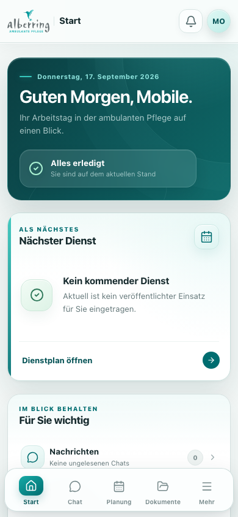
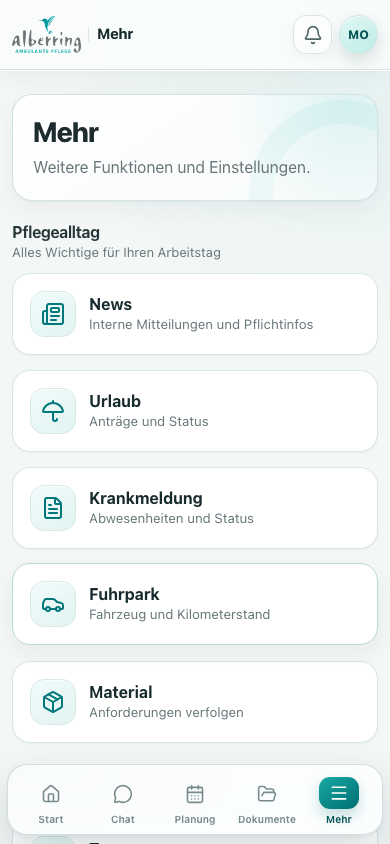
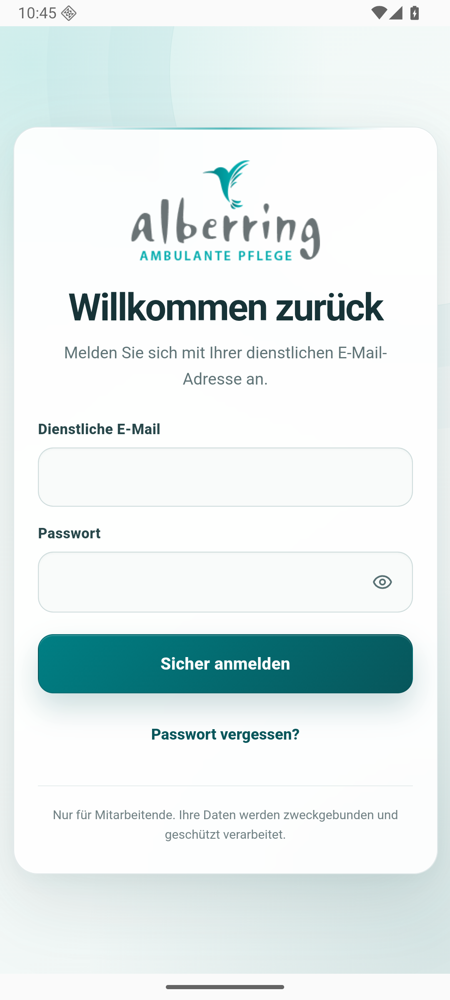
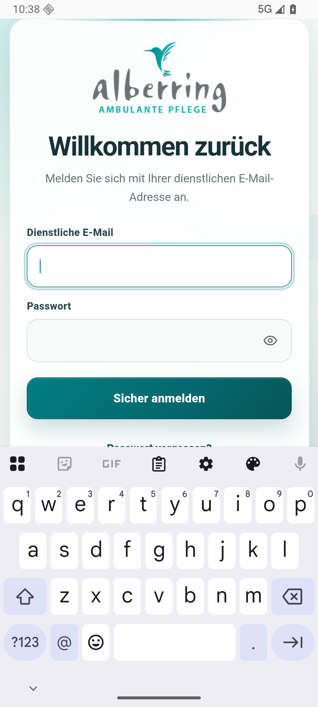
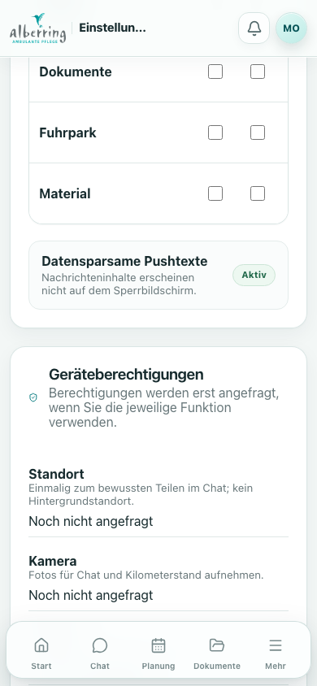
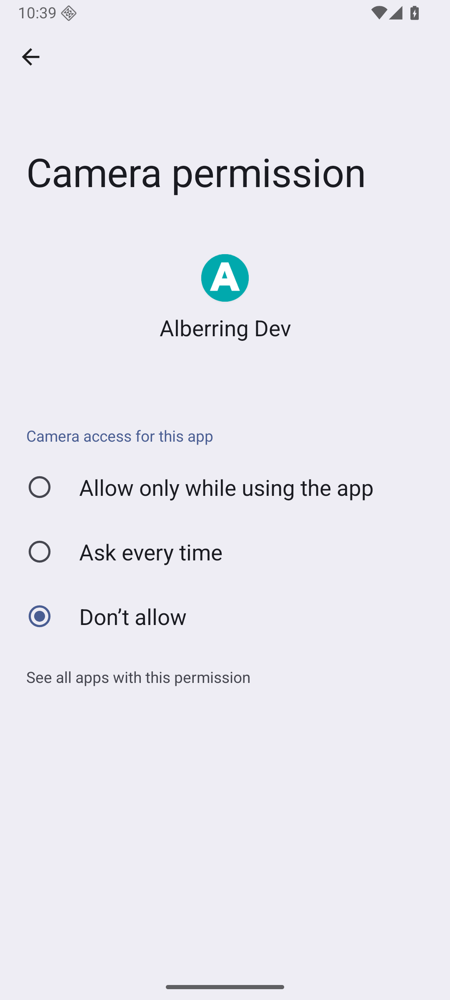
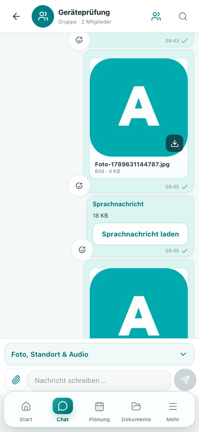
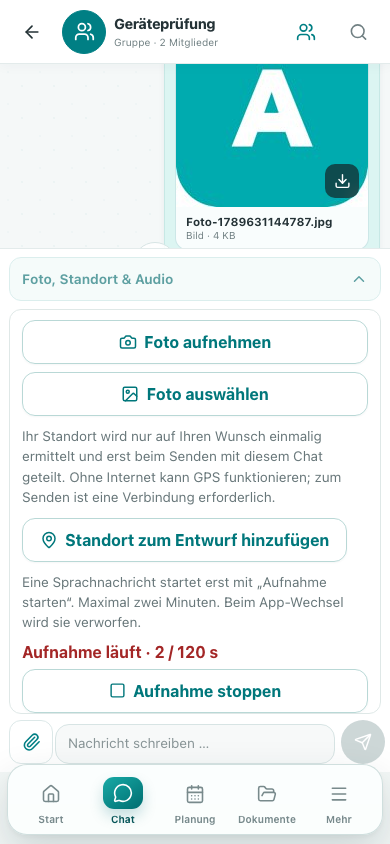
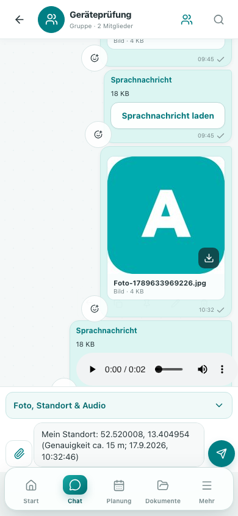
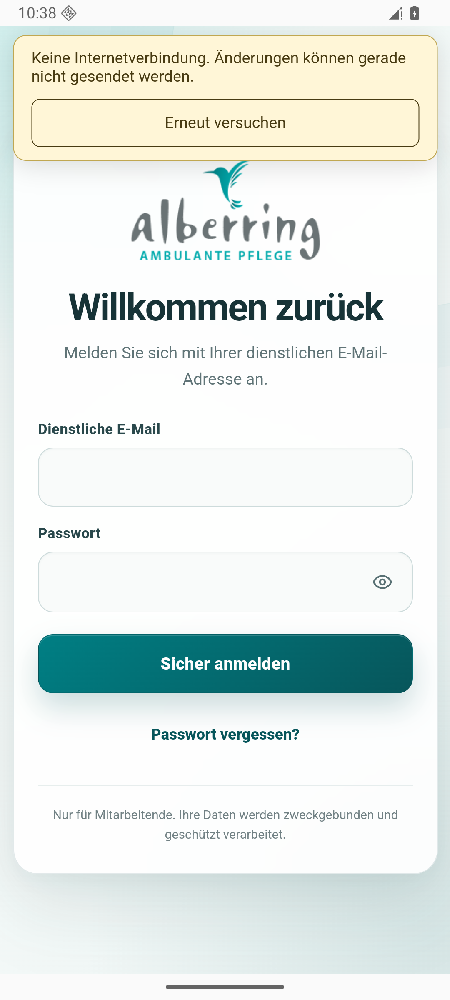

# Technische Dokumentation

Alberring Connect | Entwicklung für Android und iOS

Dokumentversion 1.0 | 28. September 2026 | App-Version 1.0.0 / Build 1

Diese Dokumentation beschreibt die im lokalen Projekt vorhandene mobile Implementierung. Sie verbindet Architektur, native Integration, Datenflüsse, Entwicklungsabläufe und nachvollziehbare Prüfnachweise. Zielgruppe sind technische Projektverantwortliche, Entwickler und mit der Übergabe betraute Personen.

**Nachweisstand:** Quellcode am 28.09.2026 gelesen; 59 Plattformadapter-Tests an diesem Tag erfolgreich wiederholt. Geräteaufnahmen und die umfassenden mobilen Buildnachweise stammen vom 17.09.2026. Spätere Auth-/Mailänderungen sind anhand der Dokumentation vom 24.09.2026 berücksichtigt.

**Plattformstatus:** Android wurde nachweislich als Debug-App im Emulator ausgeführt. Das iOS-Projekt und seine Swift-Brücken sind vorhanden; eine vollständige iOS-Kompilierung, iOS-Screenshots und eine Storeveröffentlichung sind in den vorliegenden Nachweisen nicht belegt.

<!-- page -->

# 01 Projekt und Orientierung

Alberring Connect ist eine interne Mitarbeiter-App. Kommunikation, Einsatzplanung, Dokumente, Abwesenheiten, Fuhrpark und Materialanforderungen werden in einer gemeinsamen Anwendung bereitgestellt. Die mobile Entwicklung erweitert die vorhandene React-Webanwendung um installierbare Android- und iOS-Pakete.

## Entwicklungsleistung

Die Fachoberfläche und das Supabase-Backend werden weiterverwendet. Ergänzt sind native Projekte, sichere Sitzungsspeicherung, Geräteberechtigungen, Kamera-/Fotozugriff, Audioaufnahme, Standortentwürfe, Lifecycle-Behandlung, Push-Vorbereitung und getrennte Build- sowie Releaseabläufe. Swift und Java bilden gezielt die gerätespezifischen Grenzen ab.

| Kapitel              | Inhalt                                                     |
| -------------------- | ---------------------------------------------------------- |
| 02-03 / Seiten 3-4   | Systemarchitektur, Technologie und Quellstruktur           |
| 04 / Seite 5         | Gemeinsame Oberfläche mit Screenshots                      |
| 05-07 / Seiten 6-8   | Android-Integration, Laufzeitnachweise und iOS-Integration |
| 08-09 / Seiten 9-10  | Anmeldung, sichere Sessions und Berechtigungen             |
| 10-11 / Seiten 11-12 | Foto, Audio, Standort und Offlineverhalten                 |
| 12-13 / Seiten 13-14 | Push, Backend, Daten- und Zugriffsschutz                   |
| 14-15 / Seiten 15-16 | Lokale Entwicklung, Builds und Qualitätssicherung          |
| 16-17 / Seiten 17-18 | Übergabe, offene Abnahmen und Quellenregister              |

## Aussagekraft dieser Fassung

Der lokale Arbeitsbaum enthält umfangreiche nicht eingecheckte Änderungen. Der Git-Basisstand `8a75225` allein beschreibt deshalb nicht die dokumentierte Implementierung. Der begleitende Quellnachweis erfasst SHA-256-Prüfsummen ausgewählter tatsächlich gelesener Dateien und aller verwendeten Screenshots.

Ältere Dokumente enthalten teilweise historische PWA- und Mailstatusangaben. Diese Fassung stützt mobile Implementierungsangaben auf die Projektdateien und nennt bei Tests und Betriebsbefunden jeweils das Datum. Eine erneute Produktions-, Store- oder Hardwareprüfung wurde für die Dokumenterstellung nicht durchgeführt.

<!-- page -->

# 02 Systemarchitektur

Web, Android und iOS nutzen dieselben React-Komponenten, Fachmodelle und Benutzerkonten. Capacitor stellt die Verbindung zwischen dem lokal gebündelten Frontend und den nativen Betriebssystemfunktionen her. Das Backend bleibt auf Supabase; Vercel stellt die Webvariante bereit.

<!-- architecture -->

## Trennung der Verantwortlichkeiten

**Oberfläche und Fachlogik:** React Router verwaltet die Navigation, TanStack Query den Serverzustand und React Hook Form/Zod die Formularverarbeitung. Die gemeinsame Codebasis vermeidet getrennte Implementierungen derselben Fachabläufe.

**Plattformadapter:** Die Entscheidung zwischen Browser-API und nativem Plugin erfolgt an der Geräte- und Speichergrenze über `Capacitor.isNativePlatform()`. Die Fachmodule verwenden diese Adapter für Standort, Medien, Uploads und sichere Persistenz.

**Servergrenze:** Authentifizierung, Organisationszuordnung, Rollenrechte, Workflowregeln und Zugriff auf private Dateien werden serverseitig durch Auth, SQL/RPC, RLS und Edge Functions abgesichert. Ein ausgeblendeter Button ist keine serverseitige Berechtigungsprüfung.

**Auslieferung:** `dist` enthält die Web-PWA, `dist-native` den lokalen Inhalt der nativen Pakete. Die Capacitor-Konfiguration enthält keine entfernte `server.url`. Änderungen am gebündelten Frontend erreichen installierte Apps über einen neuen nativen Build.

Quelle: `capacitor.config.ts`, `vite.config.ts`, `src/main.tsx`, `src/lib/supabase.ts`, `docs/06_ARCHITEKTUR.md`.

<!-- page -->

# 03 Technologien und Quellstruktur

Die Versionsangaben sind die im Repository festgelegten Werte am 28.09.2026. Sie sind keine Aussage darüber, welche Version am Markt die neueste ist.

| Bereich                    | Konfiguration im Projekt                                              |
| -------------------------- | --------------------------------------------------------------------- |
| Oberfläche                 | React 19.2.7, TypeScript 5.9.3, Vite 8.1.4                            |
| Navigation / Serverzustand | React Router 8.3.0, TanStack Query 5.101.2                            |
| Formulare                  | React Hook Form 7.81.0, Zod 4.4.3                                     |
| Native Laufzeit            | Capacitor Core, Android, iOS und CLI 8.5.2                            |
| Backend-Client             | supabase-js 2.110.2                                                   |
| Geräte-Plugins             | App, Camera, Geolocation, Network, Keyboard, Push, Splash, Filesystem |
| Audio-Plugin               | @capgo/capacitor-audio-recorder 8.2.9                                 |
| Projektwerkzeuge           | Node >=24; packageManager npm@11.12.1                                 |
| Mobile Version             | mobile-version.json: 1.0.0, Buildnummer 1                             |

## Einstiegspunkte für Entwickler

| Pfad                     | Verantwortung                                                               |
| ------------------------ | --------------------------------------------------------------------------- |
| `src/app/`               | Router, geschützte Routen und gemeinsame App-Shell                          |
| `src/features/`          | Auth, Chat, Planung, Dokumente, Fuhrpark, Verwaltung und weitere Fachmodule |
| `src/services/platform/` | Storage, Links, Permissions, Standort, Medien, Audio, Netzwerk und Push     |
| `src/components/common/` | PlatformRuntime, Geräteaktionen, Berechtigungsanzeige, Netzwerkstatus       |
| `ios/App/`               | Xcode-Projekt, Swift-Brücken, SPM und iOS-Ressourcen                        |
| `android/`               | Gradle-Projekt, Java-Brücken, Manifest und Android-Ressourcen               |
| `supabase/`              | Migrationen, SQL-Tests, Edge Functions und Mailvorlagen                     |
| `scripts/`               | Buildvalidierung, Versionierung und lokale Nachweiswerkzeuge                |
| `.github/workflows/`     | Web-, native Kompatibilitäts- und mobile Releaseabläufe                     |

Die eigenen Plugins heißen `AlberringSecureStorage` und `AlberringSettings`. Ihre Registrierung muss auf beiden Plattformen mit den JavaScript-Aufrufen übereinstimmen. Pluginupdates sind besonders bei der Audio-Lifecycle-Anbindung erneut nativ zu prüfen.

Quelle: `package.json`, `mobile-version.json`, native Projektdateien und `src/services/platform/`.

<!-- page -->

# 04 Gemeinsame mobile Oberfläche

Die App-Shell verwendet auf kleinen Bildschirmen eine untere Navigation und den Bereich „Mehr“. Native Ergänzungen behandeln Safe Areas, Systemleisten, Tastaturgröße und Rückkehr aus dem Hintergrund. Die Oberfläche ist auf einen hellen Darstellungsstil eingestellt.




Die Aufnahmen zeigen die tatsächlich ausgeführte gemeinsame Oberfläche mit künstlichen Prüfprofilen. Sie belegen das mobile Layout und die Navigation, jedoch keinen iOS-Simulatorlauf. Native Besonderheiten werden zusätzlich auf der jeweiligen Plattform geprüft.

Quelle: `src/app/AppShell.tsx`, `src/components/common/PlatformRuntime.tsx`, `src/styles/platform.css`; Screenshotregister [S1].

<!-- page -->

# 05 Android-Integration

## Projekt und Paketierung

Das Gradle-Projekt unter `android/` enthält die App, Capacitor-Abhängigkeiten, Java-Brücken und Ressourcen. Die Produktionskennung lautet `de.alberring.connect`; der Debug-Build ergänzt `.dev` und verwendet den Anzeigenamen „Alberring Dev“.

| Eigenschaft             | Implementierter Wert                                               |
| ----------------------- | ------------------------------------------------------------------ |
| Mindestplattform        | minSdk 24                                                          |
| Build-/Zielplattform    | compileSdk 36, targetSdk 36                                        |
| Buildsystem             | Android Gradle Plugin 8.13.0, Gradle 8.14.3                        |
| Dokumentierte Toolchain | Java 21; historische lokale Buildprüfung mit SDK 36                |
| Native Einstiegsklasse  | `MainActivity.java`                                                |
| Releaseversion          | versionName / versionCode aus mobile-version.json bzw. CI-Umgebung |

## Native Ausführung

`MainActivity` bindet die eigenen Plugins ein. Die gemeinsame Runtime behandelt den Android-Zurück-Button: aktive Bedienabläufe können ihn abfangen, anschließend werden Tastatur oder Dialog geschlossen, eine vorherige Route geöffnet oder die App minimiert. `adjustResize` und Keyboard-Listener passen die Oberfläche an Texteingaben an.

Im Manifest sind Internet, Netzwerkstatus, Kamera, Mikrofon, Standort und Benachrichtigungen deklariert. Kamera, GPS und Mikrofon sind als optionale Hardware markiert. Eine Hintergrundortungsberechtigung und pauschale Medienbibliotheksrechte sind nicht enthalten.

## Sicherheitskonfiguration und Artefakte

Cleartext-Verkehr und App-Backups sind deaktiviert. Zusätzliche Regeln begrenzen die Datenübernahme beim Gerätetransfer. Die Sessionwerte werden verschlüsselt gespeichert; die Details stehen in Kapitel 08.

Das Protokoll vom 17.09.2026 belegt eine Debug-APK, ein **unsigniertes** Release-AAB, Android-Lint und zwei erfolgreiche Keystore-Instrumentationstests im API-36-ARM64-Emulator. Das AAB war damit kein freigegebenes Play-Store-Uploadpaket. Signierte Builds benötigen reale Upload-Schlüssel und vollständige Signing-Umgebungswerte.

Quelle: `android/app/build.gradle`, `android/variables.gradle`, `AndroidManifest.xml`, `MainActivity.java`; Buildnachweis [E2]. Die Projektwerte entsprechen dem Capacitor-8-Migrationsleitfaden [W1].

<!-- page -->

# 06 Android: belegte Laufzeitzustände

Die folgenden Aufnahmen stammen aus der tatsächlich installierten Android-Debug-App im API-36-Emulator. Sie dokumentieren die Einbettung der gemeinsamen Oberfläche und die native Bildschirmtastatur.




Die Felder enthalten keine eingegebenen Zugangsdaten. Diese Ansichten belegen den App-Start und einen Tastaturzustand. Sie ersetzen weder die Prüfung sämtlicher Fachabläufe auf Android noch Tests auf physischen Geräten verschiedener Hersteller.

Quelle: Screenshotregister [S1] und Android-Build-/Emulatornachweis [E2].

<!-- page -->

# 07 iOS-Integration

## Projektaufbau

Das Xcode-Projekt `ios/App/App.xcodeproj` verwendet das Scheme `App` und Swift Package Manager. Das Deployment Target ist iOS 15.0. Debug und Release besitzen die getrennten Kennungen `de.alberring.connect.dev` und `de.alberring.connect`. Die zentrale Versionierung überträgt Marketing-Version und Buildnummer in das Projekt.

| Datei / Bestandteil                   | Technische Aufgabe                                                   |
| ------------------------------------- | -------------------------------------------------------------------- |
| `AppDelegate.swift`                   | App-Einstieg, URL-Weitergabe und APNs-Callbacks                      |
| `SceneDelegate.swift`                 | Scene-Lifecycle und Unterbrechung aktiver Audioaufnahme              |
| `AlberringBridgeViewController.swift` | Registrierung eigener Capacitor-Brücken                              |
| `AlberringSecureStoragePlugin.swift`  | get / set / remove auf gerätegebundener Keychain                     |
| `AlberringSettingsPlugin.swift`       | Berechtigungsstatus und Wechsel in Systemeinstellungen               |
| `Info.plist`                          | URL-Scheme, Nutzungserklärungen, Transport- und Darstellungsvorgaben |
| `App.entitlements`                    | Konfigurierbare APNs-Umgebung für Signing                            |
| `PrivacyInfo.xcprivacy`               | Projektseitiges Privacy-Manifest                                     |

## Betriebssystemintegration

Die lokale WebView lädt das native Frontend. App Transport Security erlaubt keine beliebigen unsicheren Verbindungen. Kamera, Mikrofon und Standort sind mit deutschen Nutzungserklärungen versehen. Auch Texte für Fotozugriff und den vom eingebundenen Standort-SDK benötigten zusätzlichen Standortschlüssel sind vorhanden.

Der zusätzliche Plist-Text ist keine aktivierte Hintergrundortung: Der Anwendungsadapter fordert einen einzelnen Standort im Vordergrund an. Für Audio existiert kein Background-Audio-Modus. Eine Unterbrechung der aktiven Scene beendet beziehungsweise verwirft die laufende Aufnahme.

## Stand und nächste technische Abnahme

**Vorhanden:** iOS-Projekt, SPM-Abhängigkeiten, Swift-Brücken, Ressourcen und ein historisch dokumentierter Syntax-/Plist-/Projektcheck. **Noch unbelegt:** vollständiger Xcode-Build, Simulatorlauf, physische Geräteprüfung, signiertes Archiv und TestFlight-Verteilung. Deshalb enthält diese Fassung keine als iOS ausgegebenen Browserbilder.

Für Capacitor 8 nennt die offizielle Dokumentation Xcode 26.0 oder neuer [W1]. Nach Einrichtung der Toolchain sind Build, Kalt-/Warmstart von Auth-Links, Kamera-Rückkehr, Mikrofonunterbrechung, Keychain, Tastatur und Berechtigungswechsel zu prüfen. Anschließend werden echte iOS-Screenshots ergänzt.

Quelle: Dateien unter `ios/App/`, `docs/evidence/NATIVE_NOTES.md`, [E2], [W1].

<!-- page -->

# 08 Anmeldung und sichere Sitzungen

## Gemeinsame Identität, plattformspezifischer Speicher

Alle Plattformen verwenden Supabase Auth und dieselben betrieblichen Konten. `src/lib/supabase.ts` bindet den gemeinsamen `authStorage`-Adapter ein. Im Browser bleibt LocalStorage erhalten; native Aufrufe gehen ausschließlich an die eigene Secure-Storage-Bridge. Bei einem nativen Speicherfehler wird kein Klartext-Fallback verwendet.

| Plattform | Implementierte Persistenz                                                                                             |
| --------- | --------------------------------------------------------------------------------------------------------------------- |
| iOS       | Keychain Generic Password; App-ID als Servicebasis; nicht synchronisierbar; `WhenUnlockedThisDeviceOnly`              |
| Android   | AES-256-GCM; Schlüssel im AndroidKeyStore; frischer Nonce; authentifizierter Ciphertext in privaten SharedPreferences |
| Browser   | Vorhandenes LocalStorage-Modell des Webclients                                                                        |

Android bindet den Speicherschlüssel als zusätzliche authentifizierte Daten an den verschlüsselten Wert. Beschädigter Ciphertext führt zu einem Fehler. iOS-Keychain-Daten können eine Deinstallation überdauern; ein automatischer Reinstall-Purge ist im Projekt nicht implementiert.

## Auth-Links und Lifecycle

Native Authentifizierung verwendet PKCE. Die Callback-Route `de.alberring.connect://auth/callback` nimmt einen einmaligen Code entgegen; die Entwicklungskennung ist separat erlaubt. Fremde Schemes, Benutzerinformationen, Ports und Token-Fragmente werden verworfen. Interne App-Routen sind auf eine definierte Liste begrenzt.

Die Runtime verarbeitet sowohl Start-URLs als auch Links in einer laufenden App. Im Hintergrund wird der automatische Auth-Refresh angehalten; bei Rückkehr werden Sitzung und Daten aktualisiert. Beim Logout wird zunächst die Push-Gerätebindung aufgehoben. Schlägt dieser Ablauf fehl, zeigt die App einen Fehler statt einer vollständigen Abmeldung.

## Auth-/Mailänderungen vom 24.09.2026

Der jüngere Projektbericht dokumentiert verbesserte Fehlerzustände bei Einladung und Passwort-Reset, einen 24-Stunden-Hinweis sowie eingerichtetes STRATO-SMTP. Die Zustellung blieb dort wegen einer URL-Ablehnung offen. Ein zusätzlicher TokenHash-Einstieg ist lokal vorhanden, laut Bericht noch nicht veröffentlicht; native PKCE-Rücksprünge bleiben beim bisherigen ConfirmationURL-Ablauf.

Diese Angaben sind der **dokumentierte Betriebsstand vom 24.09.2026**, keine neue Liveprüfung. Die Android-Bilder vom 17.09.2026 belegen die nachträglichen Änderungen nicht. Vor Freigabe ist ein neuer nativer Build samt Auth-Abnahme nötig.

Quelle: `storage.ts`, `links.ts`, `AuthProvider.tsx`, native Speicherbrücken sowie `docs/MAILVERSAND_2026-09-24.md`.

<!-- page -->

# 09 Berechtigungen im Nutzungskontext

Kamera, Mikrofon und Standort werden bei einer passenden Nutzeraktion angefragt. Die Statusschicht unterscheidet `notDetermined`, `granted`, `denied`, `restricted` und `permanentlyDenied`. Nicht zuverlässig abfragbare Browserzustände werden als solche behandelt.




Die native Settings-Bridge kann in die App-Einstellungen wechseln. Dauerhafte Ablehnung, Restriktion und ausgeschaltete Ortungsdienste erhalten eigene Fehlerpfade. Android kombiniert Betriebssystemstatus und Anfragehistorie; eine vollständige Erkennung jeder Geräteverwaltungsrichtlinie wird nicht behauptet.

Quelle: `permissions.ts`, `DevicePermissions.tsx`, native Settings-Brücken und Screenshotregister [S1].

<!-- page -->

# 10 Kamera, Fotos und Sprachnachrichten

Fotoaufnahme und einzelne Bildauswahl laufen nativ über das Camera-Plugin. Die gemeinsame Vorbereitung dekodiert das Bild, begrenzt es auf maximal 2048 Pixel Kantenlänge und erzeugt JPEG neu. Eingebettete EXIF-/GPS-Metadaten werden dabei nicht übernommen. Eingangslimit: 20 MiB; erzeugte Fotodatei: maximal 10 MiB.




Audio startet ausdrücklich, endet spätestens nach 120 Sekunden und bietet Stop, Verwerfen und Vorschau. Erst das Senden erzeugt den Chat-Anhang. Browser verwenden MediaRecorder, native Apps den gepinnten Recorder. App-Unterbrechung beendet aktive Aufnahmen; temporäre Dateien, Media-Tracks und Blob-URLs werden bereinigt. Die Bilder belegen keine physische Sensorqualität.

Quelle: `media.ts`, `audio.ts`, `DeviceActions.tsx`, native Lifecycle-Klassen; [S1], [E3].

<!-- page -->

# 11 Standort, Netzwerk und Offlinezustand

Standort wird einmalig im Vordergrund mit einem Timeout von 20 Sekunden angefragt. Koordinaten, Genauigkeit und Zeitpunkt landen zunächst im Chatentwurf. Erst die bewusste Sendeaktion überträgt die Nachricht. Es gibt keinen Standort-Watcher und keine Hintergrundortung.




API-Aufrufe besitzen grundsätzlich 25 Sekunden Timeout, Uploadpfade bis zu 120 Sekunden. Leseabfragen werden höchstens einmal wiederholt; fachliche Mutationen nicht automatisch. Eine Offline-Sendequeue ist nicht implementiert. Der lokale App-Inhalt bleibt verfügbar, für serverseitige Aktionen ist eine erreichbare Verbindung erforderlich. Ein Online-Signal allein bestätigt die Backend-Erreichbarkeit nicht.

Quelle: `location.ts`, `network.ts`, `uploads.ts`, `src/main.tsx`, `NetworkStatus.tsx`; [S1].

<!-- page -->

# 12 Push-Benachrichtigungen

## Vorbereiteter Ablauf

1. Der Nutzer aktiviert Push im Einstellungsbereich; die App prüft die technische Verfügbarkeit und fragt die Betriebssystemfreigabe an.
2. Das native Plugin liefert einen Token. Der Client registriert ihn mit Installationskennung, Plattform, Umgebung und App-Version beim Backend.
3. Die Datenbank bindet die Registrierung an Benutzer, Organisation und aktive Auth-Sitzung. Tokenrotation und Widerruf werden serverseitig behandelt.
4. Der vorhandene Notification-Batch verarbeitet geeignete Einträge und adressiert APNs für iOS beziehungsweise FCM für Android.
5. Ein Tap öffnet ausschließlich eine erlaubte interne Route. Die angeforderten Inhalte unterliegen weiterhin den normalen Fachberechtigungen.

## Trennung von Transport und Fachdaten

Push transportiert generische Hinweise und ein begrenztes Navigationsziel. Nachrichteninhalte, Gesundheitsdaten, Fotos, Audiodateien, Koordinaten und signierte Download-URLs werden nicht als Vorschautext versendet. Roh-Tokens sind über die Client-Lese-API nicht sichtbar.

| Bestandteil   | Implementierung / Grenze                                                  |
| ------------- | ------------------------------------------------------------------------- |
| Client        | `push.ts`, `PushSettings.tsx`, Lifecycle-Initialisierung                  |
| Datenbank     | Erweiterung von user_devices, Registrierung/Widerruf, Versandbelege       |
| Versand       | `send-notification-batch` und gemeinsame Push-Transportlogik              |
| Logout        | Geordneter Widerruf; Fehlerzustand bei fehlgeschlagener Abmeldung         |
| Konfiguration | `VITE_PUSH_ENABLED` aktiviert den vorbereiteten nativen Pfad ausdrücklich |
| Android       | Firebase-Clientkonfiguration und FCM-v1-Serverzugang erforderlich         |
| iOS           | APNs-Zugang, passende Bundle-ID, Entitlement und Signing erforderlich     |

## Abnahmestatus

Die Implementierung und Tests der Logik sind dokumentiert. Eine reale Zustellung mit Betreiber-Credentials in Vordergrund, Hintergrund und nach Beenden der App ist in den vorliegenden Nachweisen nicht belegt. Fehlende Providerkonfiguration ist ein offener Einrichtungsschritt.

Registrierungen mit mehr als 60 Tagen Inaktivität werden beim dokumentierten Geräteversand nicht ausgewählt. Das ist keine automatische Löschfrist für alle Geräte- oder Versanddaten.

Quelle: `src/services/platform/push.ts`, `supabase/functions/_shared/push.ts`, `supabase/functions/send-notification-batch/index.ts` und Migration [B1].

<!-- page -->

# 13 Backend und Datenflüsse

## Gemeinsame Infrastruktur

Supabase stellt Auth, PostgreSQL, private Storage-Buckets, Realtime und Edge Functions bereit. Die native Erweiterung führt keine zweite Benutzerdatenbank ein. Der Client kommuniziert mit öffentlichem Projektschlüssel und Benutzersitzung; privilegierte Service-Schlüssel bleiben serverseitig.

RLS begrenzt Datensatzzugriffe, Fach-RPCs prüfen erlaubte Zustandswechsel und privilegierte Aktionen. Bei Funktionen mit erhöhten Rechten sind die Prüfungen innerhalb der Funktion entscheidend. Dieses Zusammenspiel ist im Repository durch SQL-Tests dokumentiert. Das allgemeine Supabase-RLS-Prinzip ist in [W2] beschrieben.

| Datenart                | Verarbeitung und technische Grenze                                   |
| ----------------------- | -------------------------------------------------------------------- |
| Sitzung / PKCE-Verifier | Native Persistenz über Keychain oder Keystore-Bridge                 |
| Fachdaten / Chat        | Authentifizierte Zugriffe, Organisations- und Fachberechtigungen     |
| Fotos / Audio           | Bewusster Upload und Verknüpfung mit dem Fachobjekt; private Dateien |
| Standort                | Textentwurf vor dem Senden; keine kontinuierliche Erfassung          |
| Dokumente / Atteste     | Private Buckets und autorisierte Downloadpfade                       |
| Push-Token              | Geschütztes Geräteregister und sitzungsgebundene RPCs                |

## Beispiel: privater Chat-Anhang

Datei auswählen oder aufnehmen, lokal validieren, gegebenenfalls als Foto normalisieren, signierte Upload-URL anfordern, Datei übertragen und anschließend dem Chat fachlich zuordnen. Der XHR-Upload meldet tatsächlichen Bytefortschritt und unterstützt Abbruch. Origin und Zielpfad der Upload-URL müssen zum konfigurierten Backend passen.

Ein erfolgreicher Dateitransfer ist noch keine erfolgreich gespeicherte Chatnachricht. Die fachliche Verknüpfung und die bestehende Fehlerkompensation bleiben Aufgabe des jeweiligen Moduls. Private Dateien werden nicht durch den PWA-Service-Worker gecacht.

## Betrieb und Datenschutz

Die App verarbeitet auch personal- und gesundheitsbezogene Inhalte. Für die Übergabe bleiben tatsächlich geltende Aufbewahrung, Löschung, Backups, Zugriffsverantwortung und Providerkonfiguration zu dokumentieren. Diese Fassung beschreibt technische Maßnahmen; sie stellt keine rechtliche oder organisatorische Freigabe aus.

Quelle: `src/lib/supabase.ts`, `uploads.ts`, `docs/DATABASE.md`, `docs/PRIVACY_AND_SECURITY.md`, [B1], [W2].

<!-- page -->

# 14 Entwicklungs- und Buildablauf

## Voraussetzungen und Konfiguration

Node ab 24 und die zum Lockfile passende npm-Umgebung installieren. Für Android sind Java 21 und SDK 36 vorgesehen; iOS benötigt eine vollständige Xcode-Umgebung. `.env.example` beschreibt öffentliche Clientwerte. Reale Geheimnisse gehören nicht in `VITE_*`, Quellcode oder App-Pakete.

```sh
# Abhängigkeiten gemäß package-lock.json
npm ci
# Gemeinsame Weboberfläche lokal entwickeln
npm run dev
# Gezielt Plattformadapter prüfen
npm run test:mobile
# Gemeinsames Frontend nativ bauen, versionieren und synchronisieren
npm run mobile:sync
```

`mobile:sync` führt `build:native`, `mobile:version` und `cap sync` aus. Die Bundleprüfung kontrolliert lokale Assets, native CSP und das Fehlen eines PWA-Service-Workers. Der Webbuild bleibt davon getrennt.

## Android und iOS

```sh
# Android-Kompatibilität lokal kompilieren
./android/gradlew --project-dir android assembleDebug bundleRelease lintDebug
# Plattformprojekte in der jeweiligen IDE öffnen
npm run mobile:android
npm run mobile:ios
```

Ein reproduzierbarer unsignierter iOS-Simulatorbuild ist im nativen Workflow hinterlegt:

```sh
xcodebuild -project ios/App/App.xcodeproj -scheme App \
  -configuration Debug -sdk iphonesimulator \
  -destination 'generic/platform=iOS Simulator' \
  -derivedDataPath ios/DerivedData CODE_SIGNING_ALLOWED=NO build
```

Die Befehle sind eine Arbeitsanleitung. Für diese Dokumentfassung wurden weder neue native Pakete gebaut noch Plattformen synchronisiert. Die aktuellen Adaptertests und die historischen Buildbelege sind in Kapitel 15 getrennt ausgewiesen.

Quelle: `package.json`, `scripts/verify-native-bundle.mjs`, `scripts/sync-mobile-version.mjs`, `.github/workflows/native.yml`.

<!-- page -->

# 15 Qualitätssicherung und Nachweise

## Aktuell wiederholte Prüfung am 28.09.2026

`npm run test:mobile` wurde während der Dokumenterstellung erneut ausgeführt: **59 Tests in 6 Dateien bestanden**. Geprüft werden Plattformadapter einschließlich Storage, Netzwerk, Links, Uploads, Push und Gerätefunktionen. Vitest-Tests belegen die getestete Logik; sie sind keine physische Geräteabnahme.

## Vorhandene historische Prüfnachweise

| Datum / Bereich        | Dokumentiertes Ergebnis                                     | Aussagegrenze                                      |
| ---------------------- | ----------------------------------------------------------- | -------------------------------------------------- |
| 17.09. / Frontend      | 166 Vitest-Tests, 12 öffentliche Playwright-Tests           | Historischer Gesamtstand                           |
| 17.09. / Browser       | 25 authentifizierte mobile Routen; Foto, Audio und Standort | Lokales Backend; Audio/GPS-Testwerte synthetisch   |
| 17.09. / Backend       | 539 pgTAP-Assertions, 29 Deno-Tests                         | Historischer lokaler Nachweis                      |
| 17.09. / Android       | Debug-APK, unsigniertes AAB, Lint; 2 Keystore-Gerätetests   | API-36-Emulator; keine Storefreigabe               |
| 17.09. / Android-Lint  | 0 Fehler, 6 Warnungen                                       | Warnungen zu Toolchain und Ressourcen dokumentiert |
| 17.09. / iOS           | Swift-, Plist- und Projekt-Syntax geprüft                   | Kein vollständiger iOS-SDK-Build                   |
| 24.09. / Auth und Mail | Bericht: 185 Vitest- und 46 Edge-Function-Tests             | Spätere Änderung; Zustellprüfung blieb offen       |

## Verbleibende Geräteprüfung

Auf physischen Android- und iOS-Geräten sind Anmeldung und Wiederherstellung, Abmeldung bei Netzverlust, Passwort-Reset, Deep Links im Kalt-/Warmstart, Kamera-Rückkehr, Abbruch und Ablehnung von Permissions, Audio-Unterbrechung, Standortgenauigkeit und Uploadabbruch zu prüfen. Push benötigt zusätzlich reale Providerkonfiguration und Tests in allen App-Zuständen.

Für iOS ist vor diesen Prüfungen ein vollständiger Build nachzuholen. Für beide Plattformen ist ein neuer Build aus dem aktuellen Arbeitsstand nötig, damit Änderungen nach dem 17.09.2026 in der nativen Abnahme enthalten sind. Aus den alten Screenshots lässt sich keine aktuelle Binärgleichheit ableiten.

Quellen: [E1]-[E4], aktuelles Protokoll `docs/evidence/mobile-adapter-tests_2026-09-28.txt` und `docs/MAILVERSAND_2026-09-24.md`.

<!-- page -->

# 16 Release, Wartung und Übergabe

## Vorbereitete Automatisierung

`native.yml` beschreibt Android-Kompatibilitätsbuilds und einen unsignierten iOS-Simulatorbuild. `mobile-release.yml` enthält Qualitätsprüfungen sowie Jobs für signierte Android- und iOS-Artefakte. Die Releasejobs sind durch `MOBILE_RELEASE_ENABLED` und das Environment `store-release` geschützt. Eine erfolgreiche GitHub-Ausführung ist durch die lokalen Nachweise nicht belegt.

Der Releaseworkflow erstellt Artefakte; die Storeeinreichung bleibt ein eigener Schritt. Für Android wird ein Upload-Keystore benötigt. Für iOS müssen Team, Distribution-Zertifikat und Provisioning-Profil zusammenpassen. Push-Konfiguration und Signiermaterial werden über die dafür vorgesehenen CI-Werte eingebracht.

## Updateverhalten

| Änderung                                   | Verteilung / Wartungsfolge                                         |
| ------------------------------------------ | ------------------------------------------------------------------ |
| Serverdaten oder kompatible Konfiguration  | Gemeinsam im Backend; installierte Clientversionen berücksichtigen |
| React-Oberfläche und gebündelte Logik      | Webdeployment sowie neuer nativer Build für Android/iOS            |
| Plugin, Berechtigung oder Swift-/Java-Code | Neue native Binärdatei und plattformspezifische Prüfung            |

Die App besitzt keinen implementierten Remote-JavaScript-Updatekanal. Backendänderungen sollten bestehende App-Versionen weiter unterstützen; entfallende RPCs und Felder benötigen ein abgestimmtes Migrationskonzept.

## Offene Schritte bis zur mobilen Freigabe

1. Produktionsidentität, Vertrieb und Apple-/Google-Organisationskonten verbindlich festlegen.
2. Aktuellen Quellstand eindeutig sichern, Version und Buildnummer festlegen und native Pakete neu bauen.
3. iOS-Kompilierung, echte Geräteabnahme und aktuelle Android-/iOS-Screenshots nachweisen.
4. Auth-/Mailzustellung einschließlich mobiler Rücksprünge vollständig abnehmen; letzten dokumentierten Mailblocker klären.
5. Signing und APNs/FCM konfigurieren; Push-Empfang, Rotation und Logout auf Geräten prüfen.
6. Storeangaben, Support-/Datenschutztexte und betriebliches Lösch-/Backupkonzept vervollständigen; TestFlight bzw. internen Play-Test durchführen.

Quelle: `.github/workflows/`, `docs/03_RELEASE_PROZESS.md`, `docs/08_STORE_SETUP_CHECKLISTE.md`. Storevorgaben sind vor der tatsächlichen Einreichung erneut zu prüfen.

<!-- page -->

# 17 Quellen- und Abbildungsregister

## Projektquellen

| Kennung | Quelle im Repository                                                                          |
| ------- | --------------------------------------------------------------------------------------------- |
| S1      | `docs/screenshots/README.md` und `NACHWEIS.json`: Herkunft und Grenzen der Screenshots        |
| E1      | `docs/evidence/frontend-tests.md`: Frontend-/Build-/Browsernachweise vom 17.09.2026           |
| E2      | `docs/evidence/android-build.txt`: Builds, Hashwerte, Lint und Instrumentation vom 17.09.2026 |
| E3      | `docs/evidence/mobile-device-flows.json`: Foto-, Audio- und Standortabläufe                   |
| E4      | `docs/evidence/ABSCHLUSSBERICHT.txt` und `backend-tests.txt`: historische Gesamtergebnisse    |
| B1      | `supabase/migrations/20260917073037_native_push_devices_and_audio.sql`                        |
| A1      | `docs/06_ARCHITEKTUR.md` und `docs/evidence/NATIVE_NOTES.md`                                  |
| A2      | `docs/MAILVERSAND_2026-09-24.md`: jüngerer Auth-/Mailstand                                    |

## Abbildungen und Herkunft

| Abbildung | Originaldatei unter docs/screenshots/                     | Umgebung                          |
| --------- | --------------------------------------------------------- | --------------------------------- |
| 1 / 2     | 04-mobile-dashboard.png / 06-mobile-navigation.png        | Mobiler Browser                   |
| 3 / 4     | 12-android-login.png / 14-android-keyboard.png            | Android-Emulator                  |
| 5 / 6     | 08-permission-status.png / 16-android-camera-settings.png | Browser / Android                 |
| 7 / 8     | 13-photo-upload.png / 14-audio-recording.png              | Browser; Audio synthetisch        |
| 9 / 10    | 15-location-draft.png / 13-android-offline.png            | Browser-GPS synthetisch / Android |

Alle zehn Aufnahmen stammen aus dem vorhandenen Nachweisstand vom 17.09.2026. Die Bildinhalte wurden unverändert übernommen und für das PDF proportional skaliert. Es wurden keine neuen Laufzeitaufnahmen, Mockups oder künstlichen iOS-Nachweise erzeugt.

## Offizielle technische Referenzen

**[W1] Capacitor: Updating to 8.0.** Xcode-Voraussetzung und native Projektwerte; eingesehen am 28.09.2026. [Capacitor-Migrationsleitfaden](https://capacitorjs.com/docs/updating/8-0).

**[W2] Supabase: Row Level Security.** Technische Einordnung der Datenbank-Zugriffsregeln; eingesehen am 28.09.2026. [Supabase-RLS-Dokumentation](https://supabase.com/docs/guides/database/postgres/row-level-security).

Zur Reproduktion gehören die Markdown-Quelle, `scripts/build-technical-mobile-documentation.py`, das aktuelle Testprotokoll sowie `docs/evidence/technical-mobile-documentation_2026-09-28.json`. Der Quellnachweis enthält ausgewählte Dateiprüfsummen und den PDF-Hash; er ist kein vollständiger Repository-Snapshot.
